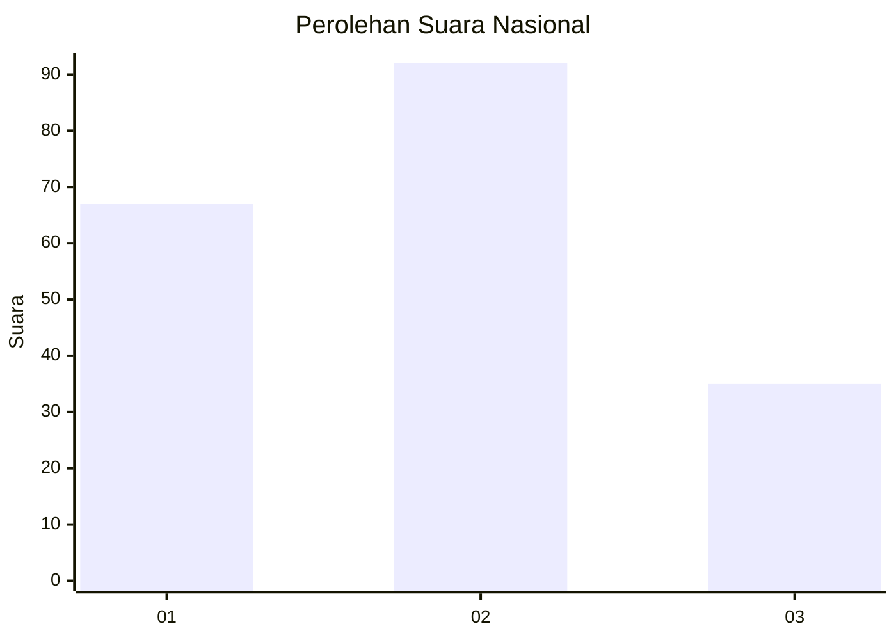
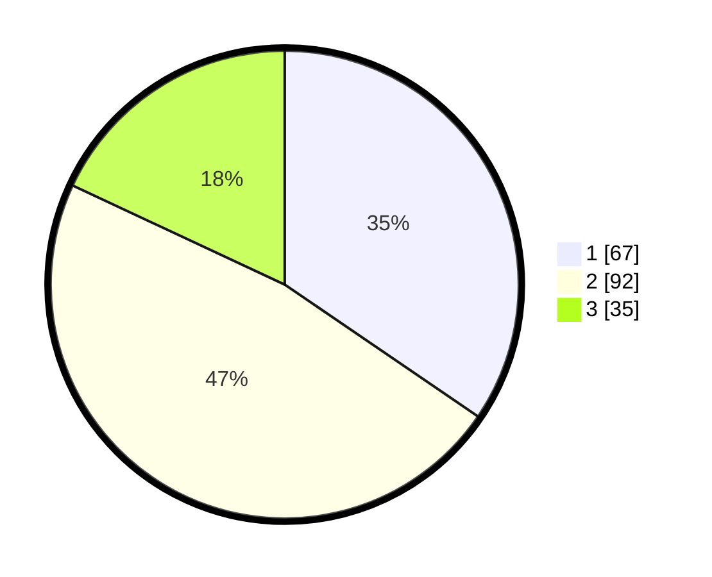

# Hasil

## Grafik

## Tabel

| No.    | Nama Paslon    | Suara | Suara (raw) | Persentase |
|:------ |:-------------- | -----:| -----------:| ----------:|
| 100025 | ANIES MUHAIMIN | 67    | [67][p-1]   | 34,54      |
| 100026 | PRABOWO GIBRAN | 92    | [92][p-2]   | 47,42      |
| 100027 | GANJAR MAHFUD  | 35    | [35][p-3]   | 18,04      |

[p-1]: https://github.com/gigit-pemilu/pemilu-2024/blob/main/pilpres/hitung-suara/sub/31-dki-jakarta/sub/72-jakarta-utara/sub/03-koja/sub/1002-tugu-utara/sub/106-tps/sub/paslon-1.txt
[p-2]: https://github.com/gigit-pemilu/pemilu-2024/blob/main/pilpres/hitung-suara/sub/31-dki-jakarta/sub/72-jakarta-utara/sub/03-koja/sub/1002-tugu-utara/sub/106-tps/sub/paslon-2.txt
[p-3]: https://github.com/gigit-pemilu/pemilu-2024/blob/main/pilpres/hitung-suara/sub/31-dki-jakarta/sub/72-jakarta-utara/sub/03-koja/sub/1002-tugu-utara/sub/106-tps/sub/paslon-3.txt

## Foto C Plano

https://sirekap-obj-formc.kpu.go.id/fb70/pemilu/ppwp/31/72/03/10/02/3172031002106-20240214-205226--b0fd84f0-92c8-43c3-a307-57612ea3e45b.jpg

https://sirekap-obj-formc.kpu.go.id/fb70/pemilu/ppwp/31/72/03/10/02/3172031002106-20240214-205335--fe3cf2e3-afdd-4f5a-8ed4-9940796506d1.jpg

https://sirekap-obj-formc.kpu.go.id/fb70/pemilu/ppwp/31/72/03/10/02/3172031002106-20240214-205350--09b0d461-69c0-4bf4-8bbc-b27d7b6e3c89.jpg

## Metadata

| Key        | Value               |
| ---------- | ------------------- |
| Time Stamp | 2024-02-21 14:00:00 |

