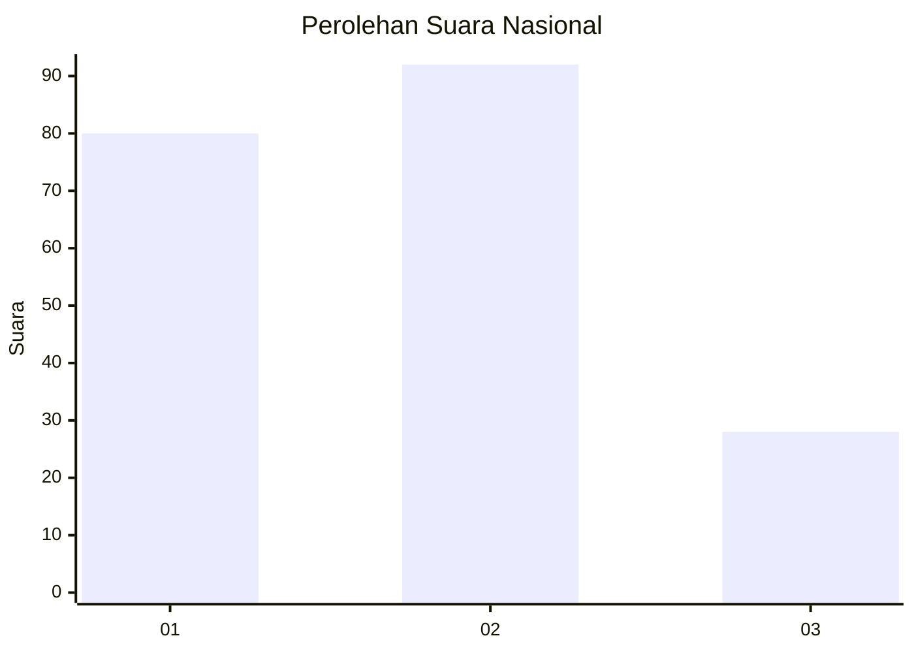
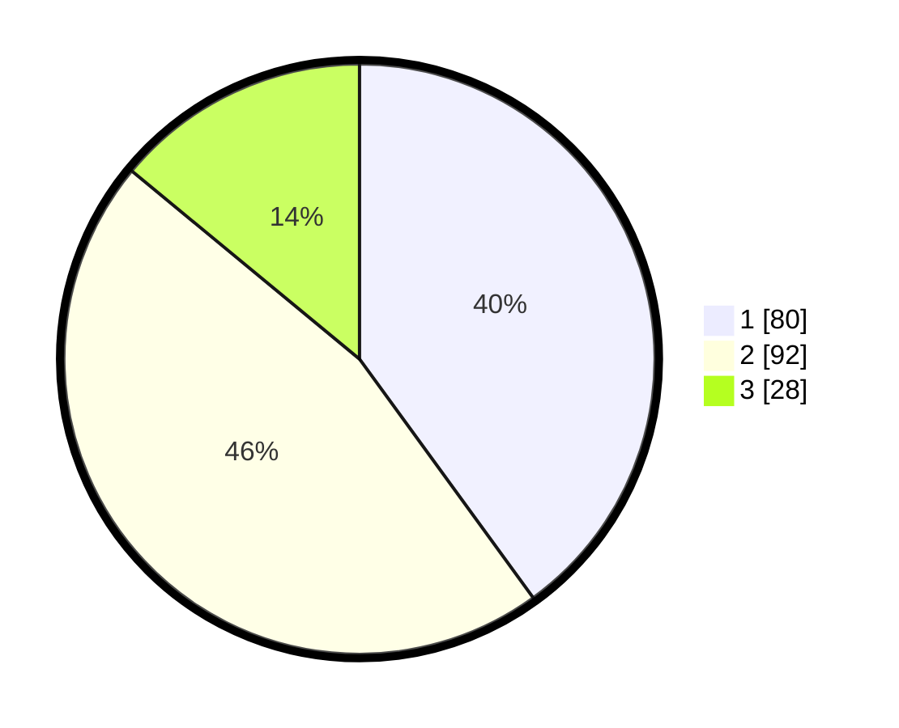

# Hasil

## Grafik

## Tabel

| No.    | Nama Paslon    | Suara | Suara (raw) | Persentase |
|:------ |:-------------- | -----:| -----------:| ----------:|
| 100025 | ANIES MUHAIMIN | 80    | [80][p-1]   | 40,00      |
| 100026 | PRABOWO GIBRAN | 92    | [92][p-2]   | 46,00      |
| 100027 | GANJAR MAHFUD  | 28    | [28][p-3]   | 14,00      |

[p-1]: https://github.com/gigit-pemilu/pemilu-2024/blob/main/pilpres/hitung-suara/sub/31-dki-jakarta/sub/72-jakarta-utara/sub/03-koja/sub/1002-tugu-utara/sub/122-tps/sub/paslon-1.txt
[p-2]: https://github.com/gigit-pemilu/pemilu-2024/blob/main/pilpres/hitung-suara/sub/31-dki-jakarta/sub/72-jakarta-utara/sub/03-koja/sub/1002-tugu-utara/sub/122-tps/sub/paslon-2.txt
[p-3]: https://github.com/gigit-pemilu/pemilu-2024/blob/main/pilpres/hitung-suara/sub/31-dki-jakarta/sub/72-jakarta-utara/sub/03-koja/sub/1002-tugu-utara/sub/122-tps/sub/paslon-3.txt

## Foto C Plano

https://sirekap-obj-formc.kpu.go.id/92b6/pemilu/ppwp/31/72/03/10/02/3172031002122-20240214-231549--e61717aa-08a4-4364-b6ca-dc93adf95df5.jpg

https://sirekap-obj-formc.kpu.go.id/92b6/pemilu/ppwp/31/72/03/10/02/3172031002122-20240214-231459--1c6da5cf-96d8-4f29-ba01-a5414ded3c03.jpg

https://sirekap-obj-formc.kpu.go.id/92b6/pemilu/ppwp/31/72/03/10/02/3172031002122-20240214-231646--7f293744-6842-4b1c-9de1-9e1c9000b5a0.jpg

## Metadata

| Key        | Value               |
| ---------- | ------------------- |
| Time Stamp | 2024-02-20 16:00:00 |

