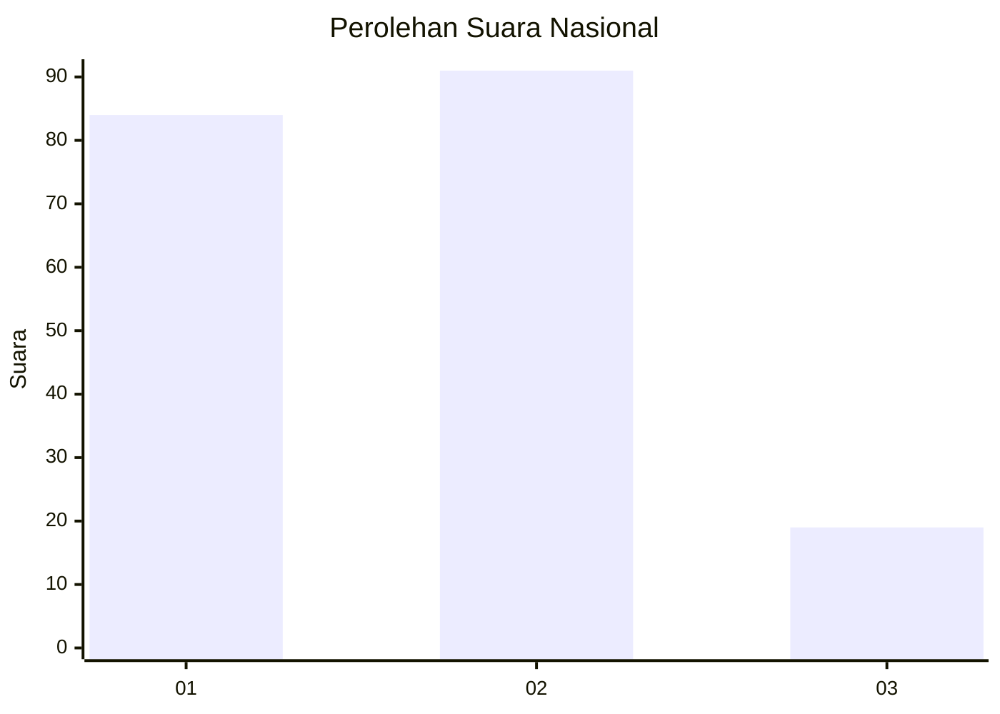
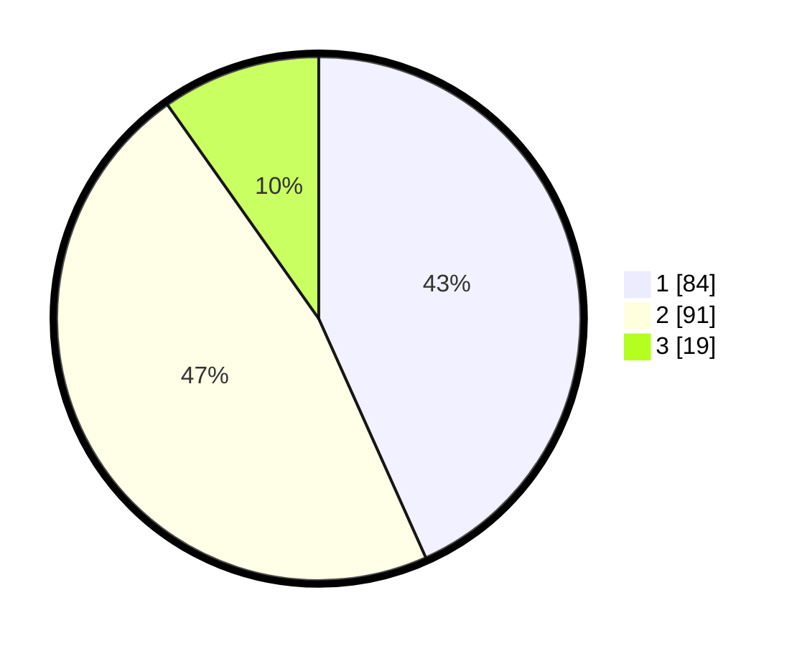

# Hasil

## Grafik

## Tabel

| No.    | Nama Paslon    | Suara | Suara (raw) | Persentase |
|:------ |:-------------- | -----:| -----------:| ----------:|
| 100025 | ANIES MUHAIMIN | 84    | [84][p-1]   | 43,30      |
| 100026 | PRABOWO GIBRAN | 91    | [91][p-2]   | 46,91      |
| 100027 | GANJAR MAHFUD  | 19    | [19][p-3]   | 9,79       |

[p-1]: https://github.com/gigit-pemilu/pemilu-2024/blob/main/pilpres/hitung-suara/sub/31-dki-jakarta/sub/72-jakarta-utara/sub/03-koja/sub/1002-tugu-utara/sub/135-tps/sub/paslon-1.txt
[p-2]: https://github.com/gigit-pemilu/pemilu-2024/blob/main/pilpres/hitung-suara/sub/31-dki-jakarta/sub/72-jakarta-utara/sub/03-koja/sub/1002-tugu-utara/sub/135-tps/sub/paslon-2.txt
[p-3]: https://github.com/gigit-pemilu/pemilu-2024/blob/main/pilpres/hitung-suara/sub/31-dki-jakarta/sub/72-jakarta-utara/sub/03-koja/sub/1002-tugu-utara/sub/135-tps/sub/paslon-3.txt

## Foto C Plano

https://sirekap-obj-formc.kpu.go.id/5489/pemilu/ppwp/31/72/03/10/02/3172031002135-20240225-115521--546bb9a8-6d15-4aba-b915-ffaa76b70721.jpg

https://sirekap-obj-formc.kpu.go.id/5489/pemilu/ppwp/31/72/03/10/02/3172031002135-20240225-115322--08abb6f5-f0f7-4d7d-aafe-d14f5e7f1a28.jpg

https://sirekap-obj-formc.kpu.go.id/5489/pemilu/ppwp/31/72/03/10/02/3172031002135-20240225-115646--f20c128c-00dc-4186-9b28-482c1bf71363.jpg

## Metadata

| Key        | Value               |
| ---------- | ------------------- |
| Time Stamp | 2024-02-26 10:00:00 |

