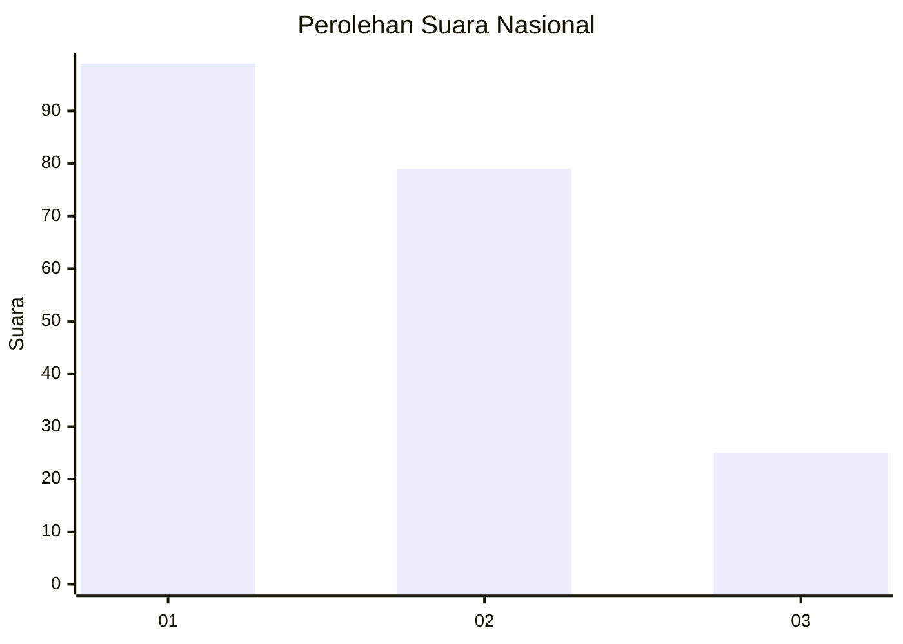
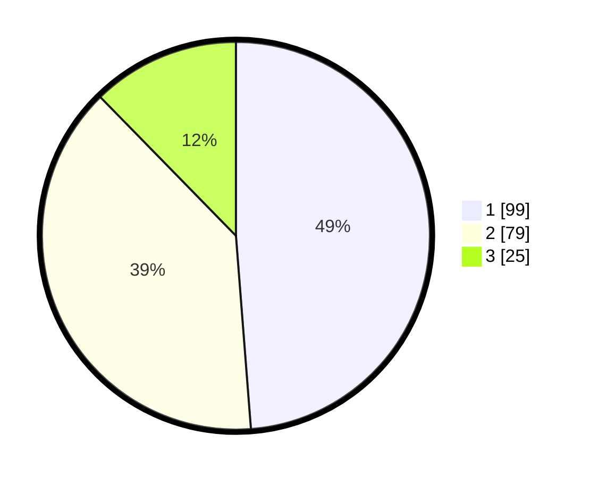

# Hasil

## Grafik

## Tabel

| No.    | Nama Paslon    | Suara | Suara (raw) | Persentase |
|:------ |:-------------- | -----:| -----------:| ----------:|
| 100025 | ANIES MUHAIMIN | 99    | [99][p-1]   | 48,77      |
| 100026 | PRABOWO GIBRAN | 79    | [79][p-2]   | 38,92      |
| 100027 | GANJAR MAHFUD  | 25    | [25][p-3]   | 12,32      |

[p-1]: https://github.com/gigit-pemilu/pemilu-2024/blob/main/pilpres/hitung-suara/sub/31-dki-jakarta/sub/72-jakarta-utara/sub/03-koja/sub/1002-tugu-utara/sub/147-tps/sub/paslon-1.txt
[p-2]: https://github.com/gigit-pemilu/pemilu-2024/blob/main/pilpres/hitung-suara/sub/31-dki-jakarta/sub/72-jakarta-utara/sub/03-koja/sub/1002-tugu-utara/sub/147-tps/sub/paslon-2.txt
[p-3]: https://github.com/gigit-pemilu/pemilu-2024/blob/main/pilpres/hitung-suara/sub/31-dki-jakarta/sub/72-jakarta-utara/sub/03-koja/sub/1002-tugu-utara/sub/147-tps/sub/paslon-3.txt

## Foto C Plano

https://sirekap-obj-formc.kpu.go.id/908d/pemilu/ppwp/31/72/03/10/02/3172031002147-20240215-000742--67e0a844-a1d2-49d3-bb30-950c2edb0085.jpg

https://sirekap-obj-formc.kpu.go.id/908d/pemilu/ppwp/31/72/03/10/02/3172031002147-20240215-022453--ad5d0720-65aa-44ab-b0c9-72b8cd21b38d.jpg

https://sirekap-obj-formc.kpu.go.id/908d/pemilu/ppwp/31/72/03/10/02/3172031002147-20240215-000700--caa6d61a-cc28-4706-8ec0-c5bf865596fa.jpg

## Metadata

| Key        | Value               |
| ---------- | ------------------- |
| Time Stamp | 2024-02-20 15:00:00 |

