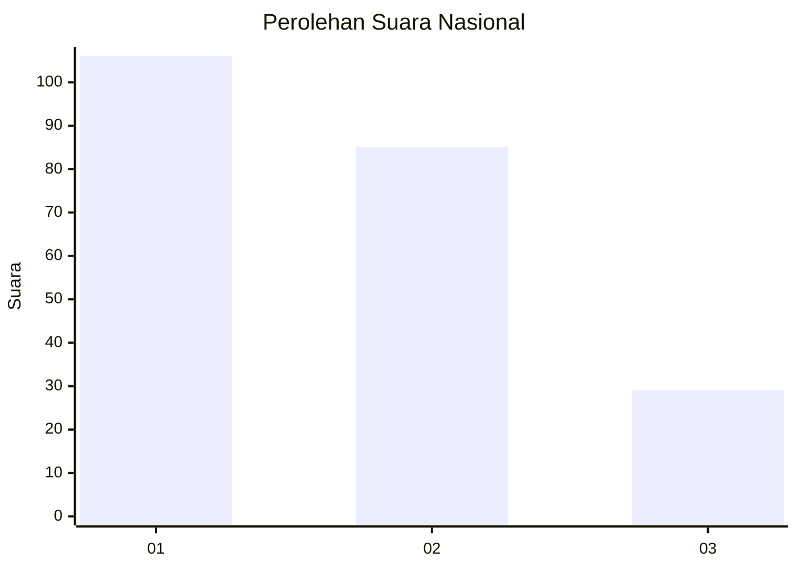
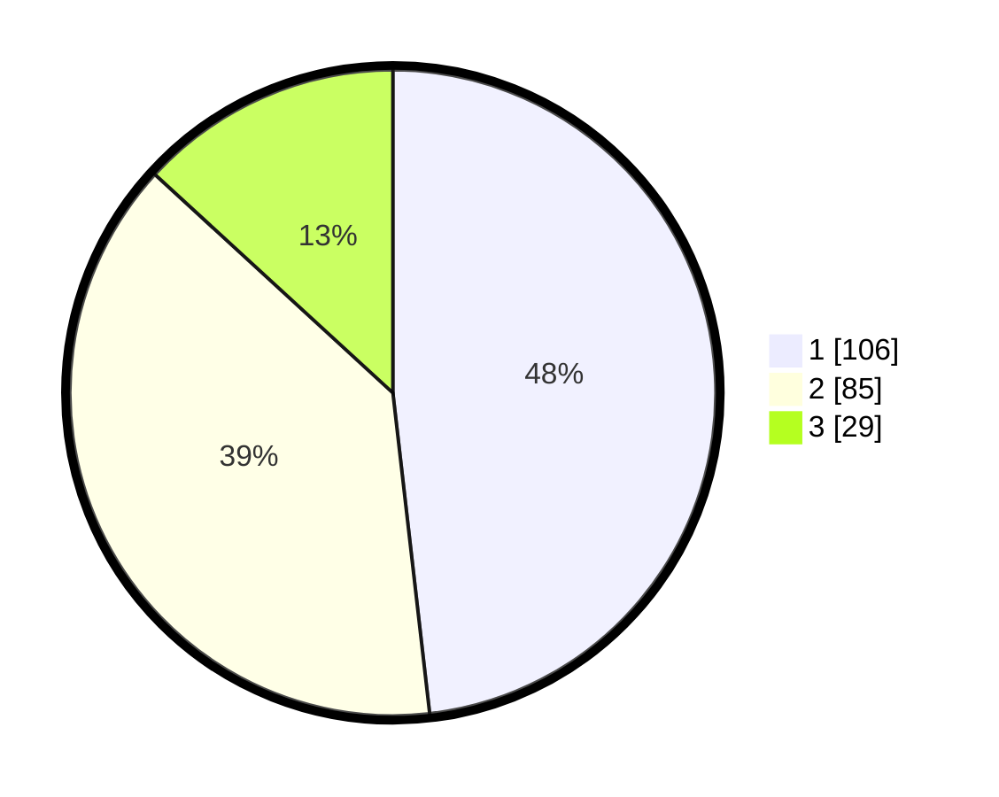

# Hasil

## Grafik

## Tabel

| No.    | Nama Paslon    | Suara | Suara (raw) | Persentase |
|:------ |:-------------- | -----:| -----------:| ----------:|
| 100025 | ANIES MUHAIMIN | 106   | [106][p-1]  | 48,18      |
| 100026 | PRABOWO GIBRAN | 85    | [85][p-2]   | 38,64      |
| 100027 | GANJAR MAHFUD  | 29    | [29][p-3]   | 13,18      |

[p-1]: https://github.com/gigit-pemilu/pemilu-2024/blob/main/pilpres/hitung-suara/sub/31-dki-jakarta/sub/72-jakarta-utara/sub/03-koja/sub/1002-tugu-utara/sub/152-tps/sub/paslon-1.txt
[p-2]: https://github.com/gigit-pemilu/pemilu-2024/blob/main/pilpres/hitung-suara/sub/31-dki-jakarta/sub/72-jakarta-utara/sub/03-koja/sub/1002-tugu-utara/sub/152-tps/sub/paslon-2.txt
[p-3]: https://github.com/gigit-pemilu/pemilu-2024/blob/main/pilpres/hitung-suara/sub/31-dki-jakarta/sub/72-jakarta-utara/sub/03-koja/sub/1002-tugu-utara/sub/152-tps/sub/paslon-3.txt

## Foto C Plano

https://sirekap-obj-formc.kpu.go.id/fd0f/pemilu/ppwp/31/72/03/10/02/3172031002152-20240214-212834--7d13f38e-7ca1-4b44-b4e0-d9b21efd34f2.jpg

https://sirekap-obj-formc.kpu.go.id/fd0f/pemilu/ppwp/31/72/03/10/02/3172031002152-20240214-212913--48fec40d-8772-405a-b71e-56429783197d.jpg

https://sirekap-obj-formc.kpu.go.id/fd0f/pemilu/ppwp/31/72/03/10/02/3172031002152-20240214-212953--b29fc219-781f-4cc7-8f95-89408c7438e1.jpg

## Metadata

| Key        | Value               |
| ---------- | ------------------- |
| Time Stamp | 2024-02-15 12:00:28 |

