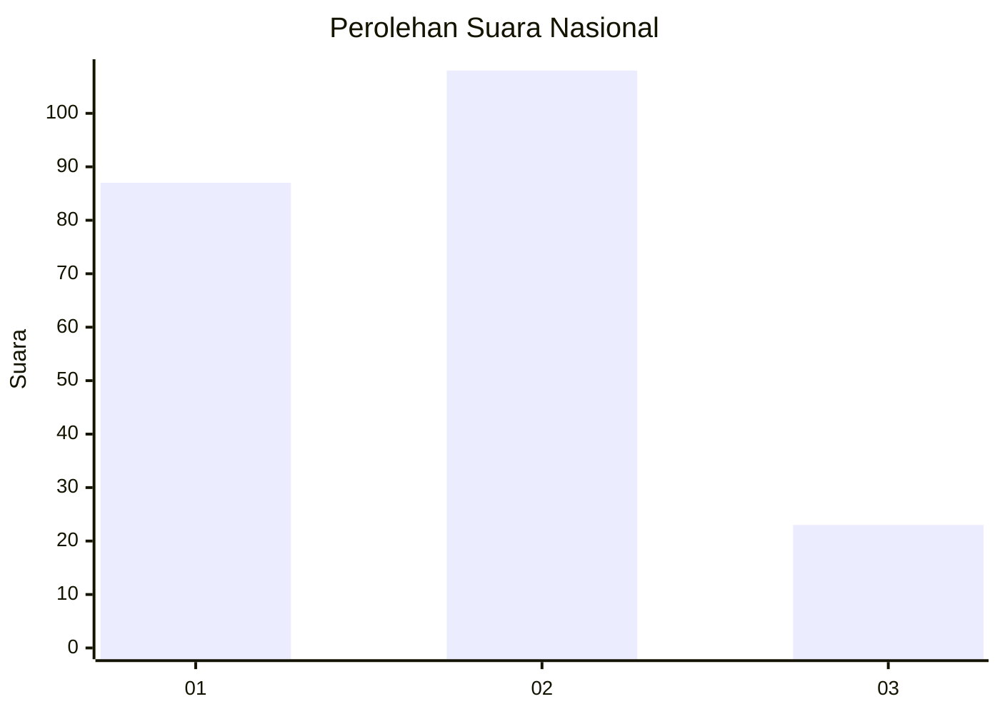
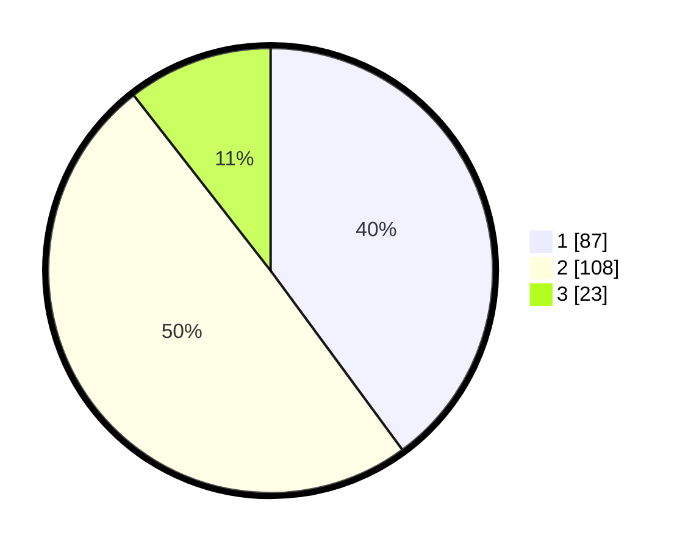

# Hasil

## Grafik

## Tabel

| No.    | Nama Paslon    | Suara | Suara (raw) | Persentase |
|:------ |:-------------- | -----:| -----------:| ----------:|
| 100025 | ANIES MUHAIMIN | 87    | [87][p-1]   | 39,91      |
| 100026 | PRABOWO GIBRAN | 108   | [108][p-2]  | 49,54      |
| 100027 | GANJAR MAHFUD  | 23    | [23][p-3]   | 10,55      |

[p-1]: https://github.com/gigit-pemilu/pemilu-2024/blob/main/pilpres/hitung-suara/sub/31-dki-jakarta/sub/72-jakarta-utara/sub/03-koja/sub/1002-tugu-utara/sub/161-tps/sub/paslon-1.txt
[p-2]: https://github.com/gigit-pemilu/pemilu-2024/blob/main/pilpres/hitung-suara/sub/31-dki-jakarta/sub/72-jakarta-utara/sub/03-koja/sub/1002-tugu-utara/sub/161-tps/sub/paslon-2.txt
[p-3]: https://github.com/gigit-pemilu/pemilu-2024/blob/main/pilpres/hitung-suara/sub/31-dki-jakarta/sub/72-jakarta-utara/sub/03-koja/sub/1002-tugu-utara/sub/161-tps/sub/paslon-3.txt

## Foto C Plano

https://sirekap-obj-formc.kpu.go.id/0bfb/pemilu/ppwp/31/72/03/10/02/3172031002161-20240214-235411--b5e141c3-ac7f-4b81-8906-520d9bb6592f.jpg

https://sirekap-obj-formc.kpu.go.id/0bfb/pemilu/ppwp/31/72/03/10/02/3172031002161-20240215-005903--1e513357-c248-4766-a364-51f67102aa09.jpg

https://sirekap-obj-formc.kpu.go.id/0bfb/pemilu/ppwp/31/72/03/10/02/3172031002161-20240215-010051--217cf6e6-d809-470c-9980-c29debce1de9.jpg

## Metadata

| Key        | Value               |
| ---------- | ------------------- |
| Time Stamp | 2024-02-20 16:00:00 |

