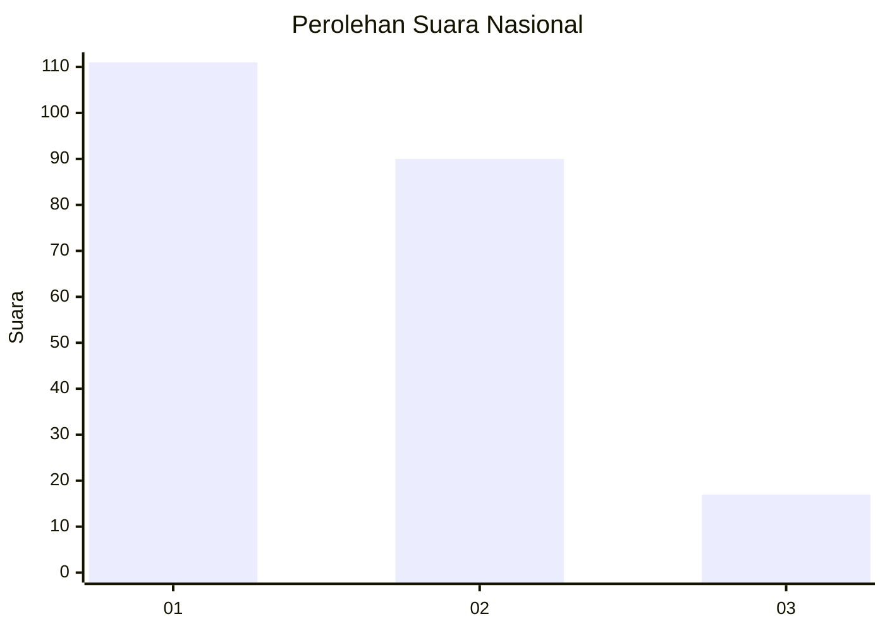
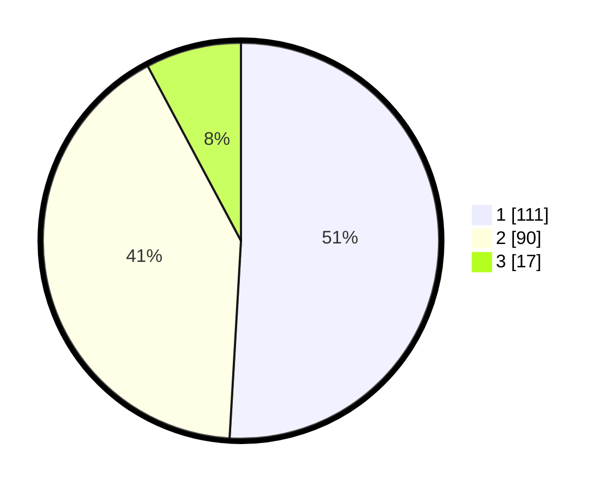

# Hasil

## Grafik

## Tabel

| No.    | Nama Paslon    | Suara | Suara (raw) | Persentase |
|:------ |:-------------- | -----:| -----------:| ----------:|
| 100025 | ANIES MUHAIMIN | 111   | [111][p-1]  | 50,92      |
| 100026 | PRABOWO GIBRAN | 90    | [90][p-2]   | 41,28      |
| 100027 | GANJAR MAHFUD  | 17    | [17][p-3]   | 7,80       |

[p-1]: https://github.com/gigit-pemilu/pemilu-2024/blob/main/pilpres/hitung-suara/sub/31-dki-jakarta/sub/72-jakarta-utara/sub/03-koja/sub/1002-tugu-utara/sub/163-tps/sub/paslon-1.txt
[p-2]: https://github.com/gigit-pemilu/pemilu-2024/blob/main/pilpres/hitung-suara/sub/31-dki-jakarta/sub/72-jakarta-utara/sub/03-koja/sub/1002-tugu-utara/sub/163-tps/sub/paslon-2.txt
[p-3]: https://github.com/gigit-pemilu/pemilu-2024/blob/main/pilpres/hitung-suara/sub/31-dki-jakarta/sub/72-jakarta-utara/sub/03-koja/sub/1002-tugu-utara/sub/163-tps/sub/paslon-3.txt

## Foto C Plano

https://sirekap-obj-formc.kpu.go.id/b73c/pemilu/ppwp/31/72/03/10/02/3172031002163-20240214-230327--4f32b80b-cbbf-4fa8-8db6-44d4ee78e5fd.jpg

https://sirekap-obj-formc.kpu.go.id/b73c/pemilu/ppwp/31/72/03/10/02/3172031002163-20240214-230351--348aa8cf-d769-47c0-b153-dbb3f5ffe99a.jpg

https://sirekap-obj-formc.kpu.go.id/b73c/pemilu/ppwp/31/72/03/10/02/3172031002163-20240214-230509--7d7984d0-57eb-4315-bcaf-034af101de9b.jpg

## Metadata

| Key        | Value               |
| ---------- | ------------------- |
| Time Stamp | 2024-02-20 16:00:00 |

