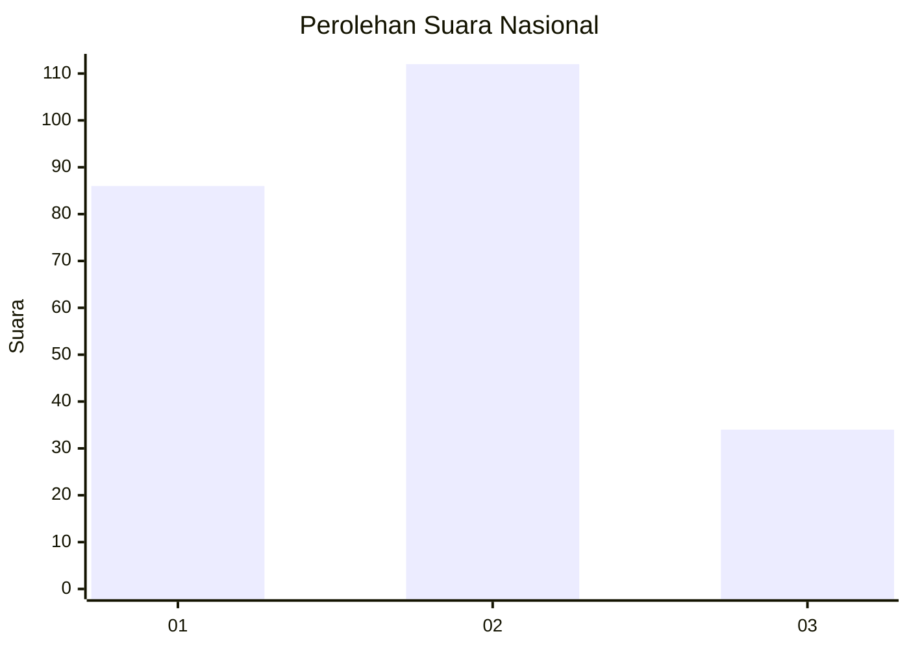
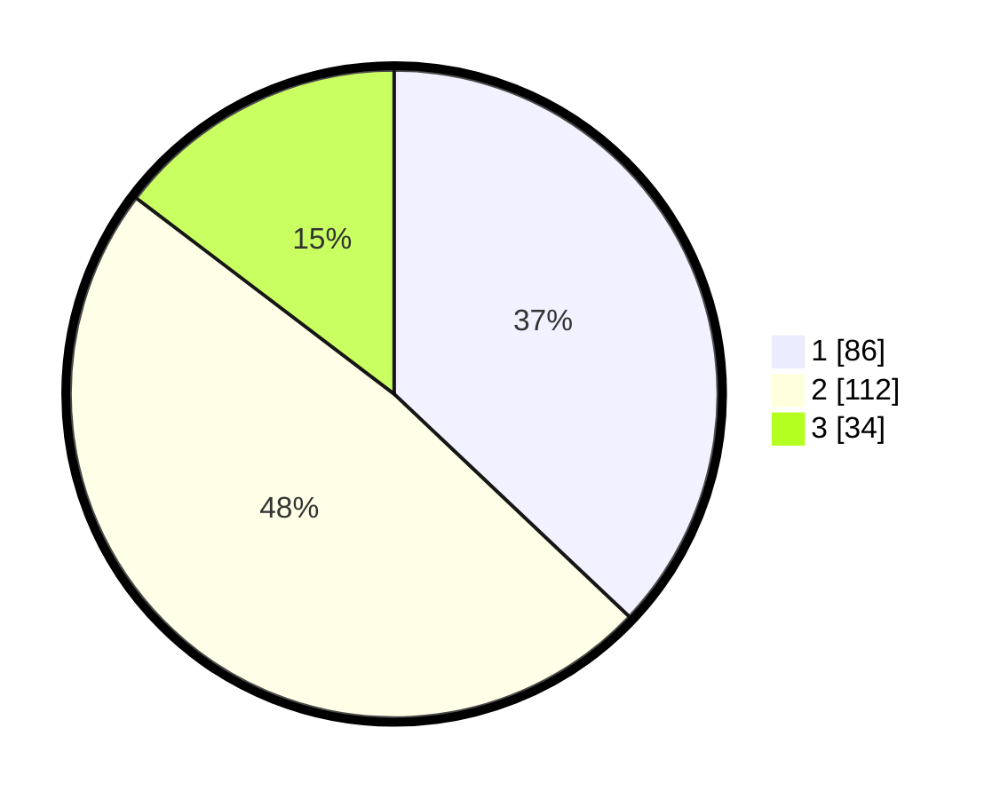

# Hasil

## Grafik

## Tabel

| No.    | Nama Paslon    | Suara | Suara (raw) | Persentase |
|:------ |:-------------- | -----:| -----------:| ----------:|
| 100025 | ANIES MUHAIMIN | 86    | [86][p-1]   | 37,07      |
| 100026 | PRABOWO GIBRAN | 112   | [112][p-2]  | 48,28      |
| 100027 | GANJAR MAHFUD  | 34    | [34][p-3]   | 14,66      |

[p-1]: https://github.com/gigit-pemilu/pemilu-2024/blob/main/pilpres/hitung-suara/sub/31-dki-jakarta/sub/72-jakarta-utara/sub/03-koja/sub/1002-tugu-utara/sub/175-tps/sub/paslon-1.txt
[p-2]: https://github.com/gigit-pemilu/pemilu-2024/blob/main/pilpres/hitung-suara/sub/31-dki-jakarta/sub/72-jakarta-utara/sub/03-koja/sub/1002-tugu-utara/sub/175-tps/sub/paslon-2.txt
[p-3]: https://github.com/gigit-pemilu/pemilu-2024/blob/main/pilpres/hitung-suara/sub/31-dki-jakarta/sub/72-jakarta-utara/sub/03-koja/sub/1002-tugu-utara/sub/175-tps/sub/paslon-3.txt

## Foto C Plano

https://sirekap-obj-formc.kpu.go.id/3b68/pemilu/ppwp/31/72/03/10/02/3172031002175-20240214-225147--1e4a9342-626c-4576-8a6d-cc7f2d391e1b.jpg

https://sirekap-obj-formc.kpu.go.id/3b68/pemilu/ppwp/31/72/03/10/02/3172031002175-20240214-225516--2d632ea2-4eca-4756-86b4-2611fc18b7d1.jpg

https://sirekap-obj-formc.kpu.go.id/3b68/pemilu/ppwp/31/72/03/10/02/3172031002175-20240214-225617--08846c16-10fd-47a6-9eed-0ae6b979a792.jpg

## Metadata

| Key        | Value               |
| ---------- | ------------------- |
| Time Stamp | 2024-02-20 16:00:00 |

