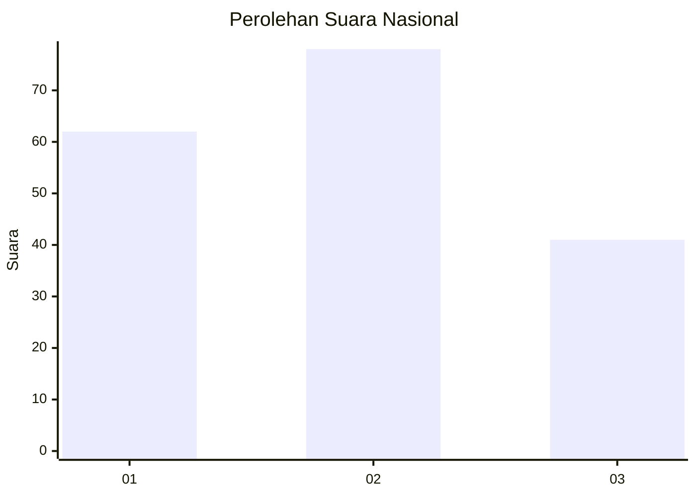
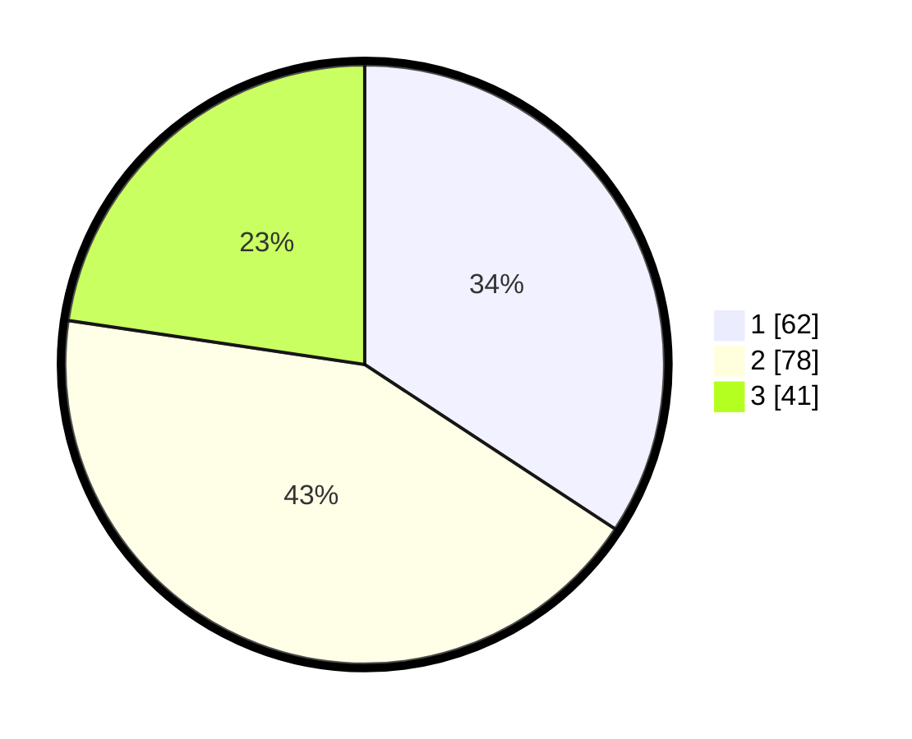

# Hasil

## Grafik

## Tabel

| No.    | Nama Paslon    | Suara | Suara (raw) | Persentase |
|:------ |:-------------- | -----:| -----------:| ----------:|
| 100025 | ANIES MUHAIMIN | 62    | [62][p-1]   | 34,25      |
| 100026 | PRABOWO GIBRAN | 78    | [78][p-2]   | 43,09      |
| 100027 | GANJAR MAHFUD  | 41    | [41][p-3]   | 22,65      |

[p-1]: https://github.com/gigit-pemilu/pemilu-2024/blob/main/pilpres/hitung-suara/sub/31-dki-jakarta/sub/72-jakarta-utara/sub/03-koja/sub/1002-tugu-utara/sub/179-tps/sub/paslon-1.txt
[p-2]: https://github.com/gigit-pemilu/pemilu-2024/blob/main/pilpres/hitung-suara/sub/31-dki-jakarta/sub/72-jakarta-utara/sub/03-koja/sub/1002-tugu-utara/sub/179-tps/sub/paslon-2.txt
[p-3]: https://github.com/gigit-pemilu/pemilu-2024/blob/main/pilpres/hitung-suara/sub/31-dki-jakarta/sub/72-jakarta-utara/sub/03-koja/sub/1002-tugu-utara/sub/179-tps/sub/paslon-3.txt

## Foto C Plano

https://sirekap-obj-formc.kpu.go.id/53f5/pemilu/ppwp/31/72/03/10/02/3172031002179-20240215-022001--2673b298-1386-436a-a3c3-6ec24c6b47a7.jpg

https://sirekap-obj-formc.kpu.go.id/53f5/pemilu/ppwp/31/72/03/10/02/3172031002179-20240215-022119--a1daaf0e-14c8-4fa5-a3fb-717735d1e2f7.jpg

https://sirekap-obj-formc.kpu.go.id/53f5/pemilu/ppwp/31/72/03/10/02/3172031002179-20240215-022236--a2f05104-e22a-4ded-bb70-9226eb08fed1.jpg

## Metadata

| Key        | Value               |
| ---------- | ------------------- |
| Time Stamp | 2024-02-20 16:00:00 |

