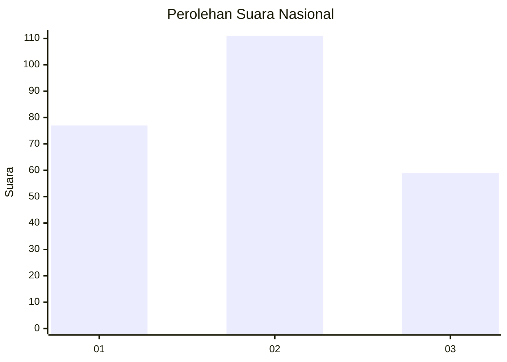
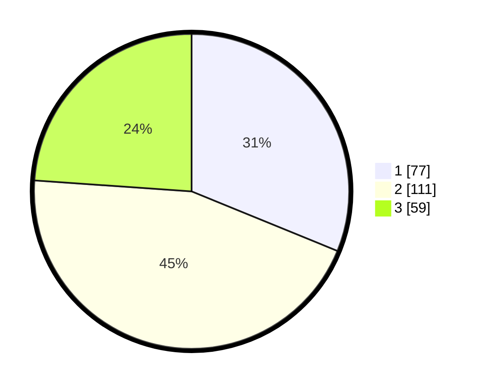

# Hasil

## Grafik

## Tabel

| No.    | Nama Paslon    | Suara | Suara (raw) | Persentase |
|:------ |:-------------- | -----:| -----------:| ----------:|
| 100025 | ANIES MUHAIMIN | 77    | [77][p-1]   | 31,17      |
| 100026 | PRABOWO GIBRAN | 111   | [111][p-2]  | 44,94      |
| 100027 | GANJAR MAHFUD  | 59    | [59][p-3]   | 23,89      |

[p-1]: https://github.com/gigit-pemilu/pemilu-2024/blob/main/pilpres/hitung-suara/sub/31-dki-jakarta/sub/72-jakarta-utara/sub/03-koja/sub/1002-tugu-utara/sub/184-tps/sub/paslon-1.txt
[p-2]: https://github.com/gigit-pemilu/pemilu-2024/blob/main/pilpres/hitung-suara/sub/31-dki-jakarta/sub/72-jakarta-utara/sub/03-koja/sub/1002-tugu-utara/sub/184-tps/sub/paslon-2.txt
[p-3]: https://github.com/gigit-pemilu/pemilu-2024/blob/main/pilpres/hitung-suara/sub/31-dki-jakarta/sub/72-jakarta-utara/sub/03-koja/sub/1002-tugu-utara/sub/184-tps/sub/paslon-3.txt

## Foto C Plano

https://sirekap-obj-formc.kpu.go.id/1dea/pemilu/ppwp/31/72/03/10/02/3172031002184-20240214-155856--bbabeaee-853f-40c7-9d8d-01b0897bb7f3.jpg

https://sirekap-obj-formc.kpu.go.id/1dea/pemilu/ppwp/31/72/03/10/02/3172031002184-20240214-155741--329001b0-d600-4e05-8adc-1a2355942c55.jpg

https://sirekap-obj-formc.kpu.go.id/1dea/pemilu/ppwp/31/72/03/10/02/3172031002184-20240214-155256--d896f458-b643-4002-b123-b6369569582a.jpg

## Metadata

| Key        | Value               |
| ---------- | ------------------- |
| Time Stamp | 2024-02-20 16:00:00 |

