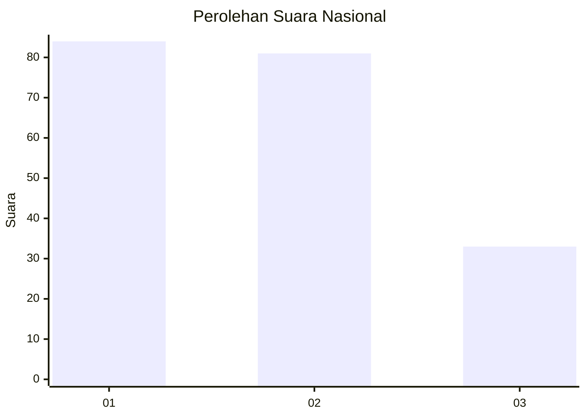
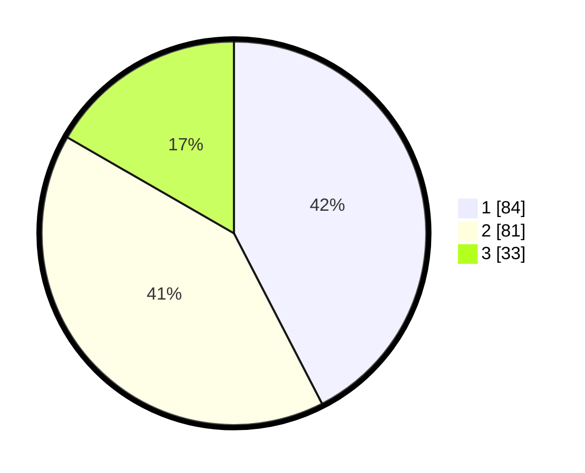

# Hasil

## Grafik

## Tabel

| No.    | Nama Paslon    | Suara | Suara (raw) | Persentase |
|:------ |:-------------- | -----:| -----------:| ----------:|
| 100025 | ANIES MUHAIMIN | 84    | [84][p-1]   | 42,42      |
| 100026 | PRABOWO GIBRAN | 81    | [81][p-2]   | 40,91      |
| 100027 | GANJAR MAHFUD  | 33    | [33][p-3]   | 16,67      |

[p-1]: https://github.com/gigit-pemilu/pemilu-2024/blob/main/pilpres/hitung-suara/sub/31-dki-jakarta/sub/72-jakarta-utara/sub/03-koja/sub/1002-tugu-utara/sub/190-tps/sub/paslon-1.txt
[p-2]: https://github.com/gigit-pemilu/pemilu-2024/blob/main/pilpres/hitung-suara/sub/31-dki-jakarta/sub/72-jakarta-utara/sub/03-koja/sub/1002-tugu-utara/sub/190-tps/sub/paslon-2.txt
[p-3]: https://github.com/gigit-pemilu/pemilu-2024/blob/main/pilpres/hitung-suara/sub/31-dki-jakarta/sub/72-jakarta-utara/sub/03-koja/sub/1002-tugu-utara/sub/190-tps/sub/paslon-3.txt

## Foto C Plano

https://sirekap-obj-formc.kpu.go.id/9088/pemilu/ppwp/31/72/03/10/02/3172031002190-20240214-202330--ec617eb5-0684-4040-8b35-8cc53dd7ab61.jpg

https://sirekap-obj-formc.kpu.go.id/9088/pemilu/ppwp/31/72/03/10/02/3172031002190-20240214-202445--096c804b-cdb8-4cbc-8fb6-27dd210ea676.jpg

https://sirekap-obj-formc.kpu.go.id/9088/pemilu/ppwp/31/72/03/10/02/3172031002190-20240214-202628--3c07e3a5-f5af-487f-b6d7-912deada2ba9.jpg

## Metadata

| Key        | Value               |
| ---------- | ------------------- |
| Time Stamp | 2024-02-20 16:00:00 |

