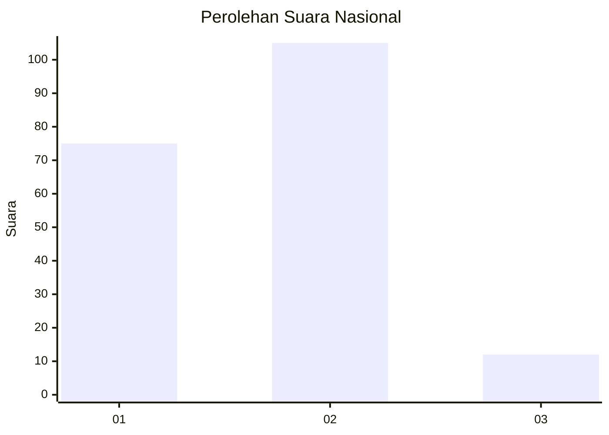

# Hasil

## Grafik

## Tabel

| No.    | Nama Paslon    | Suara | Suara (raw) | Persentase |
|:------ |:-------------- | -----:| -----------:| ----------:|
| 100025 | ANIES MUHAIMIN | 75    | [75][p-1]   | 39,06      |
| 100026 | PRABOWO GIBRAN | 105   | [105][p-2]  | 54,69      |
| 100027 | GANJAR MAHFUD  | 12    | [12][p-3]   | 6,25       |

[p-1]: https://github.com/gigit-pemilu/pemilu-2024/blob/main/pilpres/hitung-suara/sub/31-dki-jakarta/sub/72-jakarta-utara/sub/03-koja/sub/1002-tugu-utara/sub/201-tps/sub/paslon-1.txt
[p-2]: https://github.com/gigit-pemilu/pemilu-2024/blob/main/pilpres/hitung-suara/sub/31-dki-jakarta/sub/72-jakarta-utara/sub/03-koja/sub/1002-tugu-utara/sub/201-tps/sub/paslon-2.txt
[p-3]: https://github.com/gigit-pemilu/pemilu-2024/blob/main/pilpres/hitung-suara/sub/31-dki-jakarta/sub/72-jakarta-utara/sub/03-koja/sub/1002-tugu-utara/sub/201-tps/sub/paslon-3.txt

## Foto C Plano

https://sirekap-obj-formc.kpu.go.id/5b4d/pemilu/ppwp/31/72/03/10/02/3172031002201-20240214-224229--0c2bc2c7-3e76-4b48-949b-a41f641a1fb4.jpg

https://sirekap-obj-formc.kpu.go.id/5b4d/pemilu/ppwp/31/72/03/10/02/3172031002201-20240214-224420--b17fdb42-106d-4fe0-b2fc-34ec96e802e4.jpg

https://sirekap-obj-formc.kpu.go.id/5b4d/pemilu/ppwp/31/72/03/10/02/3172031002201-20240214-224554--1d1f0a8b-3bb2-450d-abe4-0624701dba7c.jpg

## Metadata

| Key        | Value               |
| ---------- | ------------------- |
| Time Stamp | 2024-02-20 15:00:00 |

