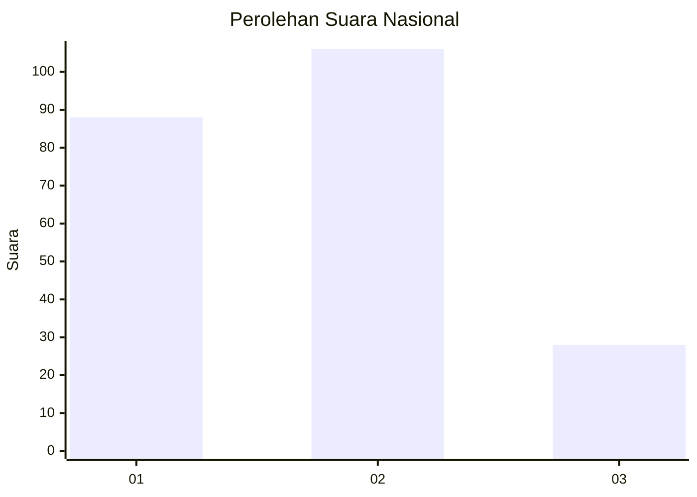
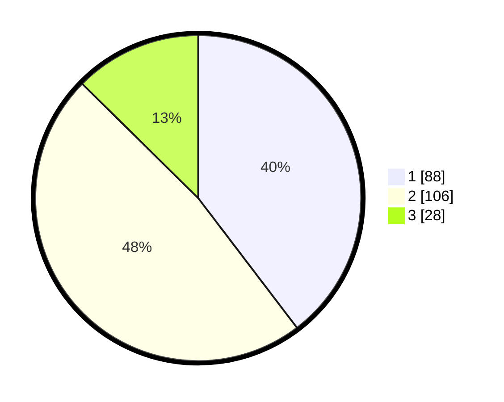

# Hasil

## Grafik

## Tabel

| No.    | Nama Paslon    | Suara | Suara (raw) | Persentase |
|:------ |:-------------- | -----:| -----------:| ----------:|
| 100025 | ANIES MUHAIMIN | 88    | [88][p-1]   | 39,64      |
| 100026 | PRABOWO GIBRAN | 106   | [106][p-2]  | 47,75      |
| 100027 | GANJAR MAHFUD  | 28    | [28][p-3]   | 12,61      |

[p-1]: https://github.com/gigit-pemilu/pemilu-2024/blob/main/pilpres/hitung-suara/sub/31-dki-jakarta/sub/72-jakarta-utara/sub/03-koja/sub/1002-tugu-utara/sub/207-tps/sub/paslon-1.txt
[p-2]: https://github.com/gigit-pemilu/pemilu-2024/blob/main/pilpres/hitung-suara/sub/31-dki-jakarta/sub/72-jakarta-utara/sub/03-koja/sub/1002-tugu-utara/sub/207-tps/sub/paslon-2.txt
[p-3]: https://github.com/gigit-pemilu/pemilu-2024/blob/main/pilpres/hitung-suara/sub/31-dki-jakarta/sub/72-jakarta-utara/sub/03-koja/sub/1002-tugu-utara/sub/207-tps/sub/paslon-3.txt

## Foto C Plano

https://sirekap-obj-formc.kpu.go.id/6c2a/pemilu/ppwp/31/72/03/10/02/3172031002207-20240215-020728--be58098e-dbfb-45da-afbc-406703f68af5.jpg

https://sirekap-obj-formc.kpu.go.id/6c2a/pemilu/ppwp/31/72/03/10/02/3172031002207-20240215-022625--7316a867-33db-4e44-bdc8-b33345f12f55.jpg

https://sirekap-obj-formc.kpu.go.id/6c2a/pemilu/ppwp/31/72/03/10/02/3172031002207-20240215-023034--e427743d-c765-4a0c-9a9b-7f7d68538d07.jpg

## Metadata

| Key        | Value               |
| ---------- | ------------------- |
| Time Stamp | 2024-02-20 16:00:00 |

