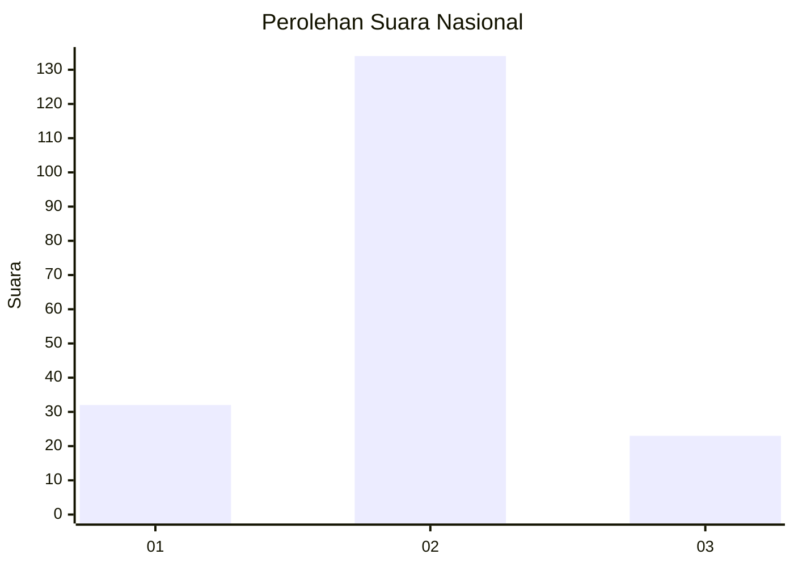
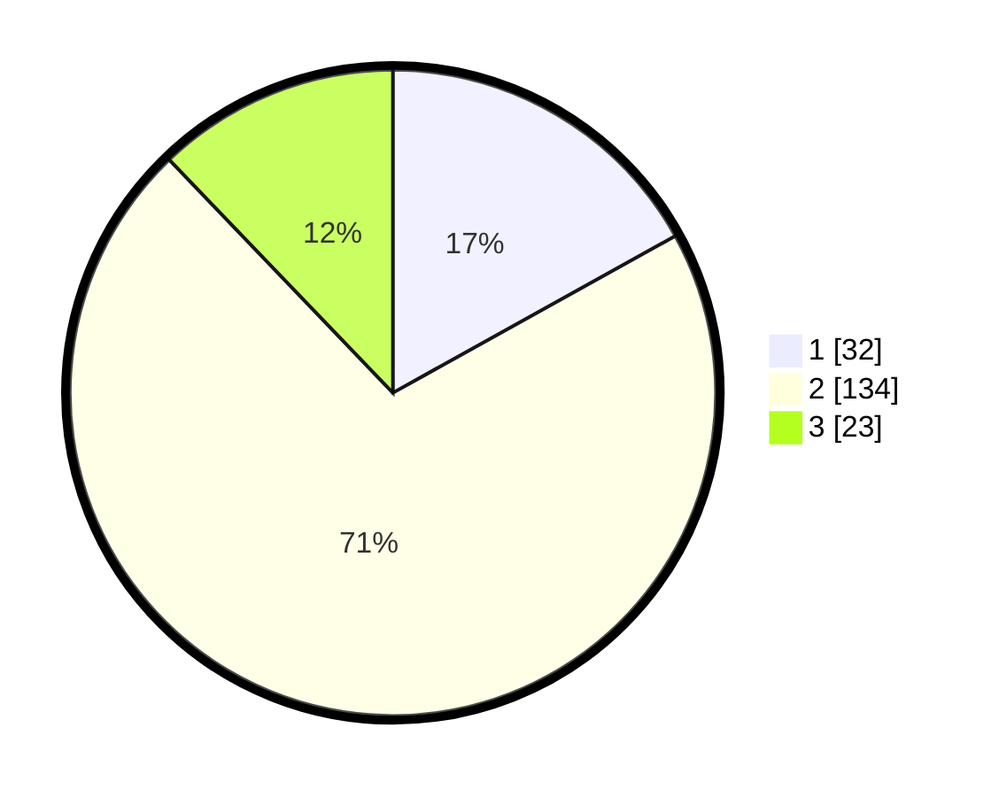

# Hasil

## Grafik

## Tabel

| No.    | Nama Paslon    | Suara | Suara (raw) | Persentase |
|:------ |:-------------- | -----:| -----------:| ----------:|
| 100025 | ANIES MUHAIMIN | 32    | [32][p-1]   | 16,93      |
| 100026 | PRABOWO GIBRAN | 134   | [134][p-2]  | 70,90      |
| 100027 | GANJAR MAHFUD  | 23    | [23][p-3]   | 12,17      |

[p-1]: https://github.com/gigit-pemilu/pemilu-2024/blob/main/pilpres/hitung-suara/sub/31-dki-jakarta/sub/72-jakarta-utara/sub/03-koja/sub/1002-tugu-utara/sub/212-tps/sub/paslon-1.txt
[p-2]: https://github.com/gigit-pemilu/pemilu-2024/blob/main/pilpres/hitung-suara/sub/31-dki-jakarta/sub/72-jakarta-utara/sub/03-koja/sub/1002-tugu-utara/sub/212-tps/sub/paslon-2.txt
[p-3]: https://github.com/gigit-pemilu/pemilu-2024/blob/main/pilpres/hitung-suara/sub/31-dki-jakarta/sub/72-jakarta-utara/sub/03-koja/sub/1002-tugu-utara/sub/212-tps/sub/paslon-3.txt

## Foto C Plano

https://sirekap-obj-formc.kpu.go.id/5e29/pemilu/ppwp/31/72/03/10/02/3172031002212-20240215-162610--d4434d58-dce4-464d-a898-b4fdf75762f1.jpg

https://sirekap-obj-formc.kpu.go.id/5e29/pemilu/ppwp/31/72/03/10/02/3172031002212-20240214-195527--6b2f961c-7002-4a2f-a970-3a8b8c6d4d94.jpg

https://sirekap-obj-formc.kpu.go.id/5e29/pemilu/ppwp/31/72/03/10/02/3172031002212-20240214-195650--b5cd6248-7d95-4036-87bd-1157f1d18445.jpg

## Metadata

| Key        | Value               |
| ---------- | ------------------- |
| Time Stamp | 2024-02-15 16:30:25 |

