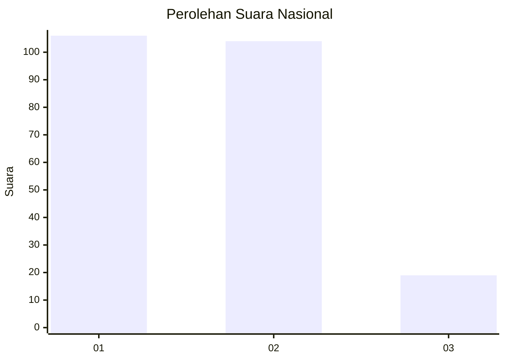
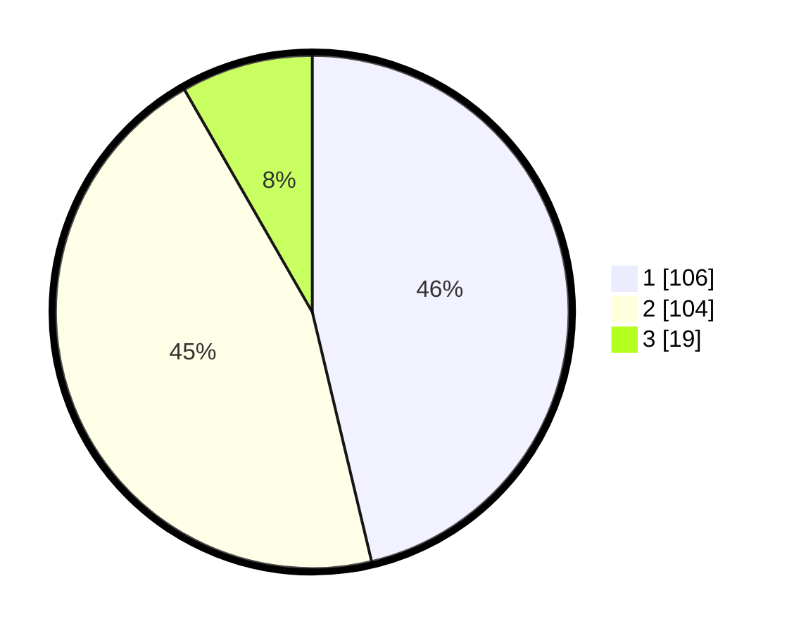

# Hasil

## Grafik

## Tabel

| No.    | Nama Paslon    | Suara | Suara (raw) | Persentase |
|:------ |:-------------- | -----:| -----------:| ----------:|
| 100025 | ANIES MUHAIMIN | 106   | [106][p-1]  | 46,29      |
| 100026 | PRABOWO GIBRAN | 104   | [104][p-2]  | 45,41      |
| 100027 | GANJAR MAHFUD  | 19    | [19][p-3]   | 8,30       |

[p-1]: https://github.com/gigit-pemilu/pemilu-2024/blob/main/pilpres/hitung-suara/sub/31-dki-jakarta/sub/72-jakarta-utara/sub/03-koja/sub/1003-lagoa/sub/010-tps/sub/paslon-1.txt
[p-2]: https://github.com/gigit-pemilu/pemilu-2024/blob/main/pilpres/hitung-suara/sub/31-dki-jakarta/sub/72-jakarta-utara/sub/03-koja/sub/1003-lagoa/sub/010-tps/sub/paslon-2.txt
[p-3]: https://github.com/gigit-pemilu/pemilu-2024/blob/main/pilpres/hitung-suara/sub/31-dki-jakarta/sub/72-jakarta-utara/sub/03-koja/sub/1003-lagoa/sub/010-tps/sub/paslon-3.txt

## Foto C Plano

https://sirekap-obj-formc.kpu.go.id/0eb7/pemilu/ppwp/31/72/03/10/03/3172031003010-20240214-221202--c723efd6-b0c1-423e-9906-e6c01248c159.jpg

https://sirekap-obj-formc.kpu.go.id/0eb7/pemilu/ppwp/31/72/03/10/03/3172031003010-20240214-221016--cbba15d5-8342-4714-bbb5-b5b08bf2644f.jpg

https://sirekap-obj-formc.kpu.go.id/0eb7/pemilu/ppwp/31/72/03/10/03/3172031003010-20240214-221314--06930f14-4810-401c-a1bb-d8118698586b.jpg

## Metadata

| Key        | Value               |
| ---------- | ------------------- |
| Time Stamp | 2024-02-16 14:00:34 |

