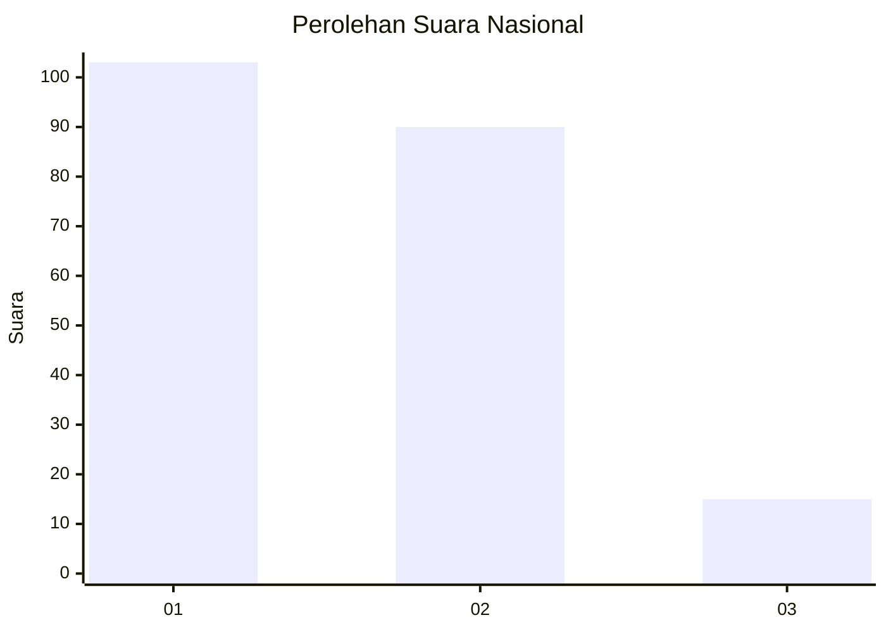
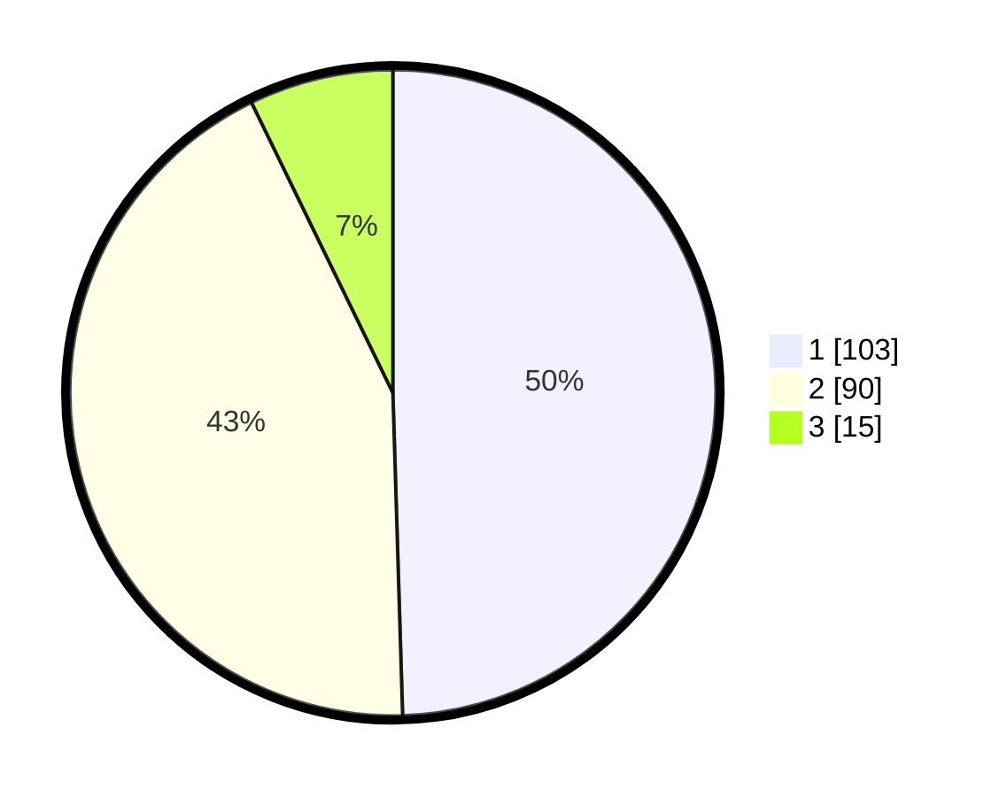

# Hasil

## Grafik

## Tabel

| No.    | Nama Paslon    | Suara | Suara (raw) | Persentase |
|:------ |:-------------- | -----:| -----------:| ----------:|
| 100025 | ANIES MUHAIMIN | 103   | [103][p-1]  | 49,52      |
| 100026 | PRABOWO GIBRAN | 90    | [90][p-2]   | 43,27      |
| 100027 | GANJAR MAHFUD  | 15    | [15][p-3]   | 7,21       |

[p-1]: https://github.com/gigit-pemilu/pemilu-2024/blob/main/pilpres/hitung-suara/sub/31-dki-jakarta/sub/72-jakarta-utara/sub/03-koja/sub/1003-lagoa/sub/011-tps/sub/paslon-1.txt
[p-2]: https://github.com/gigit-pemilu/pemilu-2024/blob/main/pilpres/hitung-suara/sub/31-dki-jakarta/sub/72-jakarta-utara/sub/03-koja/sub/1003-lagoa/sub/011-tps/sub/paslon-2.txt
[p-3]: https://github.com/gigit-pemilu/pemilu-2024/blob/main/pilpres/hitung-suara/sub/31-dki-jakarta/sub/72-jakarta-utara/sub/03-koja/sub/1003-lagoa/sub/011-tps/sub/paslon-3.txt

## Foto C Plano

https://sirekap-obj-formc.kpu.go.id/ac7e/pemilu/ppwp/31/72/03/10/03/3172031003011-20240214-221031--9a1e7386-5413-4d42-8dfa-4697a9473b1c.jpg

https://sirekap-obj-formc.kpu.go.id/ac7e/pemilu/ppwp/31/72/03/10/03/3172031003011-20240214-221211--f3067d77-86eb-4b07-9264-b066605d5ca6.jpg

https://sirekap-obj-formc.kpu.go.id/ac7e/pemilu/ppwp/31/72/03/10/03/3172031003011-20240214-221517--9047191a-29ec-473e-b7b4-8a5067e9343a.jpg

## Metadata

| Key        | Value               |
| ---------- | ------------------- |
| Time Stamp | 2024-02-16 14:00:34 |

