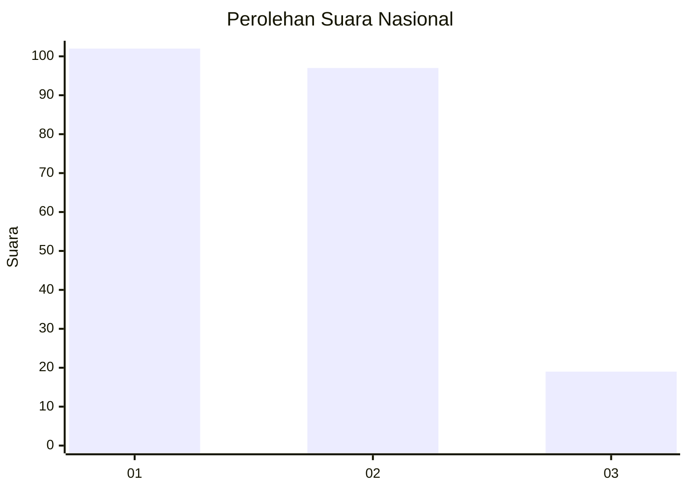
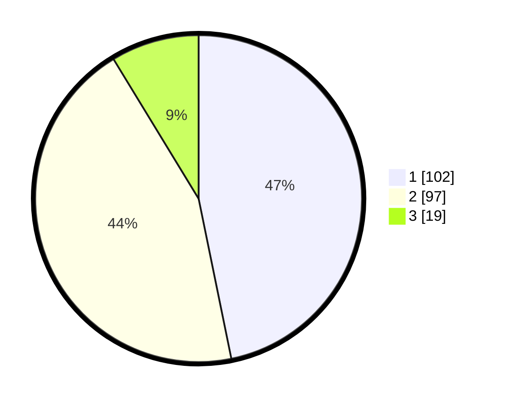

# Hasil

## Grafik

## Tabel

| No.    | Nama Paslon    | Suara | Suara (raw) | Persentase |
|:------ |:-------------- | -----:| -----------:| ----------:|
| 100025 | ANIES MUHAIMIN | 102   | [102][p-1]  | 46,79      |
| 100026 | PRABOWO GIBRAN | 97    | [97][p-2]   | 44,50      |
| 100027 | GANJAR MAHFUD  | 19    | [19][p-3]   | 8,72       |

[p-1]: https://github.com/gigit-pemilu/pemilu-2024/blob/main/pilpres/hitung-suara/sub/31-dki-jakarta/sub/72-jakarta-utara/sub/03-koja/sub/1003-lagoa/sub/014-tps/sub/paslon-1.txt
[p-2]: https://github.com/gigit-pemilu/pemilu-2024/blob/main/pilpres/hitung-suara/sub/31-dki-jakarta/sub/72-jakarta-utara/sub/03-koja/sub/1003-lagoa/sub/014-tps/sub/paslon-2.txt
[p-3]: https://github.com/gigit-pemilu/pemilu-2024/blob/main/pilpres/hitung-suara/sub/31-dki-jakarta/sub/72-jakarta-utara/sub/03-koja/sub/1003-lagoa/sub/014-tps/sub/paslon-3.txt

## Foto C Plano

https://sirekap-obj-formc.kpu.go.id/ed3b/pemilu/ppwp/31/72/03/10/03/3172031003014-20240215-025500--a74bb67e-808c-4f8f-a6c0-7789c78dc3c1.jpg

https://sirekap-obj-formc.kpu.go.id/ed3b/pemilu/ppwp/31/72/03/10/03/3172031003014-20240215-025545--2f4e855b-bf9d-4463-9a22-3051e704d194.jpg

https://sirekap-obj-formc.kpu.go.id/ed3b/pemilu/ppwp/31/72/03/10/03/3172031003014-20240215-025620--0c198483-663d-4d12-b7d0-97160ba4a098.jpg

## Metadata

| Key        | Value               |
| ---------- | ------------------- |
| Time Stamp | 2024-02-16 14:30:33 |

