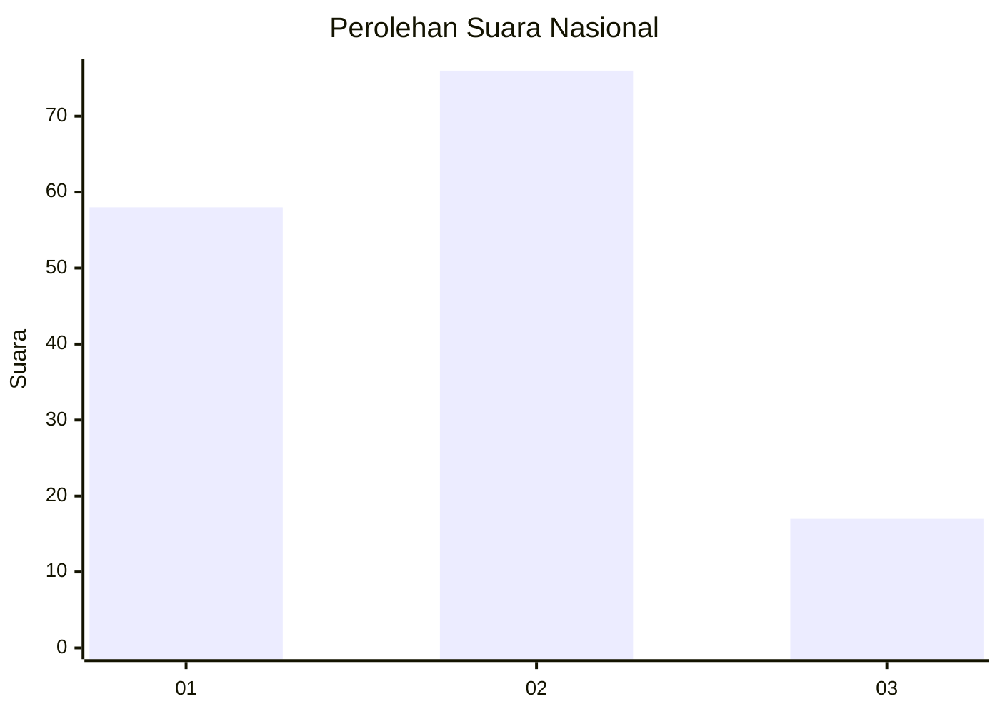
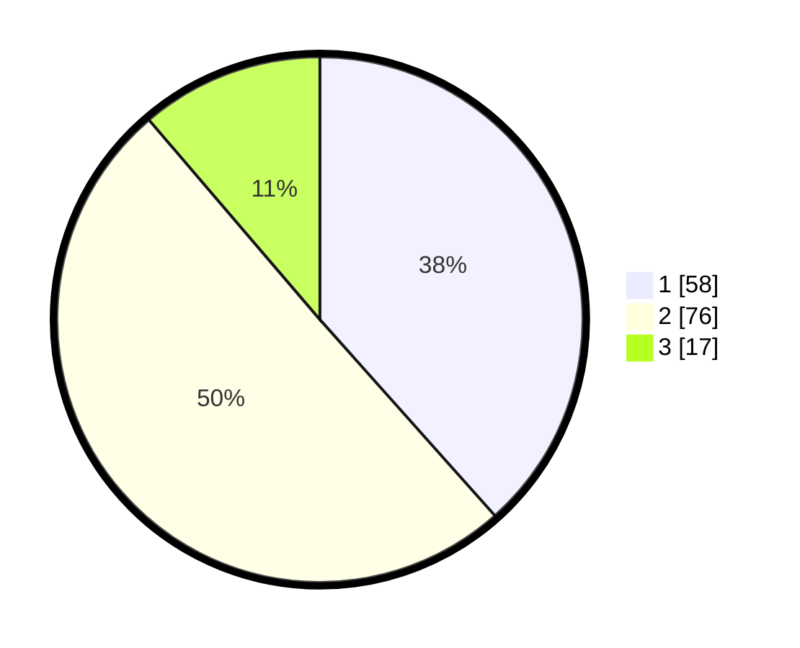

# Hasil

## Grafik

## Tabel

| No.    | Nama Paslon    | Suara | Suara (raw) | Persentase |
|:------ |:-------------- | -----:| -----------:| ----------:|
| 100025 | ANIES MUHAIMIN | 58    | [58][p-1]   | 38,41      |
| 100026 | PRABOWO GIBRAN | 76    | [76][p-2]   | 50,33      |
| 100027 | GANJAR MAHFUD  | 17    | [17][p-3]   | 11,26      |

[p-1]: https://github.com/gigit-pemilu/pemilu-2024/blob/main/pilpres/hitung-suara/sub/31-dki-jakarta/sub/72-jakarta-utara/sub/03-koja/sub/1003-lagoa/sub/038-tps/sub/paslon-1.txt
[p-2]: https://github.com/gigit-pemilu/pemilu-2024/blob/main/pilpres/hitung-suara/sub/31-dki-jakarta/sub/72-jakarta-utara/sub/03-koja/sub/1003-lagoa/sub/038-tps/sub/paslon-2.txt
[p-3]: https://github.com/gigit-pemilu/pemilu-2024/blob/main/pilpres/hitung-suara/sub/31-dki-jakarta/sub/72-jakarta-utara/sub/03-koja/sub/1003-lagoa/sub/038-tps/sub/paslon-3.txt

## Foto C Plano

https://sirekap-obj-formc.kpu.go.id/f53e/pemilu/ppwp/31/72/03/10/03/3172031003038-20240215-191457--ed50bbf7-4816-4486-a2f0-78526066ec38.jpg

https://sirekap-obj-formc.kpu.go.id/f53e/pemilu/ppwp/31/72/03/10/03/3172031003038-20240215-191658--23e213f2-7215-496d-ab7f-fd9b9ba4eaf2.jpg

https://sirekap-obj-formc.kpu.go.id/f53e/pemilu/ppwp/31/72/03/10/03/3172031003038-20240215-191904--14504d77-b955-4fb1-aae3-73da0fc03c78.jpg

## Metadata

| Key        | Value               |
| ---------- | ------------------- |
| Time Stamp | 2024-02-20 16:00:00 |

