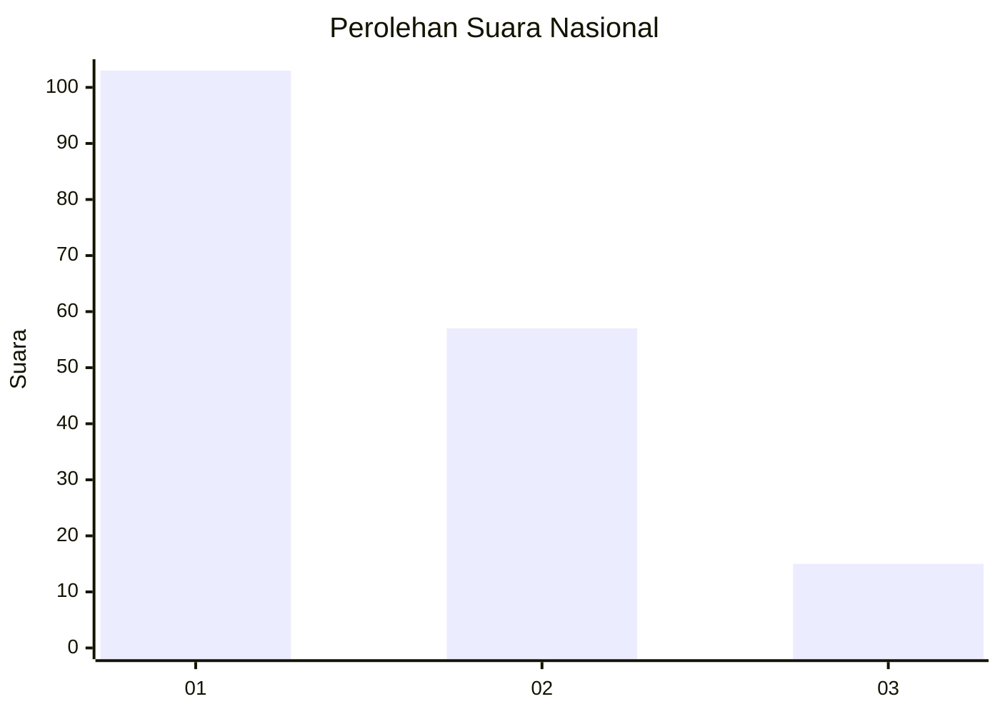
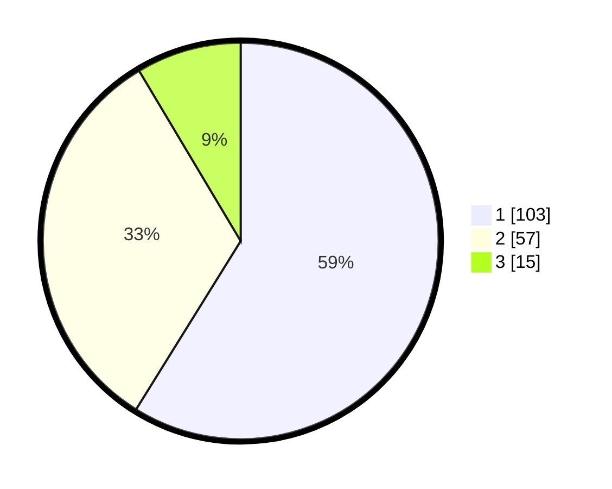

# Hasil

## Grafik

## Tabel

| No.    | Nama Paslon    | Suara | Suara (raw) | Persentase |
|:------ |:-------------- | -----:| -----------:| ----------:|
| 100025 | ANIES MUHAIMIN | 103   | [103][p-1]  | 58,86      |
| 100026 | PRABOWO GIBRAN | 57    | [57][p-2]   | 32,57      |
| 100027 | GANJAR MAHFUD  | 15    | [15][p-3]   | 8,57       |

[p-1]: https://github.com/gigit-pemilu/pemilu-2024/blob/main/pilpres/hitung-suara/sub/31-dki-jakarta/sub/72-jakarta-utara/sub/03-koja/sub/1003-lagoa/sub/057-tps/sub/paslon-1.txt
[p-2]: https://github.com/gigit-pemilu/pemilu-2024/blob/main/pilpres/hitung-suara/sub/31-dki-jakarta/sub/72-jakarta-utara/sub/03-koja/sub/1003-lagoa/sub/057-tps/sub/paslon-2.txt
[p-3]: https://github.com/gigit-pemilu/pemilu-2024/blob/main/pilpres/hitung-suara/sub/31-dki-jakarta/sub/72-jakarta-utara/sub/03-koja/sub/1003-lagoa/sub/057-tps/sub/paslon-3.txt

## Foto C Plano

https://sirekap-obj-formc.kpu.go.id/2db5/pemilu/ppwp/31/72/03/10/03/3172031003057-20240214-195255--e0cb9608-8f61-4ec2-a06e-c3f5f7c26b04.jpg

https://sirekap-obj-formc.kpu.go.id/2db5/pemilu/ppwp/31/72/03/10/03/3172031003057-20240214-193414--782186ae-a235-46f4-8a31-f60706b4a012.jpg

https://sirekap-obj-formc.kpu.go.id/2db5/pemilu/ppwp/31/72/03/10/03/3172031003057-20240214-195445--b630d601-863d-4f9b-8fe3-d115ce8e59bb.jpg

## Metadata

| Key        | Value               |
| ---------- | ------------------- |
| Time Stamp | 2024-02-14 21:46:01 |

