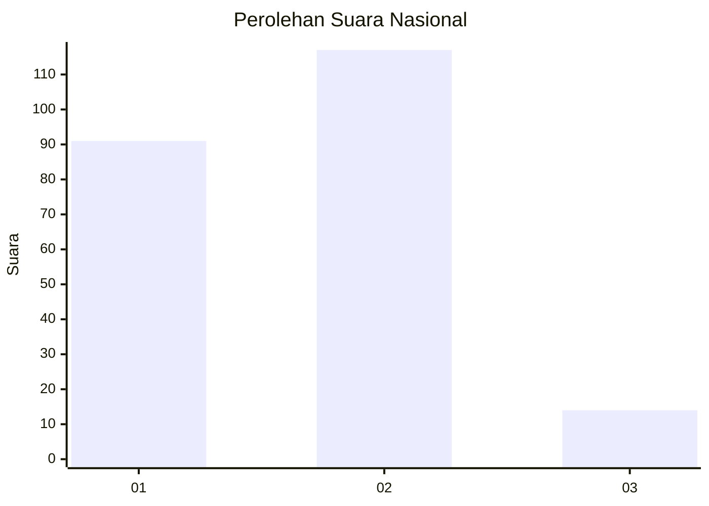

# Hasil

## Grafik

## Tabel

| No.    | Nama Paslon    | Suara | Suara (raw) | Persentase |
|:------ |:-------------- | -----:| -----------:| ----------:|
| 100025 | ANIES MUHAIMIN | 91    | [91][p-1]   | 40,99      |
| 100026 | PRABOWO GIBRAN | 117   | [117][p-2]  | 52,70      |
| 100027 | GANJAR MAHFUD  | 14    | [14][p-3]   | 6,31       |

[p-1]: https://github.com/gigit-pemilu/pemilu-2024/blob/main/pilpres/hitung-suara/sub/31-dki-jakarta/sub/72-jakarta-utara/sub/03-koja/sub/1003-lagoa/sub/065-tps/sub/paslon-1.txt
[p-2]: https://github.com/gigit-pemilu/pemilu-2024/blob/main/pilpres/hitung-suara/sub/31-dki-jakarta/sub/72-jakarta-utara/sub/03-koja/sub/1003-lagoa/sub/065-tps/sub/paslon-2.txt
[p-3]: https://github.com/gigit-pemilu/pemilu-2024/blob/main/pilpres/hitung-suara/sub/31-dki-jakarta/sub/72-jakarta-utara/sub/03-koja/sub/1003-lagoa/sub/065-tps/sub/paslon-3.txt

## Foto C Plano

https://sirekap-obj-formc.kpu.go.id/e4cc/pemilu/ppwp/31/72/03/10/03/3172031003065-20240214-235009--c90cabaf-5d6a-4a34-bb23-5650f05d5829.jpg

https://sirekap-obj-formc.kpu.go.id/e4cc/pemilu/ppwp/31/72/03/10/03/3172031003065-20240214-235113--3c48e693-05e9-43e6-9531-8ed6ec9d5f4b.jpg

https://sirekap-obj-formc.kpu.go.id/e4cc/pemilu/ppwp/31/72/03/10/03/3172031003065-20240214-235225--d4b28022-d165-4889-ae8f-938ce3d443d9.jpg

## Metadata

| Key        | Value               |
| ---------- | ------------------- |
| Time Stamp | 2024-02-20 16:00:00 |

