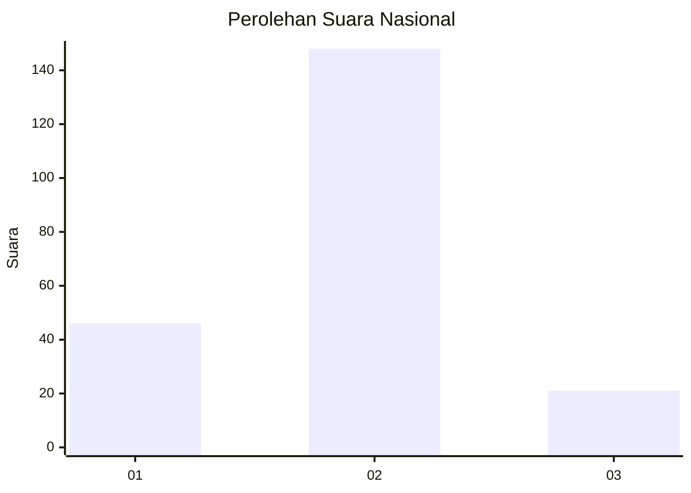

# Hasil

## Grafik

## Tabel

| No.    | Nama Paslon    | Suara | Suara (raw) | Persentase |
|:------ |:-------------- | -----:| -----------:| ----------:|
| 100025 | ANIES MUHAIMIN | 46    | [46][p-1]   | 21,40      |
| 100026 | PRABOWO GIBRAN | 148   | [148][p-2]  | 68,84      |
| 100027 | GANJAR MAHFUD  | 21    | [21][p-3]   | 9,77       |

[p-1]: https://github.com/gigit-pemilu/pemilu-2024/blob/main/pilpres/hitung-suara/sub/31-dki-jakarta/sub/72-jakarta-utara/sub/03-koja/sub/1003-lagoa/sub/078-tps/sub/paslon-1.txt
[p-2]: https://github.com/gigit-pemilu/pemilu-2024/blob/main/pilpres/hitung-suara/sub/31-dki-jakarta/sub/72-jakarta-utara/sub/03-koja/sub/1003-lagoa/sub/078-tps/sub/paslon-2.txt
[p-3]: https://github.com/gigit-pemilu/pemilu-2024/blob/main/pilpres/hitung-suara/sub/31-dki-jakarta/sub/72-jakarta-utara/sub/03-koja/sub/1003-lagoa/sub/078-tps/sub/paslon-3.txt

## Foto C Plano

https://sirekap-obj-formc.kpu.go.id/4291/pemilu/ppwp/31/72/03/10/03/3172031003078-20240215-020519--04c30f3d-6dc0-4cc5-b3fa-03d428a1350d.jpg

https://sirekap-obj-formc.kpu.go.id/4291/pemilu/ppwp/31/72/03/10/03/3172031003078-20240215-020619--c014c6a0-01c3-4b26-96c6-3fea259deed2.jpg

https://sirekap-obj-formc.kpu.go.id/4291/pemilu/ppwp/31/72/03/10/03/3172031003078-20240215-020723--a183cff9-0974-41d3-8ea3-5674718a1537.jpg

## Metadata

| Key        | Value               |
| ---------- | ------------------- |
| Time Stamp | 2024-02-20 17:00:00 |

