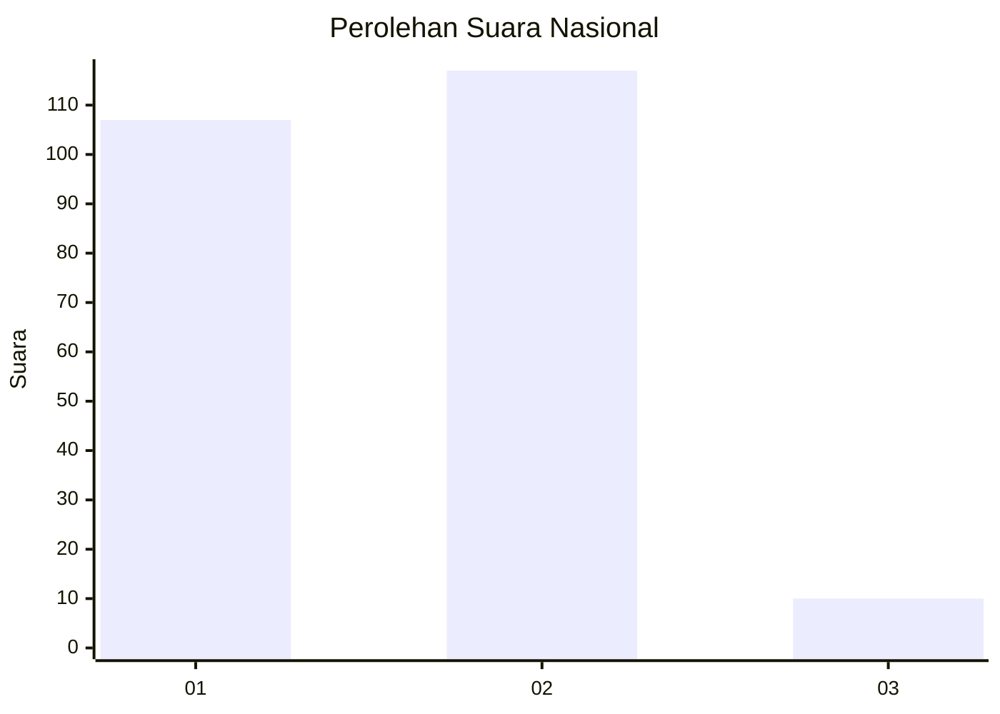
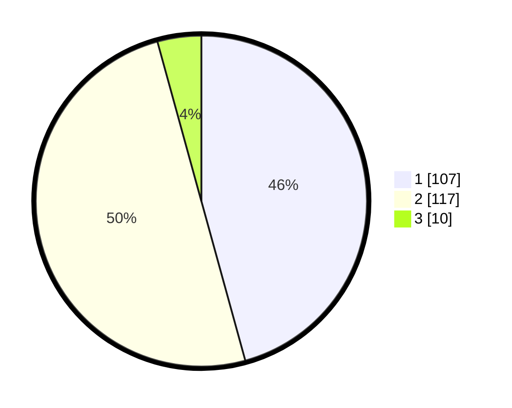

# Hasil

## Grafik

## Tabel

| No.    | Nama Paslon    | Suara | Suara (raw) | Persentase |
|:------ |:-------------- | -----:| -----------:| ----------:|
| 100025 | ANIES MUHAIMIN | 107   | [107][p-1]  | 45,73      |
| 100026 | PRABOWO GIBRAN | 117   | [117][p-2]  | 50,00      |
| 100027 | GANJAR MAHFUD  | 10    | [10][p-3]   | 4,27       |

[p-1]: https://github.com/gigit-pemilu/pemilu-2024/blob/main/pilpres/hitung-suara/sub/31-dki-jakarta/sub/72-jakarta-utara/sub/03-koja/sub/1003-lagoa/sub/093-tps/sub/paslon-1.txt
[p-2]: https://github.com/gigit-pemilu/pemilu-2024/blob/main/pilpres/hitung-suara/sub/31-dki-jakarta/sub/72-jakarta-utara/sub/03-koja/sub/1003-lagoa/sub/093-tps/sub/paslon-2.txt
[p-3]: https://github.com/gigit-pemilu/pemilu-2024/blob/main/pilpres/hitung-suara/sub/31-dki-jakarta/sub/72-jakarta-utara/sub/03-koja/sub/1003-lagoa/sub/093-tps/sub/paslon-3.txt

## Foto C Plano

https://sirekap-obj-formc.kpu.go.id/8c0a/pemilu/ppwp/31/72/03/10/03/3172031003093-20240214-203750--bb1ad893-754b-4355-8207-a744748cfb1f.jpg

https://sirekap-obj-formc.kpu.go.id/8c0a/pemilu/ppwp/31/72/03/10/03/3172031003093-20240214-203928--2efc933f-d4bb-4cad-925b-c5f2cb4f5c2d.jpg

https://sirekap-obj-formc.kpu.go.id/8c0a/pemilu/ppwp/31/72/03/10/03/3172031003093-20240214-205613--21373283-cbf1-4b72-a0f0-27dd2ae5e893.jpg

## Metadata

| Key        | Value               |
| ---------- | ------------------- |
| Time Stamp | 2024-02-20 17:00:00 |

