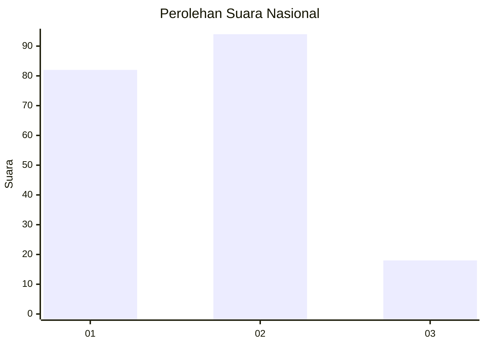
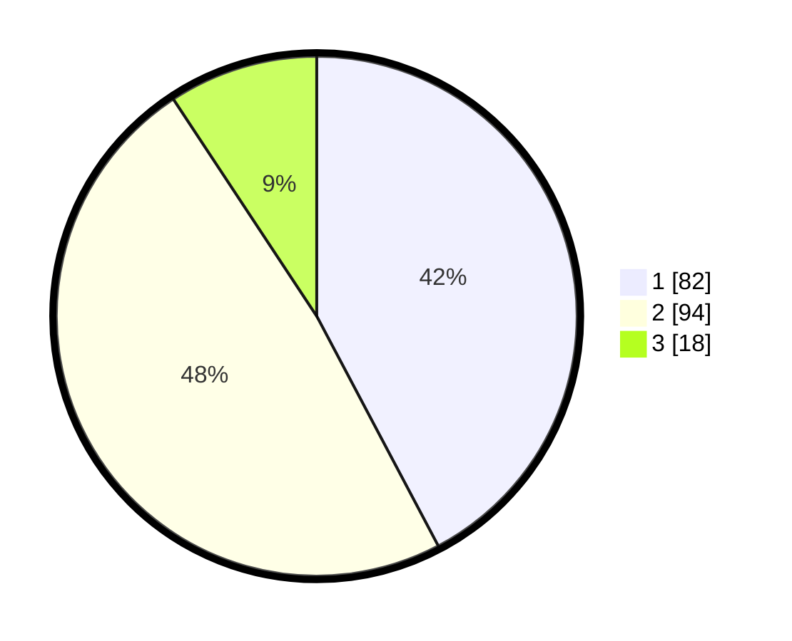

# Hasil

## Grafik

## Tabel

| No.    | Nama Paslon    | Suara | Suara (raw) | Persentase |
|:------ |:-------------- | -----:| -----------:| ----------:|
| 100025 | ANIES MUHAIMIN | 82    | [82][p-1]   | 42,27      |
| 100026 | PRABOWO GIBRAN | 94    | [94][p-2]   | 48,45      |
| 100027 | GANJAR MAHFUD  | 18    | [18][p-3]   | 9,28       |

[p-1]: https://github.com/gigit-pemilu/pemilu-2024/blob/main/pilpres/hitung-suara/sub/31-dki-jakarta/sub/72-jakarta-utara/sub/03-koja/sub/1003-lagoa/sub/103-tps/sub/paslon-1.txt
[p-2]: https://github.com/gigit-pemilu/pemilu-2024/blob/main/pilpres/hitung-suara/sub/31-dki-jakarta/sub/72-jakarta-utara/sub/03-koja/sub/1003-lagoa/sub/103-tps/sub/paslon-2.txt
[p-3]: https://github.com/gigit-pemilu/pemilu-2024/blob/main/pilpres/hitung-suara/sub/31-dki-jakarta/sub/72-jakarta-utara/sub/03-koja/sub/1003-lagoa/sub/103-tps/sub/paslon-3.txt

## Foto C Plano

https://sirekap-obj-formc.kpu.go.id/61ec/pemilu/ppwp/31/72/03/10/03/3172031003103-20240214-194325--f696a21b-2774-443f-b182-06cb87008eda.jpg

https://sirekap-obj-formc.kpu.go.id/61ec/pemilu/ppwp/31/72/03/10/03/3172031003103-20240214-155650--e7f2e76c-9e61-4b97-b341-69bdf6b989ee.jpg

https://sirekap-obj-formc.kpu.go.id/61ec/pemilu/ppwp/31/72/03/10/03/3172031003103-20240214-155656--78d10882-7d6a-4bd8-bffd-606fc3ec1d54.jpg

## Metadata

| Key        | Value               |
| ---------- | ------------------- |
| Time Stamp | 2024-02-14 21:46:01 |

