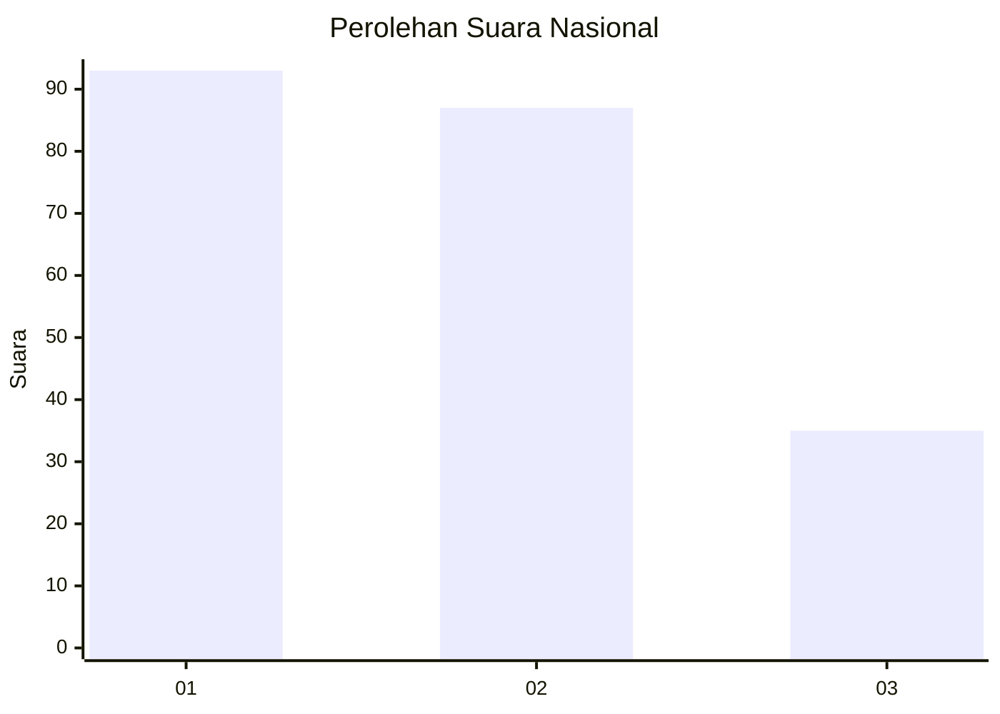
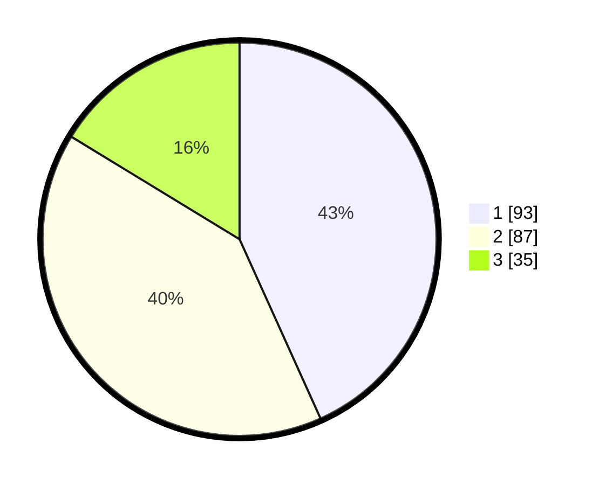

# Hasil

## Grafik

## Tabel

| No.    | Nama Paslon    | Suara | Suara (raw) | Persentase |
|:------ |:-------------- | -----:| -----------:| ----------:|
| 100025 | ANIES MUHAIMIN | 93    | [93][p-1]   | 43,26      |
| 100026 | PRABOWO GIBRAN | 87    | [87][p-2]   | 40,47      |
| 100027 | GANJAR MAHFUD  | 35    | [35][p-3]   | 16,28      |

[p-1]: https://github.com/gigit-pemilu/pemilu-2024/blob/main/pilpres/hitung-suara/sub/31-dki-jakarta/sub/72-jakarta-utara/sub/03-koja/sub/1003-lagoa/sub/125-tps/sub/paslon-1.txt
[p-2]: https://github.com/gigit-pemilu/pemilu-2024/blob/main/pilpres/hitung-suara/sub/31-dki-jakarta/sub/72-jakarta-utara/sub/03-koja/sub/1003-lagoa/sub/125-tps/sub/paslon-2.txt
[p-3]: https://github.com/gigit-pemilu/pemilu-2024/blob/main/pilpres/hitung-suara/sub/31-dki-jakarta/sub/72-jakarta-utara/sub/03-koja/sub/1003-lagoa/sub/125-tps/sub/paslon-3.txt

## Foto C Plano

https://sirekap-obj-formc.kpu.go.id/e774/pemilu/ppwp/31/72/03/10/03/3172031003125-20240216-222444--37d7b163-45ab-4d91-ba87-17106afe2684.jpg

https://sirekap-obj-formc.kpu.go.id/e774/pemilu/ppwp/31/72/03/10/03/3172031003125-20240217-044453--288892a9-41f8-43c8-ab8a-25be3e11ef3e.jpg

https://sirekap-obj-formc.kpu.go.id/e774/pemilu/ppwp/31/72/03/10/03/3172031003125-20240217-044955--6c409ab7-a8fc-4410-9c25-b72aeeff88fa.jpg

## Metadata

| Key        | Value               |
| ---------- | ------------------- |
| Time Stamp | 2024-02-20 16:00:00 |

