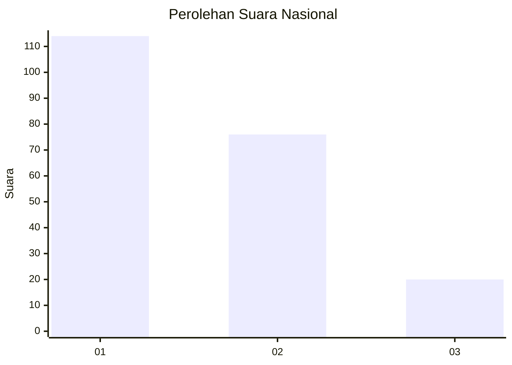
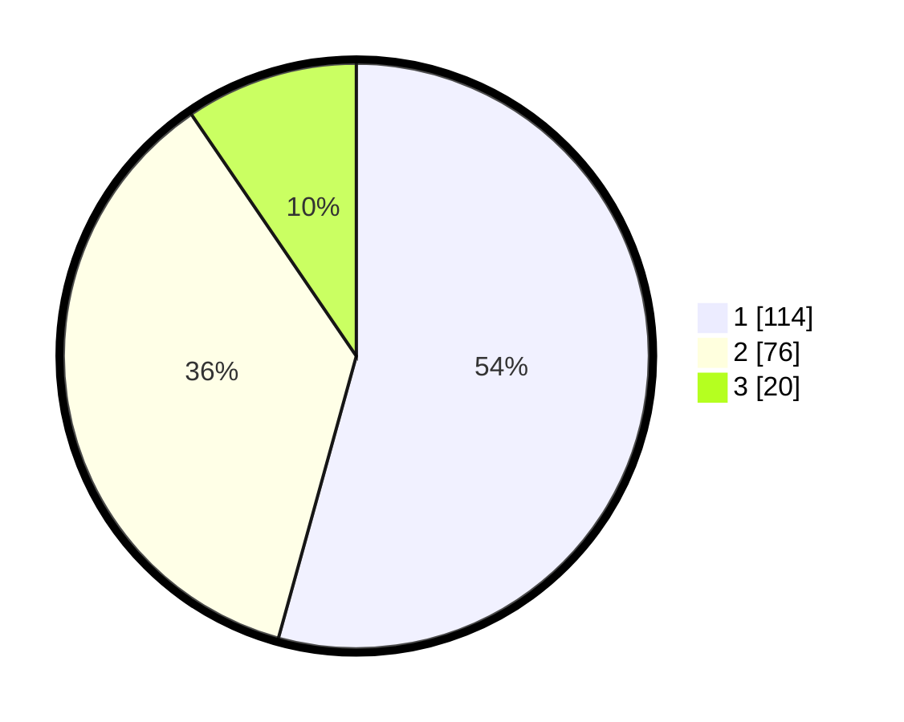

# Hasil

## Grafik

## Tabel

| No.    | Nama Paslon    | Suara | Suara (raw) | Persentase |
|:------ |:-------------- | -----:| -----------:| ----------:|
| 100025 | ANIES MUHAIMIN | 114   | [114][p-1]  | 54,29      |
| 100026 | PRABOWO GIBRAN | 76    | [76][p-2]   | 36,19      |
| 100027 | GANJAR MAHFUD  | 20    | [20][p-3]   | 9,52       |

[p-1]: https://github.com/gigit-pemilu/pemilu-2024/blob/main/pilpres/hitung-suara/sub/31-dki-jakarta/sub/72-jakarta-utara/sub/03-koja/sub/1003-lagoa/sub/132-tps/sub/paslon-1.txt
[p-2]: https://github.com/gigit-pemilu/pemilu-2024/blob/main/pilpres/hitung-suara/sub/31-dki-jakarta/sub/72-jakarta-utara/sub/03-koja/sub/1003-lagoa/sub/132-tps/sub/paslon-2.txt
[p-3]: https://github.com/gigit-pemilu/pemilu-2024/blob/main/pilpres/hitung-suara/sub/31-dki-jakarta/sub/72-jakarta-utara/sub/03-koja/sub/1003-lagoa/sub/132-tps/sub/paslon-3.txt

## Foto C Plano

https://sirekap-obj-formc.kpu.go.id/181f/pemilu/ppwp/31/72/03/10/03/3172031003132-20240214-201455--90bccb0b-3a24-4727-91b1-3821e1c7dba8.jpg

https://sirekap-obj-formc.kpu.go.id/181f/pemilu/ppwp/31/72/03/10/03/3172031003132-20240214-201624--8f24902a-dd2f-48bf-b664-6707bbb725e4.jpg

https://sirekap-obj-formc.kpu.go.id/181f/pemilu/ppwp/31/72/03/10/03/3172031003132-20240214-201756--b125f8fe-162f-44d3-a30b-e6f588e14e42.jpg

## Metadata

| Key        | Value               |
| ---------- | ------------------- |
| Time Stamp | 2024-02-20 16:00:00 |

