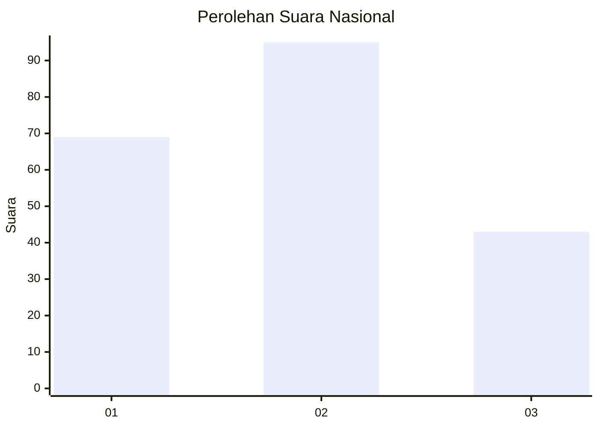
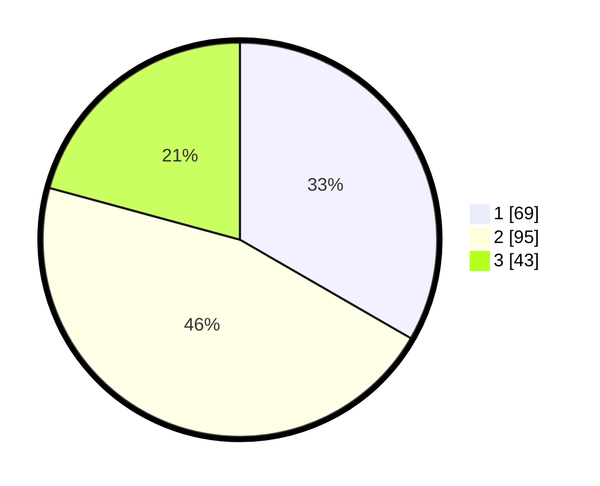

# Hasil

## Grafik

## Tabel

| No.    | Nama Paslon    | Suara | Suara (raw) | Persentase |
|:------ |:-------------- | -----:| -----------:| ----------:|
| 100025 | ANIES MUHAIMIN | 69    | [69][p-1]   | 33,33      |
| 100026 | PRABOWO GIBRAN | 95    | [95][p-2]   | 45,89      |
| 100027 | GANJAR MAHFUD  | 43    | [43][p-3]   | 20,77      |

[p-1]: https://github.com/gigit-pemilu/pemilu-2024/blob/main/pilpres/hitung-suara/sub/31-dki-jakarta/sub/72-jakarta-utara/sub/03-koja/sub/1003-lagoa/sub/150-tps/sub/paslon-1.txt
[p-2]: https://github.com/gigit-pemilu/pemilu-2024/blob/main/pilpres/hitung-suara/sub/31-dki-jakarta/sub/72-jakarta-utara/sub/03-koja/sub/1003-lagoa/sub/150-tps/sub/paslon-2.txt
[p-3]: https://github.com/gigit-pemilu/pemilu-2024/blob/main/pilpres/hitung-suara/sub/31-dki-jakarta/sub/72-jakarta-utara/sub/03-koja/sub/1003-lagoa/sub/150-tps/sub/paslon-3.txt

## Foto C Plano

https://sirekap-obj-formc.kpu.go.id/57c4/pemilu/ppwp/31/72/03/10/03/3172031003150-20240215-025114--a1eb6821-0664-4dc9-a403-30fda1824f4a.jpg

https://sirekap-obj-formc.kpu.go.id/57c4/pemilu/ppwp/31/72/03/10/03/3172031003150-20240215-025158--16665953-f567-4598-9aa1-4b463c432117.jpg

https://sirekap-obj-formc.kpu.go.id/57c4/pemilu/ppwp/31/72/03/10/03/3172031003150-20240215-025238--de053624-db26-4034-8d57-2b9f58a725ac.jpg

## Metadata

| Key        | Value               |
| ---------- | ------------------- |
| Time Stamp | 2024-02-20 16:00:00 |

