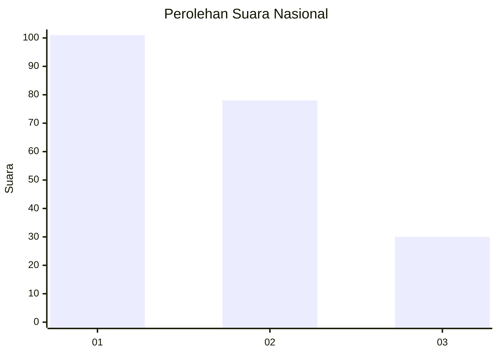
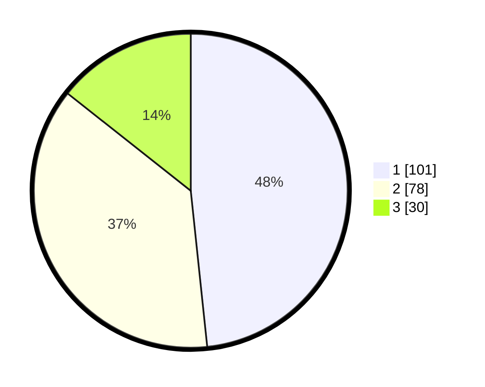

# Hasil

## Grafik

## Tabel

| No.    | Nama Paslon    | Suara | Suara (raw) | Persentase |
|:------ |:-------------- | -----:| -----------:| ----------:|
| 100025 | ANIES MUHAIMIN | 101   | [101][p-1]  | 48,33      |
| 100026 | PRABOWO GIBRAN | 78    | [78][p-2]   | 37,32      |
| 100027 | GANJAR MAHFUD  | 30    | [30][p-3]   | 14,35      |

[p-1]: https://github.com/gigit-pemilu/pemilu-2024/blob/main/pilpres/hitung-suara/sub/31-dki-jakarta/sub/72-jakarta-utara/sub/03-koja/sub/1003-lagoa/sub/167-tps/sub/paslon-1.txt
[p-2]: https://github.com/gigit-pemilu/pemilu-2024/blob/main/pilpres/hitung-suara/sub/31-dki-jakarta/sub/72-jakarta-utara/sub/03-koja/sub/1003-lagoa/sub/167-tps/sub/paslon-2.txt
[p-3]: https://github.com/gigit-pemilu/pemilu-2024/blob/main/pilpres/hitung-suara/sub/31-dki-jakarta/sub/72-jakarta-utara/sub/03-koja/sub/1003-lagoa/sub/167-tps/sub/paslon-3.txt

## Foto C Plano

https://sirekap-obj-formc.kpu.go.id/c392/pemilu/ppwp/31/72/03/10/03/3172031003167-20240214-215330--d392ed8a-d029-4d21-8217-6a3b6fc0d919.jpg

https://sirekap-obj-formc.kpu.go.id/c392/pemilu/ppwp/31/72/03/10/03/3172031003167-20240214-215920--79bf70ad-820d-4dd7-aed7-8f59a8b029e9.jpg

https://sirekap-obj-formc.kpu.go.id/c392/pemilu/ppwp/31/72/03/10/03/3172031003167-20240214-220140--cf5f8c49-e7bd-419c-948b-21c2d0c9eb41.jpg

## Metadata

| Key        | Value               |
| ---------- | ------------------- |
| Time Stamp | 2024-02-15 07:00:44 |

