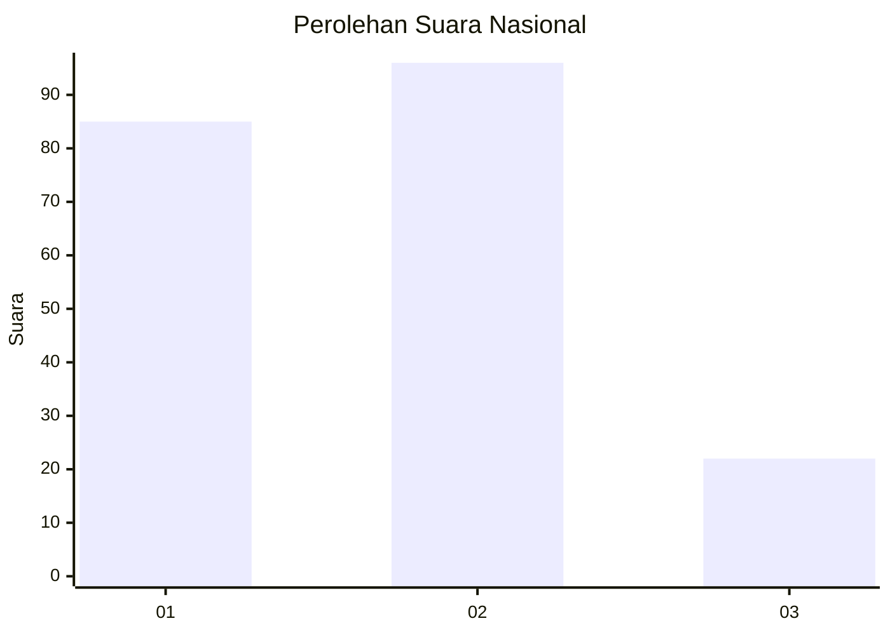
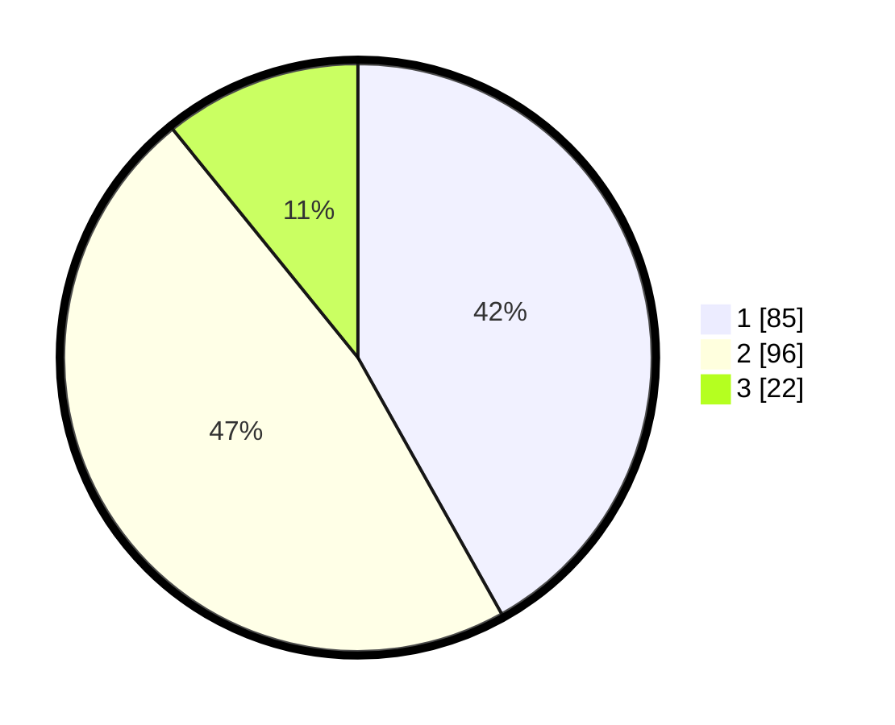

# Hasil

## Grafik

## Tabel

| No.    | Nama Paslon    | Suara | Suara (raw) | Persentase |
|:------ |:-------------- | -----:| -----------:| ----------:|
| 100025 | ANIES MUHAIMIN | 85    | [85][p-1]   | 41,87      |
| 100026 | PRABOWO GIBRAN | 96    | [96][p-2]   | 47,29      |
| 100027 | GANJAR MAHFUD  | 22    | [22][p-3]   | 10,84      |

[p-1]: https://github.com/gigit-pemilu/pemilu-2024/blob/main/pilpres/hitung-suara/sub/31-dki-jakarta/sub/72-jakarta-utara/sub/03-koja/sub/1003-lagoa/sub/169-tps/sub/paslon-1.txt
[p-2]: https://github.com/gigit-pemilu/pemilu-2024/blob/main/pilpres/hitung-suara/sub/31-dki-jakarta/sub/72-jakarta-utara/sub/03-koja/sub/1003-lagoa/sub/169-tps/sub/paslon-2.txt
[p-3]: https://github.com/gigit-pemilu/pemilu-2024/blob/main/pilpres/hitung-suara/sub/31-dki-jakarta/sub/72-jakarta-utara/sub/03-koja/sub/1003-lagoa/sub/169-tps/sub/paslon-3.txt

## Foto C Plano

https://sirekap-obj-formc.kpu.go.id/4ee2/pemilu/ppwp/31/72/03/10/03/3172031003169-20240214-220929--edf03afc-53d3-4693-bd37-ab8a93d852b1.jpg

https://sirekap-obj-formc.kpu.go.id/4ee2/pemilu/ppwp/31/72/03/10/03/3172031003169-20240214-221012--4d13c0d2-1f84-438f-8051-c34c21f2fe5b.jpg

https://sirekap-obj-formc.kpu.go.id/4ee2/pemilu/ppwp/31/72/03/10/03/3172031003169-20240214-221056--48ba9782-6b7b-4cff-8132-a458422fcc81.jpg

## Metadata

| Key        | Value               |
| ---------- | ------------------- |
| Time Stamp | 2024-02-20 16:00:00 |

