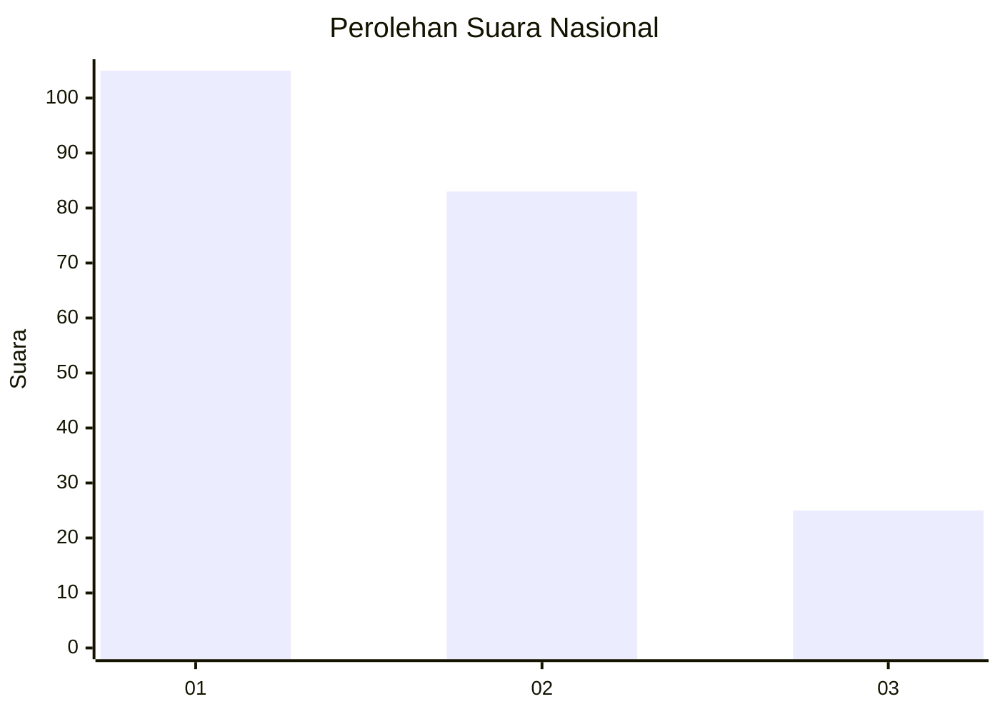
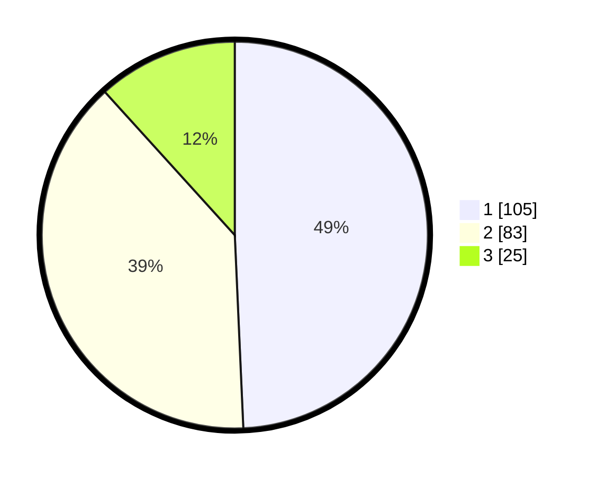

# Hasil

## Grafik

## Tabel

| No.    | Nama Paslon    | Suara | Suara (raw) | Persentase |
|:------ |:-------------- | -----:| -----------:| ----------:|
| 100025 | ANIES MUHAIMIN | 105   | [105][p-1]  | 49,30      |
| 100026 | PRABOWO GIBRAN | 83    | [83][p-2]   | 38,97      |
| 100027 | GANJAR MAHFUD  | 25    | [25][p-3]   | 11,74      |

[p-1]: https://github.com/gigit-pemilu/pemilu-2024/blob/main/pilpres/hitung-suara/sub/31-dki-jakarta/sub/72-jakarta-utara/sub/03-koja/sub/1003-lagoa/sub/174-tps/sub/paslon-1.txt
[p-2]: https://github.com/gigit-pemilu/pemilu-2024/blob/main/pilpres/hitung-suara/sub/31-dki-jakarta/sub/72-jakarta-utara/sub/03-koja/sub/1003-lagoa/sub/174-tps/sub/paslon-2.txt
[p-3]: https://github.com/gigit-pemilu/pemilu-2024/blob/main/pilpres/hitung-suara/sub/31-dki-jakarta/sub/72-jakarta-utara/sub/03-koja/sub/1003-lagoa/sub/174-tps/sub/paslon-3.txt

## Foto C Plano

https://sirekap-obj-formc.kpu.go.id/8a53/pemilu/ppwp/31/72/03/10/03/3172031003174-20240215-020712--e8cdab8b-cfa6-4f69-a7d5-e0a9987a2fdb.jpg

https://sirekap-obj-formc.kpu.go.id/8a53/pemilu/ppwp/31/72/03/10/03/3172031003174-20240215-020841--f6fcd650-a635-41b3-aeb3-7f2266325396.jpg

https://sirekap-obj-formc.kpu.go.id/8a53/pemilu/ppwp/31/72/03/10/03/3172031003174-20240215-020955--5c0e0369-9791-456c-9eb2-2044ad126fa7.jpg

## Metadata

| Key        | Value               |
| ---------- | ------------------- |
| Time Stamp | 2024-02-20 16:00:00 |

