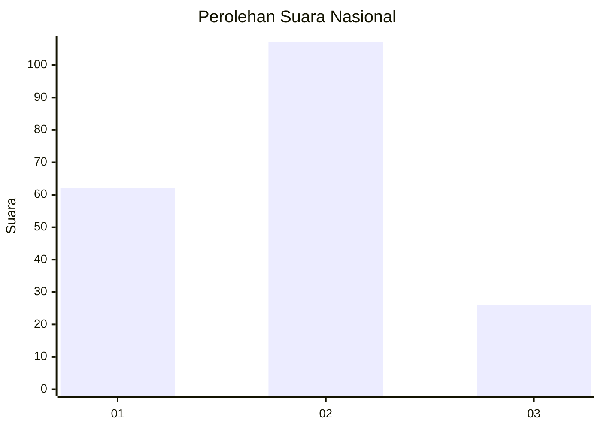
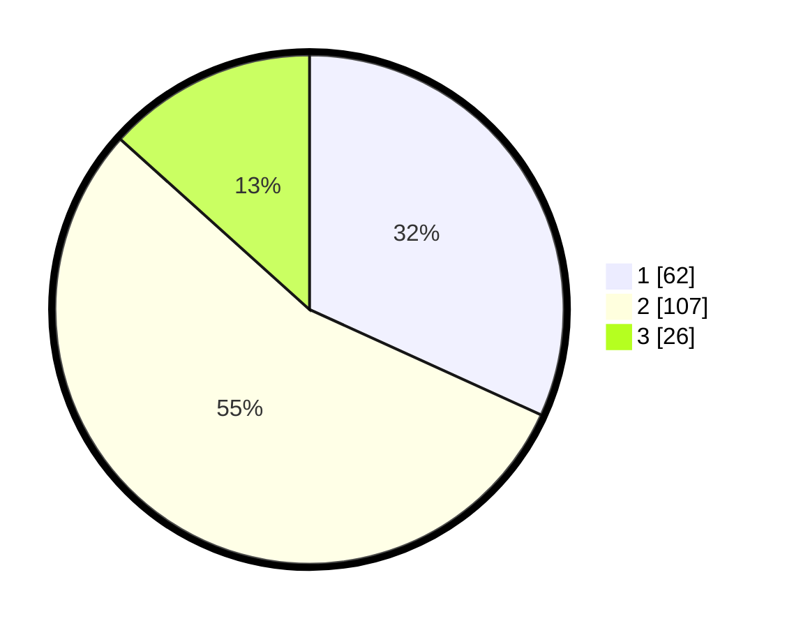

# Hasil

## Grafik

## Tabel

| No.    | Nama Paslon    | Suara | Suara (raw) | Persentase |
|:------ |:-------------- | -----:| -----------:| ----------:|
| 100025 | ANIES MUHAIMIN | 62    | [62][p-1]   | 31,79      |
| 100026 | PRABOWO GIBRAN | 107   | [107][p-2]  | 54,87      |
| 100027 | GANJAR MAHFUD  | 26    | [26][p-3]   | 13,33      |

[p-1]: https://github.com/gigit-pemilu/pemilu-2024/blob/main/pilpres/hitung-suara/sub/31-dki-jakarta/sub/72-jakarta-utara/sub/03-koja/sub/1003-lagoa/sub/178-tps/sub/paslon-1.txt
[p-2]: https://github.com/gigit-pemilu/pemilu-2024/blob/main/pilpres/hitung-suara/sub/31-dki-jakarta/sub/72-jakarta-utara/sub/03-koja/sub/1003-lagoa/sub/178-tps/sub/paslon-2.txt
[p-3]: https://github.com/gigit-pemilu/pemilu-2024/blob/main/pilpres/hitung-suara/sub/31-dki-jakarta/sub/72-jakarta-utara/sub/03-koja/sub/1003-lagoa/sub/178-tps/sub/paslon-3.txt

## Foto C Plano

https://sirekap-obj-formc.kpu.go.id/d89f/pemilu/ppwp/31/72/03/10/03/3172031003178-20240215-023958--fb179b17-a822-43c8-a74e-f00374a5bbe3.jpg

https://sirekap-obj-formc.kpu.go.id/d89f/pemilu/ppwp/31/72/03/10/03/3172031003178-20240215-024057--c7863789-5913-43a4-8ca8-2fc9e39691d5.jpg

https://sirekap-obj-formc.kpu.go.id/d89f/pemilu/ppwp/31/72/03/10/03/3172031003178-20240215-024135--de309793-4a03-4f11-889e-dde1cc445768.jpg

## Metadata

| Key        | Value               |
| ---------- | ------------------- |
| Time Stamp | 2024-02-20 16:00:00 |

