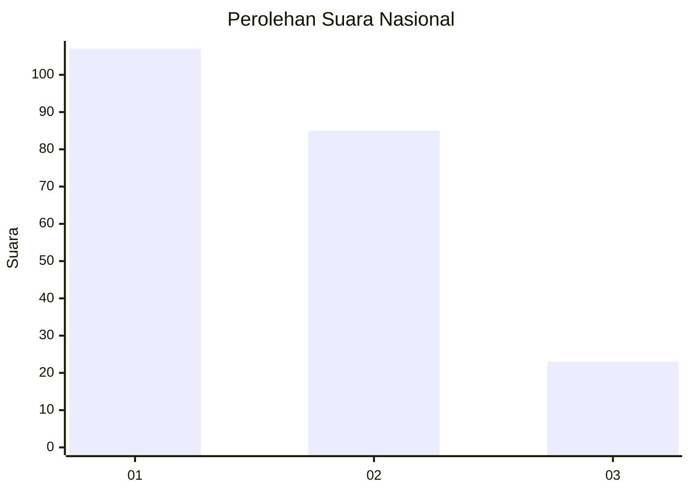
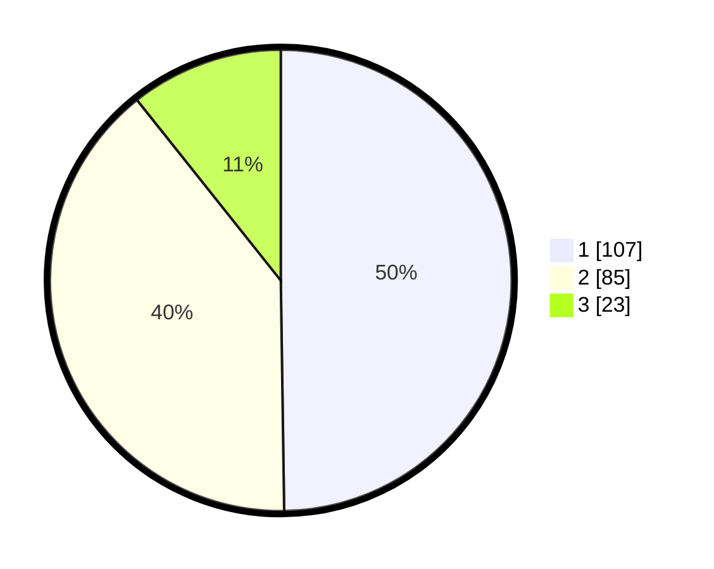

# Hasil

## Grafik

## Tabel

| No.    | Nama Paslon    | Suara | Suara (raw) | Persentase |
|:------ |:-------------- | -----:| -----------:| ----------:|
| 100025 | ANIES MUHAIMIN | 107   | [107][p-1]  | 49,77      |
| 100026 | PRABOWO GIBRAN | 85    | [85][p-2]   | 39,53      |
| 100027 | GANJAR MAHFUD  | 23    | [23][p-3]   | 10,70      |

[p-1]: https://github.com/gigit-pemilu/pemilu-2024/blob/main/pilpres/hitung-suara/sub/31-dki-jakarta/sub/72-jakarta-utara/sub/03-koja/sub/1003-lagoa/sub/192-tps/sub/paslon-1.txt
[p-2]: https://github.com/gigit-pemilu/pemilu-2024/blob/main/pilpres/hitung-suara/sub/31-dki-jakarta/sub/72-jakarta-utara/sub/03-koja/sub/1003-lagoa/sub/192-tps/sub/paslon-2.txt
[p-3]: https://github.com/gigit-pemilu/pemilu-2024/blob/main/pilpres/hitung-suara/sub/31-dki-jakarta/sub/72-jakarta-utara/sub/03-koja/sub/1003-lagoa/sub/192-tps/sub/paslon-3.txt

## Foto C Plano

https://sirekap-obj-formc.kpu.go.id/ad4c/pemilu/ppwp/31/72/03/10/03/3172031003192-20240214-235402--4e0f0acf-45cc-485a-8a12-00356265011b.jpg

https://sirekap-obj-formc.kpu.go.id/ad4c/pemilu/ppwp/31/72/03/10/03/3172031003192-20240214-235456--eb98a06e-a98f-45ba-a021-1f01d8919815.jpg

https://sirekap-obj-formc.kpu.go.id/ad4c/pemilu/ppwp/31/72/03/10/03/3172031003192-20240214-235600--5c939022-7c2f-462f-a67a-28fae568fc1a.jpg

## Metadata

| Key        | Value               |
| ---------- | ------------------- |
| Time Stamp | 2024-02-20 17:00:00 |

