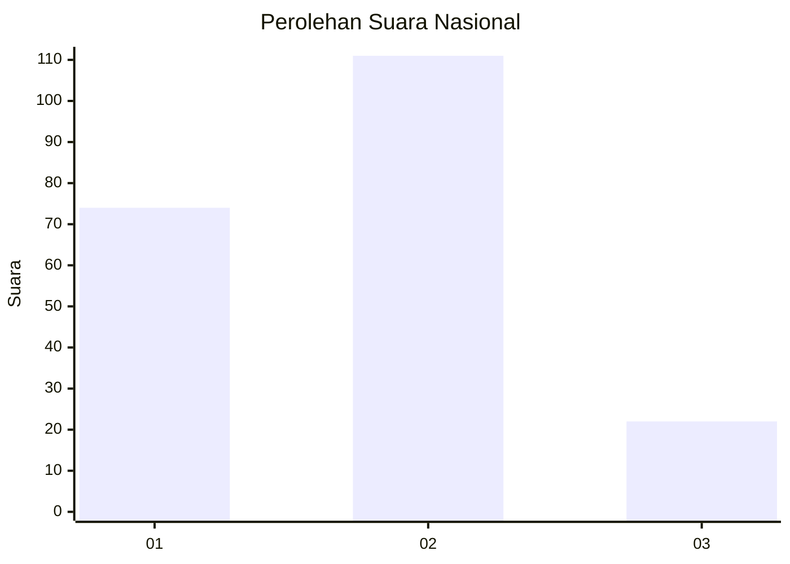
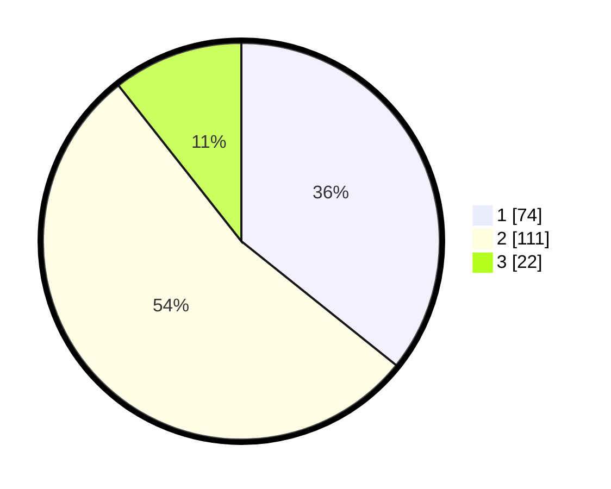

# Hasil

## Grafik

## Tabel

| No.    | Nama Paslon    | Suara | Suara (raw) | Persentase |
|:------ |:-------------- | -----:| -----------:| ----------:|
| 100025 | ANIES MUHAIMIN | 74    | [74][p-1]   | 35,75      |
| 100026 | PRABOWO GIBRAN | 111   | [111][p-2]  | 53,62      |
| 100027 | GANJAR MAHFUD  | 22    | [22][p-3]   | 10,63      |

[p-1]: https://github.com/gigit-pemilu/pemilu-2024/blob/main/pilpres/hitung-suara/sub/31-dki-jakarta/sub/72-jakarta-utara/sub/03-koja/sub/1004-rawa-badak-utara/sub/023-tps/sub/paslon-1.txt
[p-2]: https://github.com/gigit-pemilu/pemilu-2024/blob/main/pilpres/hitung-suara/sub/31-dki-jakarta/sub/72-jakarta-utara/sub/03-koja/sub/1004-rawa-badak-utara/sub/023-tps/sub/paslon-2.txt
[p-3]: https://github.com/gigit-pemilu/pemilu-2024/blob/main/pilpres/hitung-suara/sub/31-dki-jakarta/sub/72-jakarta-utara/sub/03-koja/sub/1004-rawa-badak-utara/sub/023-tps/sub/paslon-3.txt

## Foto C Plano

https://sirekap-obj-formc.kpu.go.id/c5ca/pemilu/ppwp/31/72/03/10/04/3172031004023-20240215-002124--6513cf99-fa68-4b93-83c5-d1e217b6fbd6.jpg

https://sirekap-obj-formc.kpu.go.id/c5ca/pemilu/ppwp/31/72/03/10/04/3172031004023-20240214-160141--dd3d0744-51ff-4436-8a9c-705448843207.jpg

https://sirekap-obj-formc.kpu.go.id/c5ca/pemilu/ppwp/31/72/03/10/04/3172031004023-20240215-002341--2bfdcadc-211f-44a7-bcb0-b782ca1f3deb.jpg

## Metadata

| Key        | Value               |
| ---------- | ------------------- |
| Time Stamp | 2024-02-15 09:00:24 |

