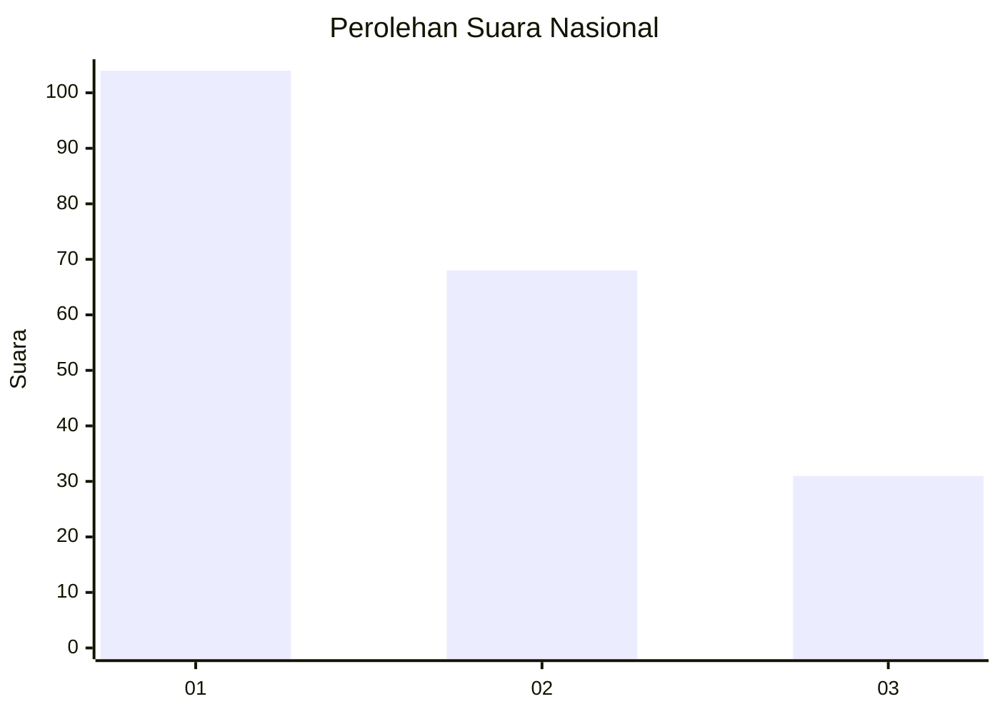
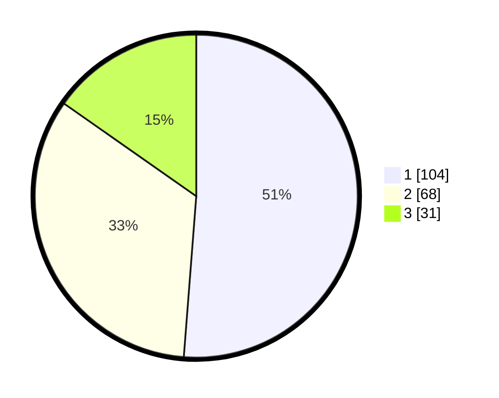

# Hasil

## Grafik

## Tabel

| No.    | Nama Paslon    | Suara | Suara (raw) | Persentase |
|:------ |:-------------- | -----:| -----------:| ----------:|
| 100025 | ANIES MUHAIMIN | 104   | [104][p-1]  | 51,23      |
| 100026 | PRABOWO GIBRAN | 68    | [68][p-2]   | 33,50      |
| 100027 | GANJAR MAHFUD  | 31    | [31][p-3]   | 15,27      |

[p-1]: https://github.com/gigit-pemilu/pemilu-2024/blob/main/pilpres/hitung-suara/sub/31-dki-jakarta/sub/72-jakarta-utara/sub/03-koja/sub/1004-rawa-badak-utara/sub/051-tps/sub/paslon-1.txt
[p-2]: https://github.com/gigit-pemilu/pemilu-2024/blob/main/pilpres/hitung-suara/sub/31-dki-jakarta/sub/72-jakarta-utara/sub/03-koja/sub/1004-rawa-badak-utara/sub/051-tps/sub/paslon-2.txt
[p-3]: https://github.com/gigit-pemilu/pemilu-2024/blob/main/pilpres/hitung-suara/sub/31-dki-jakarta/sub/72-jakarta-utara/sub/03-koja/sub/1004-rawa-badak-utara/sub/051-tps/sub/paslon-3.txt

## Foto C Plano

https://sirekap-obj-formc.kpu.go.id/5336/pemilu/ppwp/31/72/03/10/04/3172031004051-20240214-221552--a46ab069-3d67-469f-baea-57ab5cf5650d.jpg

https://sirekap-obj-formc.kpu.go.id/5336/pemilu/ppwp/31/72/03/10/04/3172031004051-20240214-221826--110d499f-b4e5-4696-9e41-daedec4630f4.jpg

https://sirekap-obj-formc.kpu.go.id/5336/pemilu/ppwp/31/72/03/10/04/3172031004051-20240214-221911--67f1852d-0e02-443b-839d-a16984a561ab.jpg

## Metadata

| Key        | Value               |
| ---------- | ------------------- |
| Time Stamp | 2024-02-16 12:51:22 |

