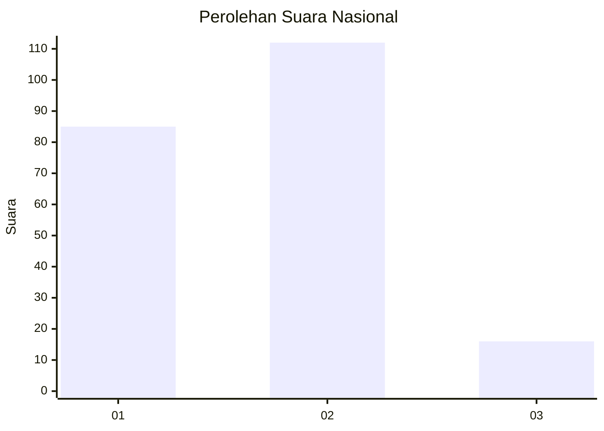

# Hasil

## Grafik

## Tabel

| No.    | Nama Paslon    | Suara | Suara (raw) | Persentase |
|:------ |:-------------- | -----:| -----------:| ----------:|
| 100025 | ANIES MUHAIMIN | 85    | [85][p-1]   | 39,91      |
| 100026 | PRABOWO GIBRAN | 112   | [112][p-2]  | 52,58      |
| 100027 | GANJAR MAHFUD  | 16    | [16][p-3]   | 7,51       |

[p-1]: https://github.com/gigit-pemilu/pemilu-2024/blob/main/pilpres/hitung-suara/sub/31-dki-jakarta/sub/72-jakarta-utara/sub/03-koja/sub/1004-rawa-badak-utara/sub/070-tps/sub/paslon-1.txt
[p-2]: https://github.com/gigit-pemilu/pemilu-2024/blob/main/pilpres/hitung-suara/sub/31-dki-jakarta/sub/72-jakarta-utara/sub/03-koja/sub/1004-rawa-badak-utara/sub/070-tps/sub/paslon-2.txt
[p-3]: https://github.com/gigit-pemilu/pemilu-2024/blob/main/pilpres/hitung-suara/sub/31-dki-jakarta/sub/72-jakarta-utara/sub/03-koja/sub/1004-rawa-badak-utara/sub/070-tps/sub/paslon-3.txt

## Foto C Plano

https://sirekap-obj-formc.kpu.go.id/ebff/pemilu/ppwp/31/72/03/10/04/3172031004070-20240215-014624--f2d83bd0-b8d8-4b01-b356-bc5f687d0bbe.jpg

https://sirekap-obj-formc.kpu.go.id/ebff/pemilu/ppwp/31/72/03/10/04/3172031004070-20240214-220010--7dedd757-17e6-4526-9b78-4f1e14b27296.jpg

https://sirekap-obj-formc.kpu.go.id/ebff/pemilu/ppwp/31/72/03/10/04/3172031004070-20240215-014843--5d7dabab-8625-41e7-94e6-6f9e120cdcd0.jpg

## Metadata

| Key        | Value               |
| ---------- | ------------------- |
| Time Stamp | 2024-02-15 12:00:28 |

