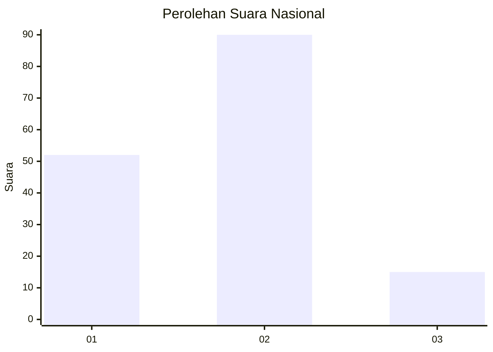
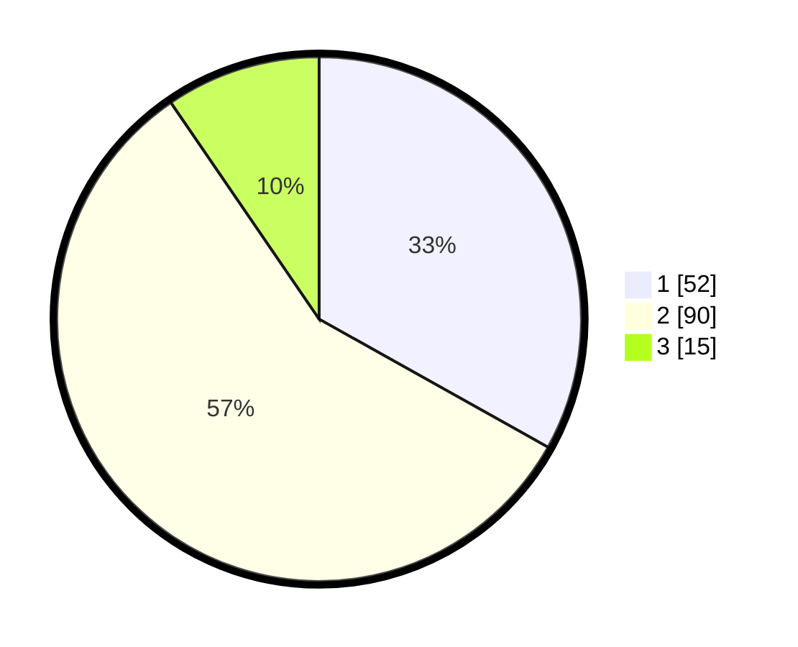

# Hasil

## Grafik

## Tabel

| No.    | Nama Paslon    | Suara | Suara (raw) | Persentase |
|:------ |:-------------- | -----:| -----------:| ----------:|
| 100025 | ANIES MUHAIMIN | 52    | [52][p-1]   | 33,12      |
| 100026 | PRABOWO GIBRAN | 90    | [90][p-2]   | 57,32      |
| 100027 | GANJAR MAHFUD  | 15    | [15][p-3]   | 9,55       |

[p-1]: https://github.com/gigit-pemilu/pemilu-2024/blob/main/pilpres/hitung-suara/sub/31-dki-jakarta/sub/72-jakarta-utara/sub/03-koja/sub/1004-rawa-badak-utara/sub/088-tps/sub/paslon-1.txt
[p-2]: https://github.com/gigit-pemilu/pemilu-2024/blob/main/pilpres/hitung-suara/sub/31-dki-jakarta/sub/72-jakarta-utara/sub/03-koja/sub/1004-rawa-badak-utara/sub/088-tps/sub/paslon-2.txt
[p-3]: https://github.com/gigit-pemilu/pemilu-2024/blob/main/pilpres/hitung-suara/sub/31-dki-jakarta/sub/72-jakarta-utara/sub/03-koja/sub/1004-rawa-badak-utara/sub/088-tps/sub/paslon-3.txt

## Foto C Plano

https://sirekap-obj-formc.kpu.go.id/db7f/pemilu/ppwp/31/72/03/10/04/3172031004088-20240215-021306--7d76ae69-0cde-4e28-9249-a0009eb67abf.jpg

https://sirekap-obj-formc.kpu.go.id/db7f/pemilu/ppwp/31/72/03/10/04/3172031004088-20240215-021404--b4553629-48d4-4537-9aab-baffedf7608c.jpg

https://sirekap-obj-formc.kpu.go.id/db7f/pemilu/ppwp/31/72/03/10/04/3172031004088-20240215-021719--0c626507-da45-4cac-938e-8f3a469b8f4e.jpg

## Metadata

| Key        | Value               |
| ---------- | ------------------- |
| Time Stamp | 2024-02-16 12:51:22 |

