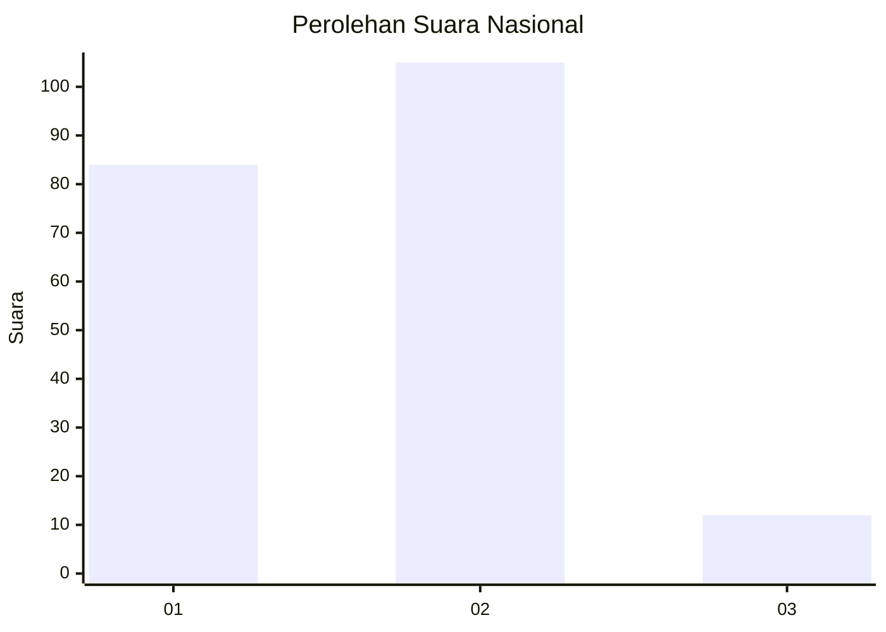
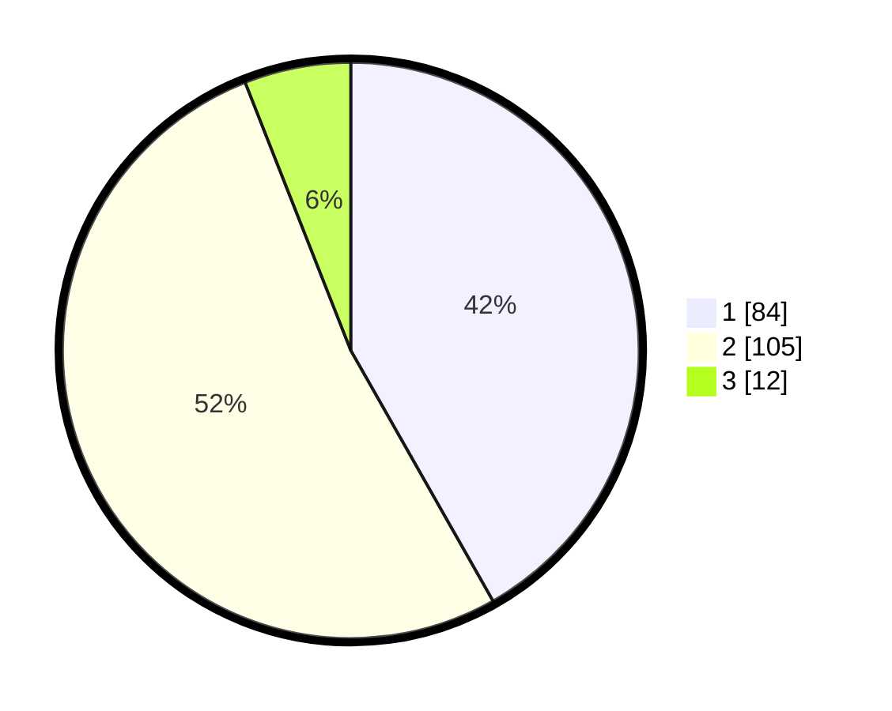

# Hasil

## Grafik

## Tabel

| No.    | Nama Paslon    | Suara | Suara (raw) | Persentase |
|:------ |:-------------- | -----:| -----------:| ----------:|
| 100025 | ANIES MUHAIMIN | 84    | [84][p-1]   | 41,79      |
| 100026 | PRABOWO GIBRAN | 105   | [105][p-2]  | 52,24      |
| 100027 | GANJAR MAHFUD  | 12    | [12][p-3]   | 5,97       |

[p-1]: https://github.com/gigit-pemilu/pemilu-2024/blob/main/pilpres/hitung-suara/sub/31-dki-jakarta/sub/72-jakarta-utara/sub/03-koja/sub/1004-rawa-badak-utara/sub/092-tps/sub/paslon-1.txt
[p-2]: https://github.com/gigit-pemilu/pemilu-2024/blob/main/pilpres/hitung-suara/sub/31-dki-jakarta/sub/72-jakarta-utara/sub/03-koja/sub/1004-rawa-badak-utara/sub/092-tps/sub/paslon-2.txt
[p-3]: https://github.com/gigit-pemilu/pemilu-2024/blob/main/pilpres/hitung-suara/sub/31-dki-jakarta/sub/72-jakarta-utara/sub/03-koja/sub/1004-rawa-badak-utara/sub/092-tps/sub/paslon-3.txt

## Foto C Plano

https://sirekap-obj-formc.kpu.go.id/2ead/pemilu/ppwp/31/72/03/10/04/3172031004092-20240214-222118--ad21b4cb-b337-4fc8-b030-54aab9459b58.jpg

https://sirekap-obj-formc.kpu.go.id/2ead/pemilu/ppwp/31/72/03/10/04/3172031004092-20240215-013019--8893a4b3-45e7-4e28-b76a-95fe87e0bf58.jpg

https://sirekap-obj-formc.kpu.go.id/2ead/pemilu/ppwp/31/72/03/10/04/3172031004092-20240215-013208--548af7cb-9e5b-42a0-a0ee-cb694aef9c06.jpg

## Metadata

| Key        | Value               |
| ---------- | ------------------- |
| Time Stamp | 2024-02-15 18:00:26 |

