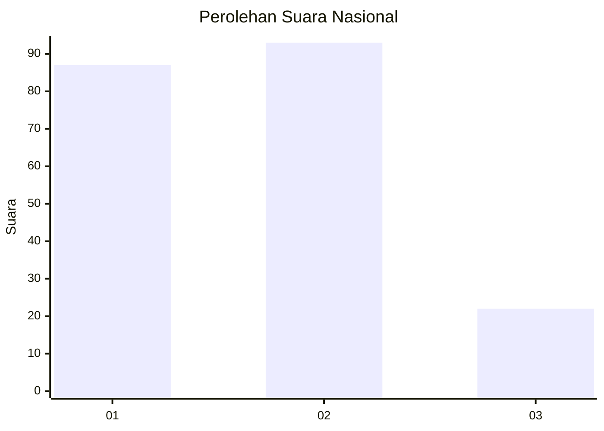
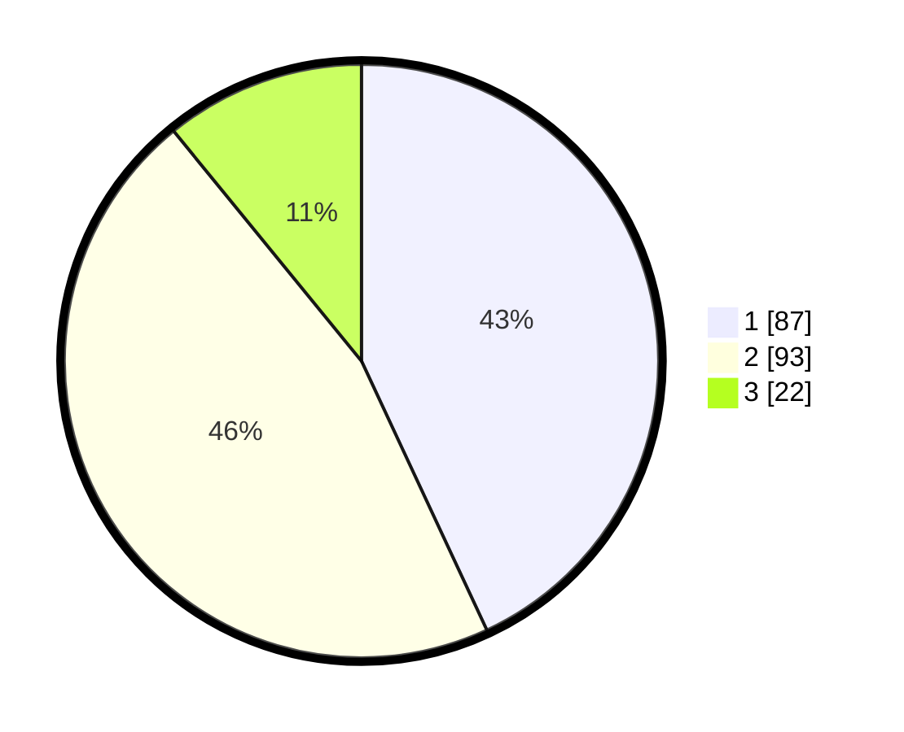

# Hasil

## Grafik

## Tabel

| No.    | Nama Paslon    | Suara | Suara (raw) | Persentase |
|:------ |:-------------- | -----:| -----------:| ----------:|
| 100025 | ANIES MUHAIMIN | 87    | [87][p-1]   | 43,07      |
| 100026 | PRABOWO GIBRAN | 93    | [93][p-2]   | 46,04      |
| 100027 | GANJAR MAHFUD  | 22    | [22][p-3]   | 10,89      |

[p-1]: https://github.com/gigit-pemilu/pemilu-2024/blob/main/pilpres/hitung-suara/sub/31-dki-jakarta/sub/72-jakarta-utara/sub/03-koja/sub/1005-tugu-selatan/sub/008-tps/sub/paslon-1.txt
[p-2]: https://github.com/gigit-pemilu/pemilu-2024/blob/main/pilpres/hitung-suara/sub/31-dki-jakarta/sub/72-jakarta-utara/sub/03-koja/sub/1005-tugu-selatan/sub/008-tps/sub/paslon-2.txt
[p-3]: https://github.com/gigit-pemilu/pemilu-2024/blob/main/pilpres/hitung-suara/sub/31-dki-jakarta/sub/72-jakarta-utara/sub/03-koja/sub/1005-tugu-selatan/sub/008-tps/sub/paslon-3.txt

## Foto C Plano

https://sirekap-obj-formc.kpu.go.id/f131/pemilu/ppwp/31/72/03/10/05/3172031005008-20240218-203721--0d7dcabf-e0d4-48e9-b31e-ae96f9c37859.jpg

https://sirekap-obj-formc.kpu.go.id/f131/pemilu/ppwp/31/72/03/10/05/3172031005008-20240218-204111--80a093ad-f9d3-4976-87d7-5a6898be45a6.jpg

https://sirekap-obj-formc.kpu.go.id/f131/pemilu/ppwp/31/72/03/10/05/3172031005008-20240218-204009--8f7c6ff0-3af3-4ff4-8e7c-fc7e74c33bc6.jpg

## Metadata

| Key        | Value               |
| ---------- | ------------------- |
| Time Stamp | 2024-02-20 17:00:00 |

