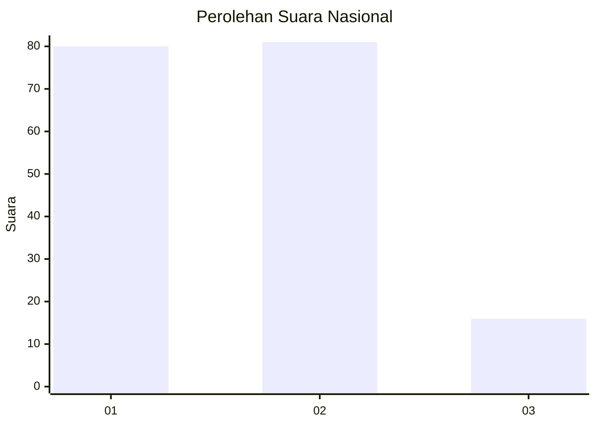
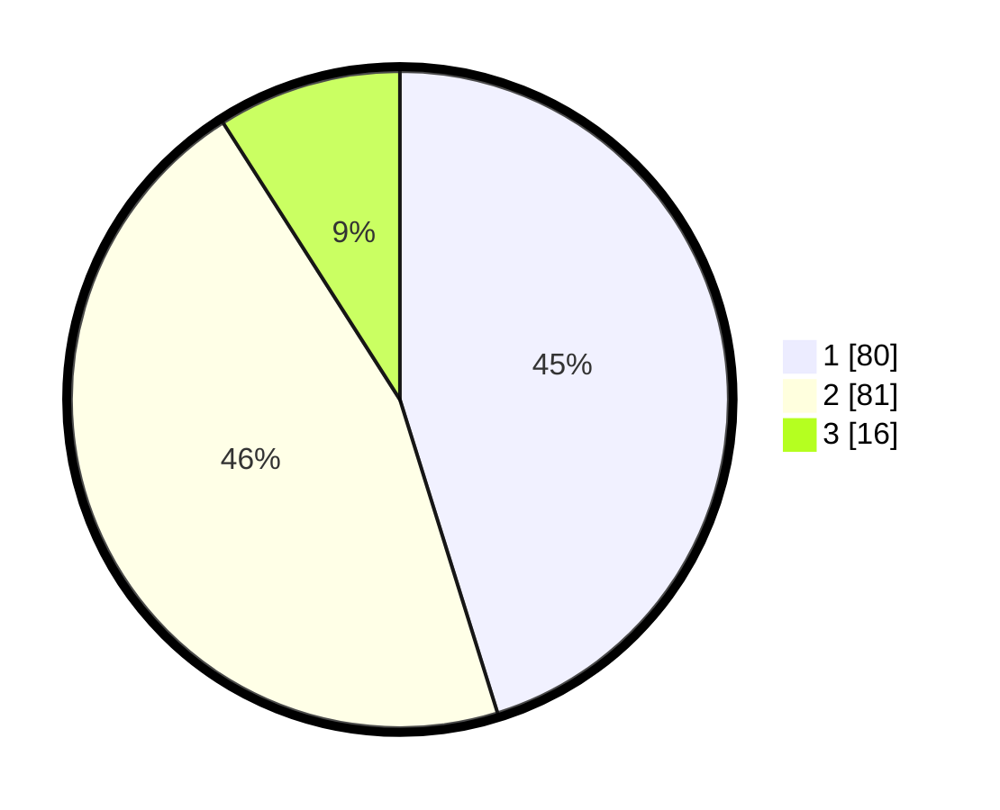

# Hasil

## Grafik

## Tabel

| No.    | Nama Paslon    | Suara | Suara (raw) | Persentase |
|:------ |:-------------- | -----:| -----------:| ----------:|
| 100025 | ANIES MUHAIMIN | 80    | [80][p-1]   | 45,20      |
| 100026 | PRABOWO GIBRAN | 81    | [81][p-2]   | 45,76      |
| 100027 | GANJAR MAHFUD  | 16    | [16][p-3]   | 9,04       |

[p-1]: https://github.com/gigit-pemilu/pemilu-2024/blob/main/pilpres/hitung-suara/sub/31-dki-jakarta/sub/72-jakarta-utara/sub/03-koja/sub/1005-tugu-selatan/sub/015-tps/sub/paslon-1.txt
[p-2]: https://github.com/gigit-pemilu/pemilu-2024/blob/main/pilpres/hitung-suara/sub/31-dki-jakarta/sub/72-jakarta-utara/sub/03-koja/sub/1005-tugu-selatan/sub/015-tps/sub/paslon-2.txt
[p-3]: https://github.com/gigit-pemilu/pemilu-2024/blob/main/pilpres/hitung-suara/sub/31-dki-jakarta/sub/72-jakarta-utara/sub/03-koja/sub/1005-tugu-selatan/sub/015-tps/sub/paslon-3.txt

## Foto C Plano

https://sirekap-obj-formc.kpu.go.id/3122/pemilu/ppwp/31/72/03/10/05/3172031005015-20240214-211849--e24d2101-1ccf-4d5b-8ba4-b0154ab01789.jpg

https://sirekap-obj-formc.kpu.go.id/3122/pemilu/ppwp/31/72/03/10/05/3172031005015-20240214-211955--63de6824-a333-4e3c-8c53-bb2a972ace48.jpg

https://sirekap-obj-formc.kpu.go.id/3122/pemilu/ppwp/31/72/03/10/05/3172031005015-20240214-212125--1c4ea94e-e83a-44b3-8592-cc9d009cf939.jpg

## Metadata

| Key        | Value               |
| ---------- | ------------------- |
| Time Stamp | 2024-02-20 16:00:00 |

