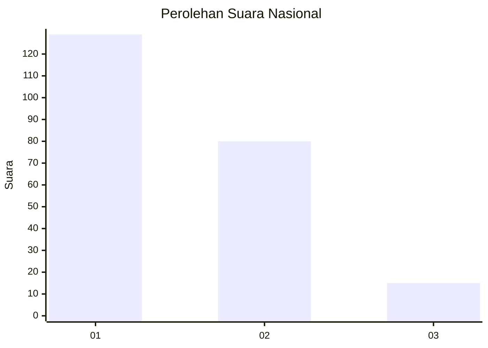
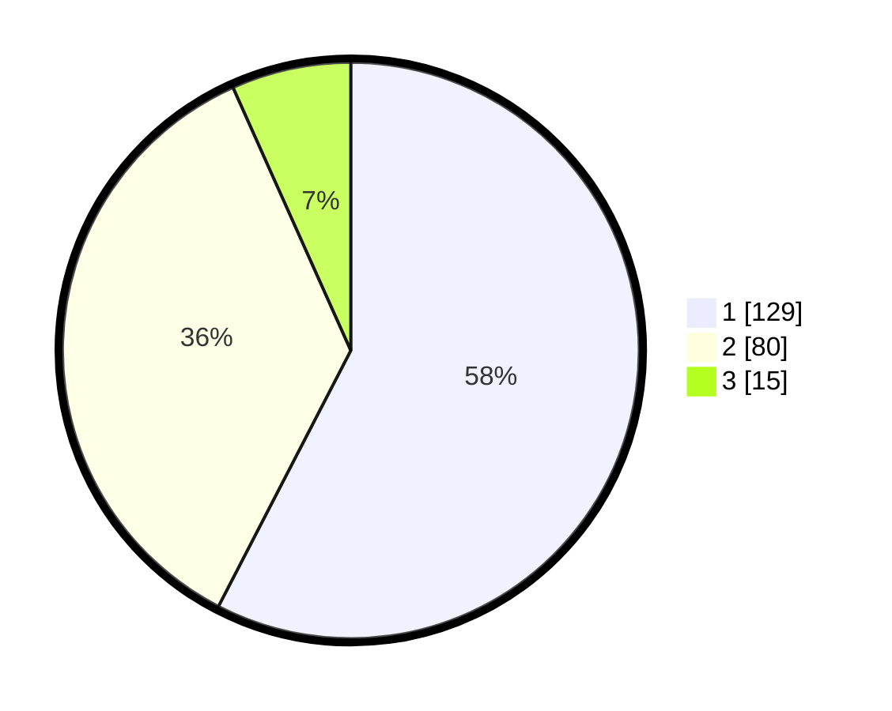

# Hasil

## Grafik

## Tabel

| No.    | Nama Paslon    | Suara | Suara (raw) | Persentase |
|:------ |:-------------- | -----:| -----------:| ----------:|
| 100025 | ANIES MUHAIMIN | 129   | [129][p-1]  | 57,59      |
| 100026 | PRABOWO GIBRAN | 80    | [80][p-2]   | 35,71      |
| 100027 | GANJAR MAHFUD  | 15    | [15][p-3]   | 6,70       |

[p-1]: https://github.com/gigit-pemilu/pemilu-2024/blob/main/pilpres/hitung-suara/sub/31-dki-jakarta/sub/72-jakarta-utara/sub/03-koja/sub/1005-tugu-selatan/sub/019-tps/sub/paslon-1.txt
[p-2]: https://github.com/gigit-pemilu/pemilu-2024/blob/main/pilpres/hitung-suara/sub/31-dki-jakarta/sub/72-jakarta-utara/sub/03-koja/sub/1005-tugu-selatan/sub/019-tps/sub/paslon-2.txt
[p-3]: https://github.com/gigit-pemilu/pemilu-2024/blob/main/pilpres/hitung-suara/sub/31-dki-jakarta/sub/72-jakarta-utara/sub/03-koja/sub/1005-tugu-selatan/sub/019-tps/sub/paslon-3.txt

## Foto C Plano

https://sirekap-obj-formc.kpu.go.id/c26b/pemilu/ppwp/31/72/03/10/05/3172031005019-20240215-001351--1425d5bc-0787-4765-bc02-7f11a7914dd9.jpg

https://sirekap-obj-formc.kpu.go.id/c26b/pemilu/ppwp/31/72/03/10/05/3172031005019-20240215-001752--22f72545-8d32-440d-8a5b-f41f84901c63.jpg

https://sirekap-obj-formc.kpu.go.id/c26b/pemilu/ppwp/31/72/03/10/05/3172031005019-20240215-001618--dfb1a6cd-4d57-4fb3-a4b9-aeb62b111f15.jpg

## Metadata

| Key        | Value               |
| ---------- | ------------------- |
| Time Stamp | 2024-02-20 17:00:00 |

