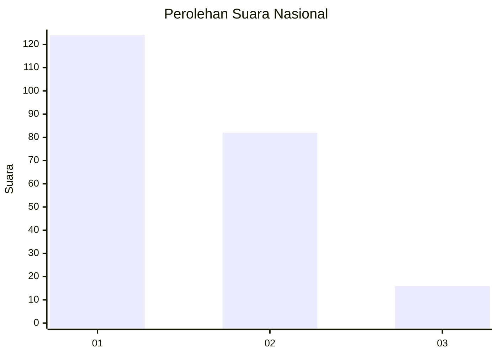
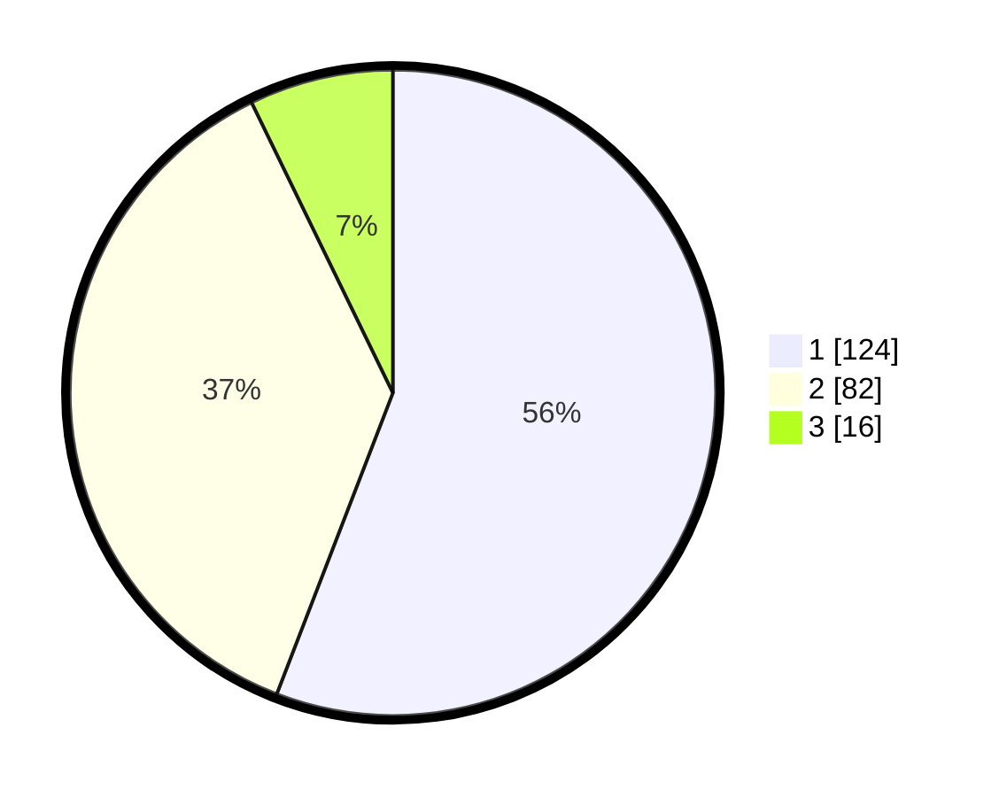

# Hasil

## Grafik

## Tabel

| No.    | Nama Paslon    | Suara | Suara (raw) | Persentase |
|:------ |:-------------- | -----:| -----------:| ----------:|
| 100025 | ANIES MUHAIMIN | 124   | [124][p-1]  | 55,86      |
| 100026 | PRABOWO GIBRAN | 82    | [82][p-2]   | 36,94      |
| 100027 | GANJAR MAHFUD  | 16    | [16][p-3]   | 7,21       |

[p-1]: https://github.com/gigit-pemilu/pemilu-2024/blob/main/pilpres/hitung-suara/sub/31-dki-jakarta/sub/72-jakarta-utara/sub/03-koja/sub/1005-tugu-selatan/sub/021-tps/sub/paslon-1.txt
[p-2]: https://github.com/gigit-pemilu/pemilu-2024/blob/main/pilpres/hitung-suara/sub/31-dki-jakarta/sub/72-jakarta-utara/sub/03-koja/sub/1005-tugu-selatan/sub/021-tps/sub/paslon-2.txt
[p-3]: https://github.com/gigit-pemilu/pemilu-2024/blob/main/pilpres/hitung-suara/sub/31-dki-jakarta/sub/72-jakarta-utara/sub/03-koja/sub/1005-tugu-selatan/sub/021-tps/sub/paslon-3.txt

## Foto C Plano

https://sirekap-obj-formc.kpu.go.id/6138/pemilu/ppwp/31/72/03/10/05/3172031005021-20240216-170011--a897ecc1-510e-4c2e-aea1-2bef72ec1322.jpg

https://sirekap-obj-formc.kpu.go.id/6138/pemilu/ppwp/31/72/03/10/05/3172031005021-20240216-165850--f2b79a96-52ee-4fe6-9b31-54642b72ed7e.jpg

https://sirekap-obj-formc.kpu.go.id/6138/pemilu/ppwp/31/72/03/10/05/3172031005021-20240216-170059--e94cadff-40f4-4864-810c-4c9021906670.jpg

## Metadata

| Key        | Value               |
| ---------- | ------------------- |
| Time Stamp | 2024-02-20 17:00:00 |

