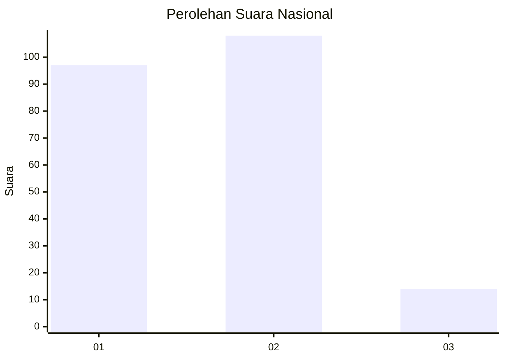
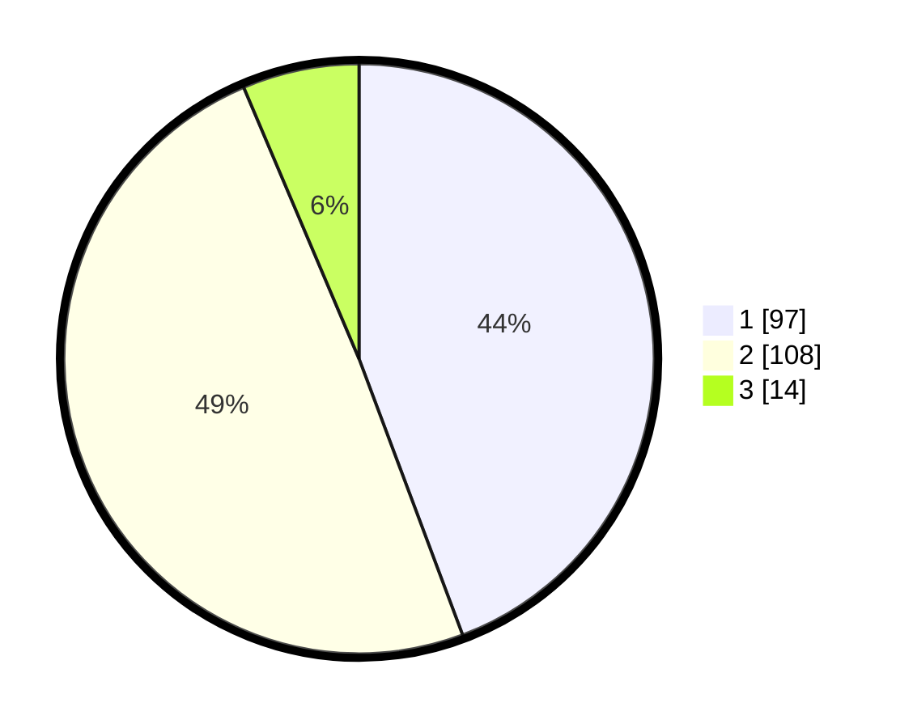

# Hasil

## Grafik

## Tabel

| No.    | Nama Paslon    | Suara | Suara (raw) | Persentase |
|:------ |:-------------- | -----:| -----------:| ----------:|
| 100025 | ANIES MUHAIMIN | 97    | [97][p-1]   | 44,29      |
| 100026 | PRABOWO GIBRAN | 108   | [108][p-2]  | 49,32      |
| 100027 | GANJAR MAHFUD  | 14    | [14][p-3]   | 6,39       |

[p-1]: https://github.com/gigit-pemilu/pemilu-2024/blob/main/pilpres/hitung-suara/sub/31-dki-jakarta/sub/72-jakarta-utara/sub/03-koja/sub/1005-tugu-selatan/sub/040-tps/sub/paslon-1.txt
[p-2]: https://github.com/gigit-pemilu/pemilu-2024/blob/main/pilpres/hitung-suara/sub/31-dki-jakarta/sub/72-jakarta-utara/sub/03-koja/sub/1005-tugu-selatan/sub/040-tps/sub/paslon-2.txt
[p-3]: https://github.com/gigit-pemilu/pemilu-2024/blob/main/pilpres/hitung-suara/sub/31-dki-jakarta/sub/72-jakarta-utara/sub/03-koja/sub/1005-tugu-selatan/sub/040-tps/sub/paslon-3.txt

## Foto C Plano

https://sirekap-obj-formc.kpu.go.id/bbeb/pemilu/ppwp/31/72/03/10/05/3172031005040-20240219-155737--5b0cf4ba-ea53-43be-8152-12adf8db336f.jpg

https://sirekap-obj-formc.kpu.go.id/bbeb/pemilu/ppwp/31/72/03/10/05/3172031005040-20240219-142157--97dd5d66-c696-4ff0-b8b3-f2ed52b0825e.jpg

https://sirekap-obj-formc.kpu.go.id/bbeb/pemilu/ppwp/31/72/03/10/05/3172031005040-20240219-142340--bfec82e6-266f-40f5-87e6-b577c4653b0a.jpg

## Metadata

| Key        | Value               |
| ---------- | ------------------- |
| Time Stamp | 2024-02-19 16:00:00 |

