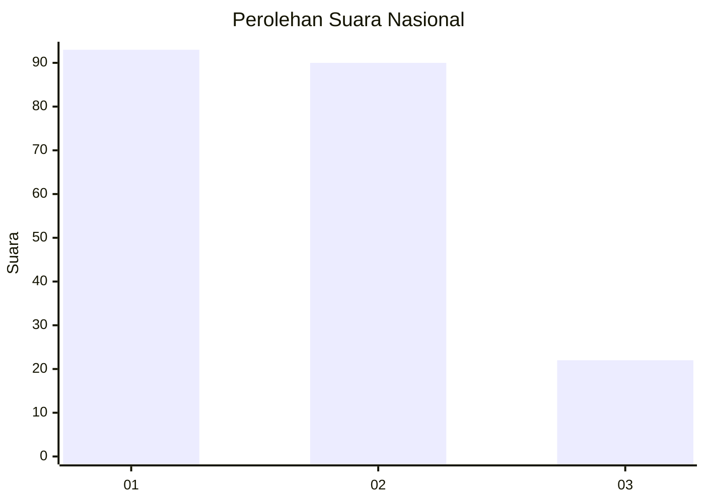
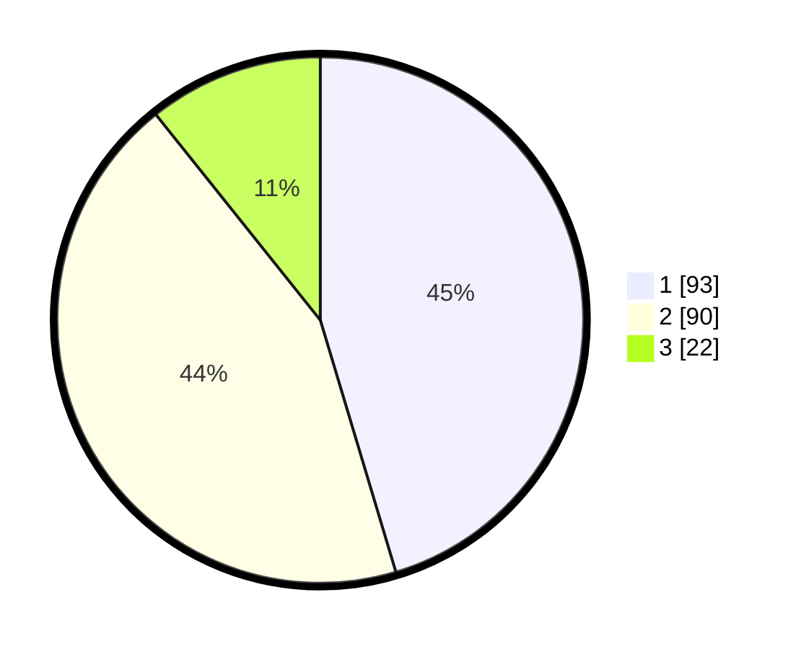

# Hasil

## Grafik

## Tabel

| No.    | Nama Paslon    | Suara | Suara (raw) | Persentase |
|:------ |:-------------- | -----:| -----------:| ----------:|
| 100025 | ANIES MUHAIMIN | 93    | [93][p-1]   | 45,37      |
| 100026 | PRABOWO GIBRAN | 90    | [90][p-2]   | 43,90      |
| 100027 | GANJAR MAHFUD  | 22    | [22][p-3]   | 10,73      |

[p-1]: https://github.com/gigit-pemilu/pemilu-2024/blob/main/pilpres/hitung-suara/sub/31-dki-jakarta/sub/72-jakarta-utara/sub/03-koja/sub/1005-tugu-selatan/sub/046-tps/sub/paslon-1.txt
[p-2]: https://github.com/gigit-pemilu/pemilu-2024/blob/main/pilpres/hitung-suara/sub/31-dki-jakarta/sub/72-jakarta-utara/sub/03-koja/sub/1005-tugu-selatan/sub/046-tps/sub/paslon-2.txt
[p-3]: https://github.com/gigit-pemilu/pemilu-2024/blob/main/pilpres/hitung-suara/sub/31-dki-jakarta/sub/72-jakarta-utara/sub/03-koja/sub/1005-tugu-selatan/sub/046-tps/sub/paslon-3.txt

## Foto C Plano

https://sirekap-obj-formc.kpu.go.id/d8ba/pemilu/ppwp/31/72/03/10/05/3172031005046-20240215-005425--2a6cbf03-df97-401e-853b-2c7a91b24354.jpg

https://sirekap-obj-formc.kpu.go.id/d8ba/pemilu/ppwp/31/72/03/10/05/3172031005046-20240215-000141--ae2f1ae9-c89d-4a13-a777-800ac3597ed2.jpg

https://sirekap-obj-formc.kpu.go.id/d8ba/pemilu/ppwp/31/72/03/10/05/3172031005046-20240215-000251--726aa558-426f-4b96-a813-ffce9748aa0b.jpg

## Metadata

| Key        | Value               |
| ---------- | ------------------- |
| Time Stamp | 2024-02-20 17:00:00 |

