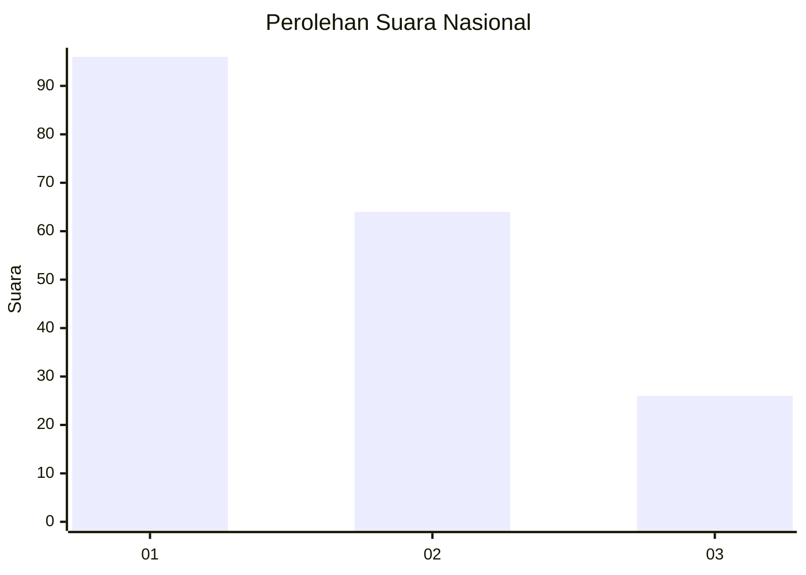
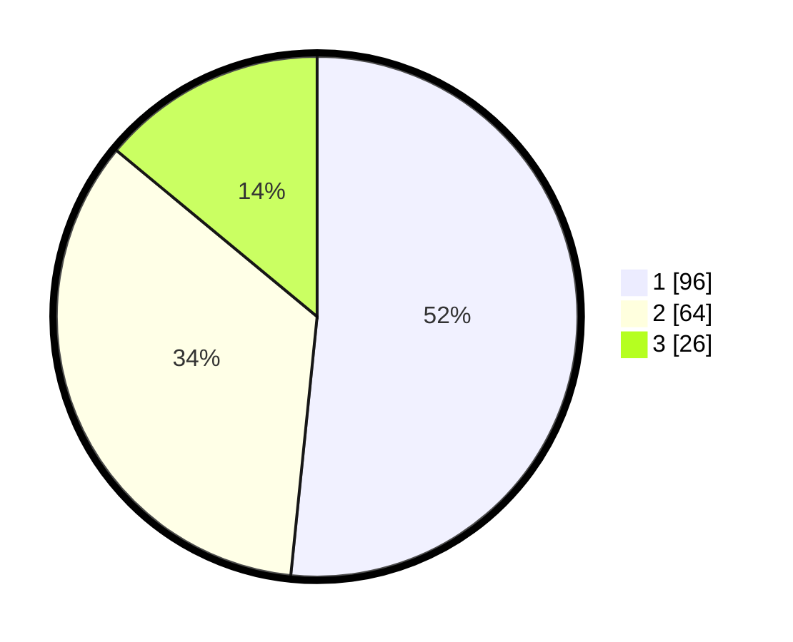

# Hasil

## Grafik

## Tabel

| No.    | Nama Paslon    | Suara | Suara (raw) | Persentase |
|:------ |:-------------- | -----:| -----------:| ----------:|
| 100025 | ANIES MUHAIMIN | 96    | [96][p-1]   | 51,61      |
| 100026 | PRABOWO GIBRAN | 64    | [64][p-2]   | 34,41      |
| 100027 | GANJAR MAHFUD  | 26    | [26][p-3]   | 13,98      |

[p-1]: https://github.com/gigit-pemilu/pemilu-2024/blob/main/pilpres/hitung-suara/sub/31-dki-jakarta/sub/72-jakarta-utara/sub/03-koja/sub/1005-tugu-selatan/sub/047-tps/sub/paslon-1.txt
[p-2]: https://github.com/gigit-pemilu/pemilu-2024/blob/main/pilpres/hitung-suara/sub/31-dki-jakarta/sub/72-jakarta-utara/sub/03-koja/sub/1005-tugu-selatan/sub/047-tps/sub/paslon-2.txt
[p-3]: https://github.com/gigit-pemilu/pemilu-2024/blob/main/pilpres/hitung-suara/sub/31-dki-jakarta/sub/72-jakarta-utara/sub/03-koja/sub/1005-tugu-selatan/sub/047-tps/sub/paslon-3.txt

## Foto C Plano

https://sirekap-obj-formc.kpu.go.id/c91f/pemilu/ppwp/31/72/03/10/05/3172031005047-20240214-201608--19b2ebb3-8680-4236-adca-6b23cff2e7cc.jpg

https://sirekap-obj-formc.kpu.go.id/c91f/pemilu/ppwp/31/72/03/10/05/3172031005047-20240214-202115--979c772a-7e2d-4f0d-af0d-cfd2bffb113e.jpg

https://sirekap-obj-formc.kpu.go.id/c91f/pemilu/ppwp/31/72/03/10/05/3172031005047-20240214-201831--83a2e53b-e7b8-410b-ba2f-b542d9da5147.jpg

## Metadata

| Key        | Value               |
| ---------- | ------------------- |
| Time Stamp | 2024-02-20 17:00:00 |

