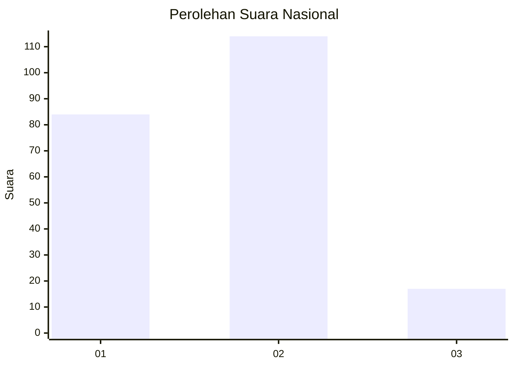
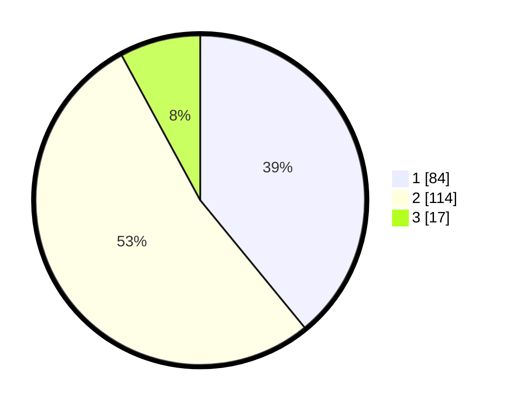

# Hasil

## Grafik

## Tabel

| No.    | Nama Paslon    | Suara | Suara (raw) | Persentase |
|:------ |:-------------- | -----:| -----------:| ----------:|
| 100025 | ANIES MUHAIMIN | 84    | [84][p-1]   | 39,07      |
| 100026 | PRABOWO GIBRAN | 114   | [114][p-2]  | 53,02      |
| 100027 | GANJAR MAHFUD  | 17    | [17][p-3]   | 7,91       |

[p-1]: https://github.com/gigit-pemilu/pemilu-2024/blob/main/pilpres/hitung-suara/sub/31-dki-jakarta/sub/72-jakarta-utara/sub/03-koja/sub/1005-tugu-selatan/sub/057-tps/sub/paslon-1.txt
[p-2]: https://github.com/gigit-pemilu/pemilu-2024/blob/main/pilpres/hitung-suara/sub/31-dki-jakarta/sub/72-jakarta-utara/sub/03-koja/sub/1005-tugu-selatan/sub/057-tps/sub/paslon-2.txt
[p-3]: https://github.com/gigit-pemilu/pemilu-2024/blob/main/pilpres/hitung-suara/sub/31-dki-jakarta/sub/72-jakarta-utara/sub/03-koja/sub/1005-tugu-selatan/sub/057-tps/sub/paslon-3.txt

## Foto C Plano

https://sirekap-obj-formc.kpu.go.id/fd91/pemilu/ppwp/31/72/03/10/05/3172031005057-20240214-210630--59dd68b8-c8ae-431b-8e15-13ed47a04c6d.jpg

https://sirekap-obj-formc.kpu.go.id/fd91/pemilu/ppwp/31/72/03/10/05/3172031005057-20240214-211239--6a5e01bf-7eb1-457e-b99c-6bd997f33b0f.jpg

https://sirekap-obj-formc.kpu.go.id/fd91/pemilu/ppwp/31/72/03/10/05/3172031005057-20240214-211453--d4a579fb-83b9-4f82-896e-037a22bd1222.jpg

## Metadata

| Key        | Value               |
| ---------- | ------------------- |
| Time Stamp | 2024-02-20 17:00:00 |

