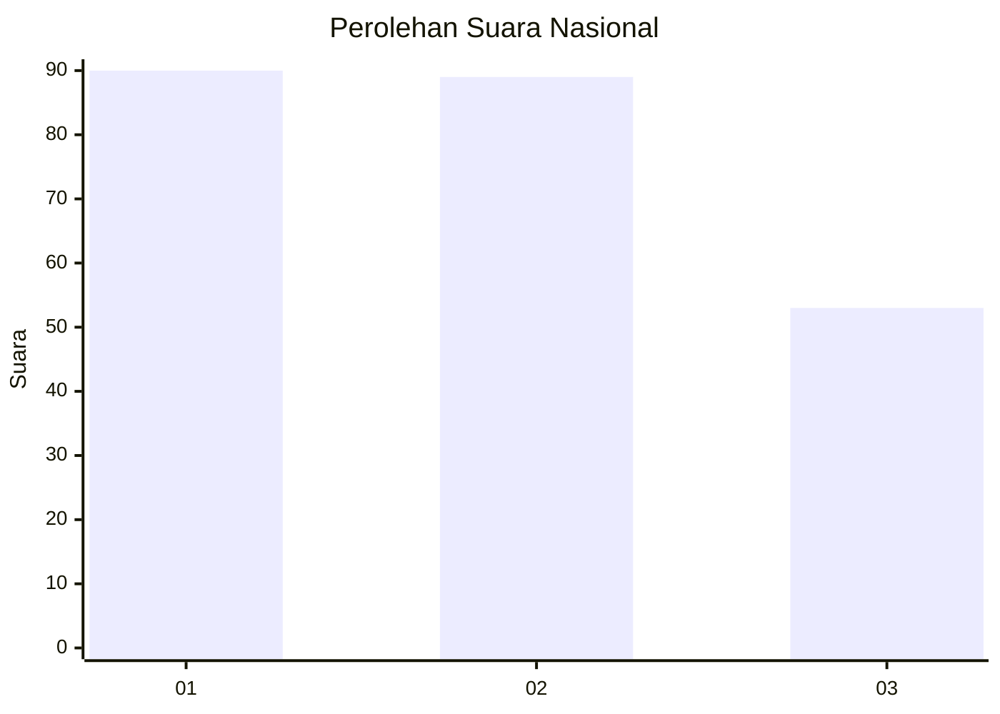
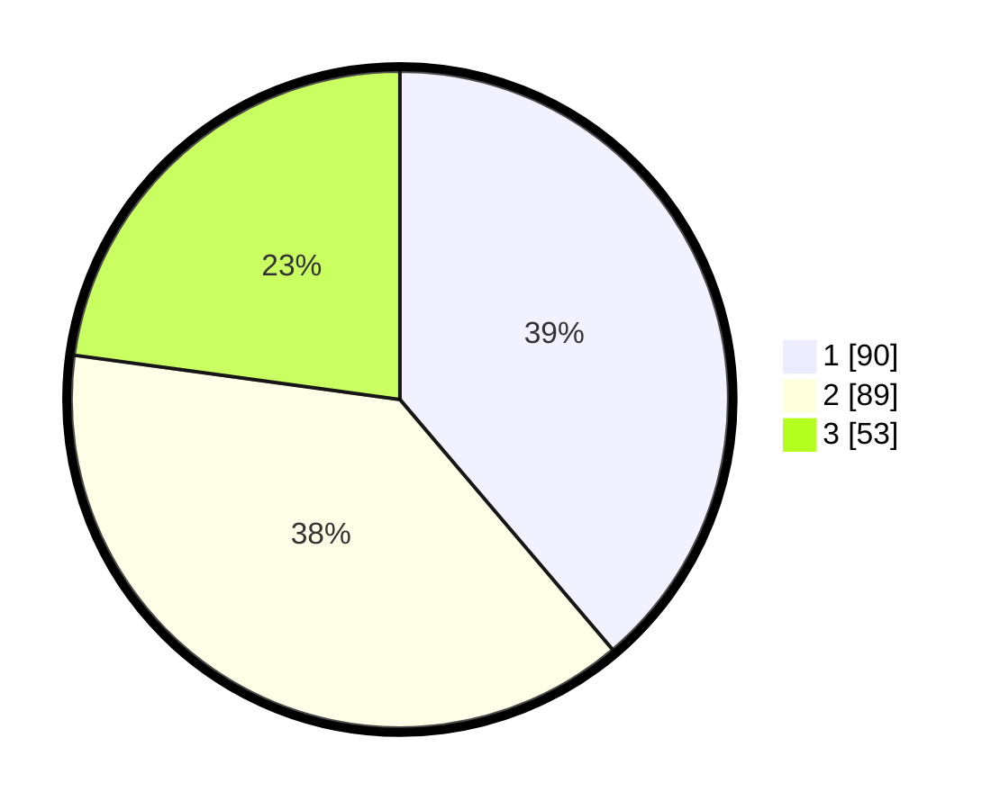

# Hasil

## Grafik

## Tabel

| No.    | Nama Paslon    | Suara | Suara (raw) | Persentase |
|:------ |:-------------- | -----:| -----------:| ----------:|
| 100025 | ANIES MUHAIMIN | 90    | [90][p-1]   | 38,79      |
| 100026 | PRABOWO GIBRAN | 89    | [89][p-2]   | 38,36      |
| 100027 | GANJAR MAHFUD  | 53    | [53][p-3]   | 22,84      |

[p-1]: https://github.com/gigit-pemilu/pemilu-2024/blob/main/pilpres/hitung-suara/sub/31-dki-jakarta/sub/72-jakarta-utara/sub/03-koja/sub/1005-tugu-selatan/sub/063-tps/sub/paslon-1.txt
[p-2]: https://github.com/gigit-pemilu/pemilu-2024/blob/main/pilpres/hitung-suara/sub/31-dki-jakarta/sub/72-jakarta-utara/sub/03-koja/sub/1005-tugu-selatan/sub/063-tps/sub/paslon-2.txt
[p-3]: https://github.com/gigit-pemilu/pemilu-2024/blob/main/pilpres/hitung-suara/sub/31-dki-jakarta/sub/72-jakarta-utara/sub/03-koja/sub/1005-tugu-selatan/sub/063-tps/sub/paslon-3.txt

## Foto C Plano

https://sirekap-obj-formc.kpu.go.id/7e83/pemilu/ppwp/31/72/03/10/05/3172031005063-20240214-210852--e29e9e2e-0b72-43be-a361-413a8c37cd9f.jpg

https://sirekap-obj-formc.kpu.go.id/7e83/pemilu/ppwp/31/72/03/10/05/3172031005063-20240214-205634--1edb6e66-f589-4a3c-87f9-bb13012a8ef0.jpg

https://sirekap-obj-formc.kpu.go.id/7e83/pemilu/ppwp/31/72/03/10/05/3172031005063-20240214-210054--3bbc9f48-95ee-4381-852e-125660d4597c.jpg

## Metadata

| Key        | Value               |
| ---------- | ------------------- |
| Time Stamp | 2024-02-20 17:00:00 |

