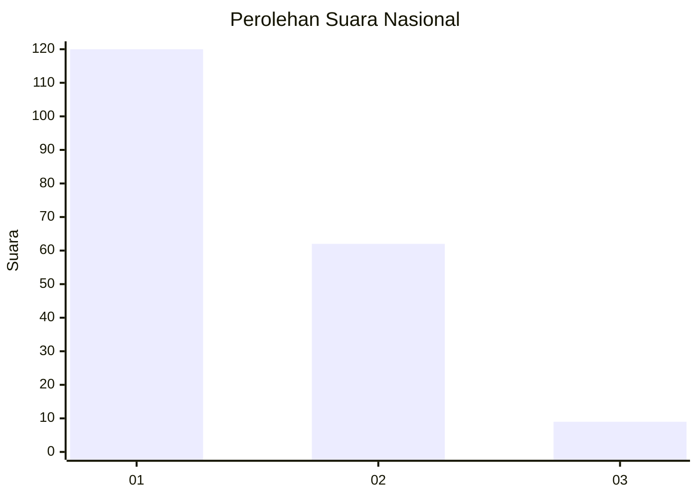
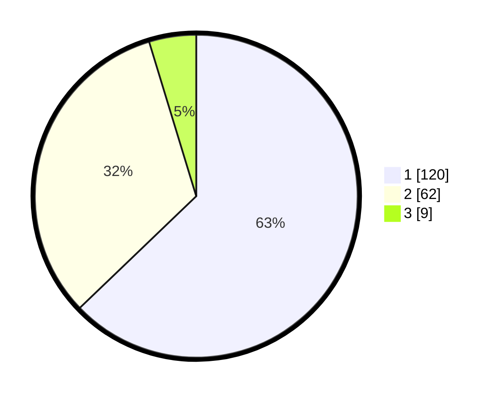

# Hasil

## Grafik

## Tabel

| No.    | Nama Paslon    | Suara | Suara (raw) | Persentase |
|:------ |:-------------- | -----:| -----------:| ----------:|
| 100025 | ANIES MUHAIMIN | 120   | [120][p-1]  | 62,83      |
| 100026 | PRABOWO GIBRAN | 62    | [62][p-2]   | 32,46      |
| 100027 | GANJAR MAHFUD  | 9     | [9][p-3]    | 4,71       |

[p-1]: https://github.com/gigit-pemilu/pemilu-2024/blob/main/pilpres/hitung-suara/sub/31-dki-jakarta/sub/72-jakarta-utara/sub/03-koja/sub/1005-tugu-selatan/sub/101-tps/sub/paslon-1.txt
[p-2]: https://github.com/gigit-pemilu/pemilu-2024/blob/main/pilpres/hitung-suara/sub/31-dki-jakarta/sub/72-jakarta-utara/sub/03-koja/sub/1005-tugu-selatan/sub/101-tps/sub/paslon-2.txt
[p-3]: https://github.com/gigit-pemilu/pemilu-2024/blob/main/pilpres/hitung-suara/sub/31-dki-jakarta/sub/72-jakarta-utara/sub/03-koja/sub/1005-tugu-selatan/sub/101-tps/sub/paslon-3.txt

## Foto C Plano

https://sirekap-obj-formc.kpu.go.id/e931/pemilu/ppwp/31/72/03/10/05/3172031005101-20240215-102541--15396b7c-4366-47db-899b-5068766f0315.jpg

https://sirekap-obj-formc.kpu.go.id/e931/pemilu/ppwp/31/72/03/10/05/3172031005101-20240215-102548--3c3d9645-7bf5-49f9-8767-2165fd208829.jpg

https://sirekap-obj-formc.kpu.go.id/e931/pemilu/ppwp/31/72/03/10/05/3172031005101-20240215-102555--9f84ffee-4d7d-47ab-a119-387afc49fc80.jpg

## Metadata

| Key        | Value               |
| ---------- | ------------------- |
| Time Stamp | 2024-02-20 17:00:00 |

