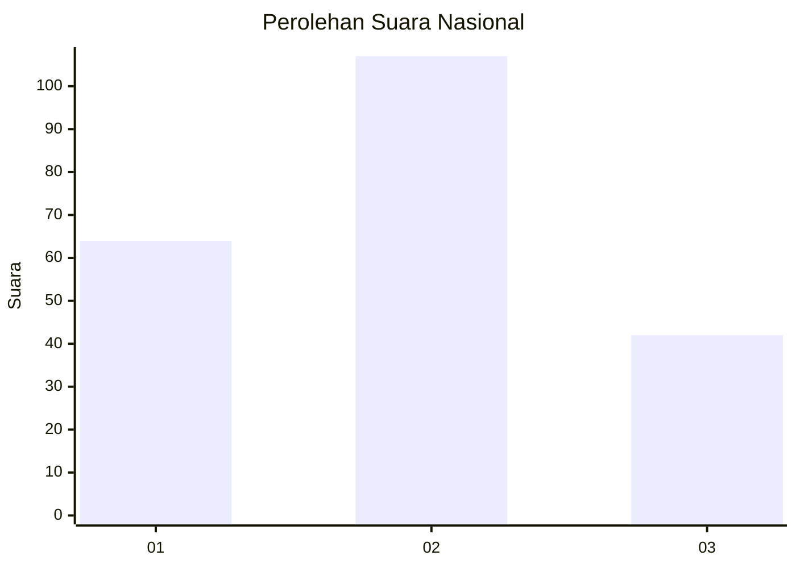
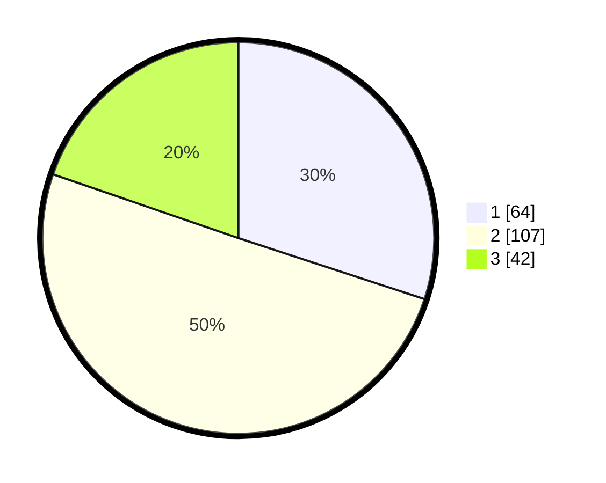

# Hasil

## Grafik

## Tabel

| No.    | Nama Paslon    | Suara | Suara (raw) | Persentase |
|:------ |:-------------- | -----:| -----------:| ----------:|
| 100025 | ANIES MUHAIMIN | 64    | [64][p-1]   | 30,05      |
| 100026 | PRABOWO GIBRAN | 107   | [107][p-2]  | 50,23      |
| 100027 | GANJAR MAHFUD  | 42    | [42][p-3]   | 19,72      |

[p-1]: https://github.com/gigit-pemilu/pemilu-2024/blob/main/pilpres/hitung-suara/sub/31-dki-jakarta/sub/72-jakarta-utara/sub/03-koja/sub/1005-tugu-selatan/sub/107-tps/sub/paslon-1.txt
[p-2]: https://github.com/gigit-pemilu/pemilu-2024/blob/main/pilpres/hitung-suara/sub/31-dki-jakarta/sub/72-jakarta-utara/sub/03-koja/sub/1005-tugu-selatan/sub/107-tps/sub/paslon-2.txt
[p-3]: https://github.com/gigit-pemilu/pemilu-2024/blob/main/pilpres/hitung-suara/sub/31-dki-jakarta/sub/72-jakarta-utara/sub/03-koja/sub/1005-tugu-selatan/sub/107-tps/sub/paslon-3.txt

## Foto C Plano

https://sirekap-obj-formc.kpu.go.id/a605/pemilu/ppwp/31/72/03/10/05/3172031005107-20240214-204609--a365af25-0bc1-4680-9c0e-ba9010c39426.jpg

https://sirekap-obj-formc.kpu.go.id/a605/pemilu/ppwp/31/72/03/10/05/3172031005107-20240214-204659--d6cab28a-2c42-4ce0-a2c7-3af7579a382a.jpg

https://sirekap-obj-formc.kpu.go.id/a605/pemilu/ppwp/31/72/03/10/05/3172031005107-20240214-213643--a4bb0c62-e16b-4379-bcca-34ed60ec1973.jpg

## Metadata

| Key        | Value               |
| ---------- | ------------------- |
| Time Stamp | 2024-02-20 17:00:00 |

