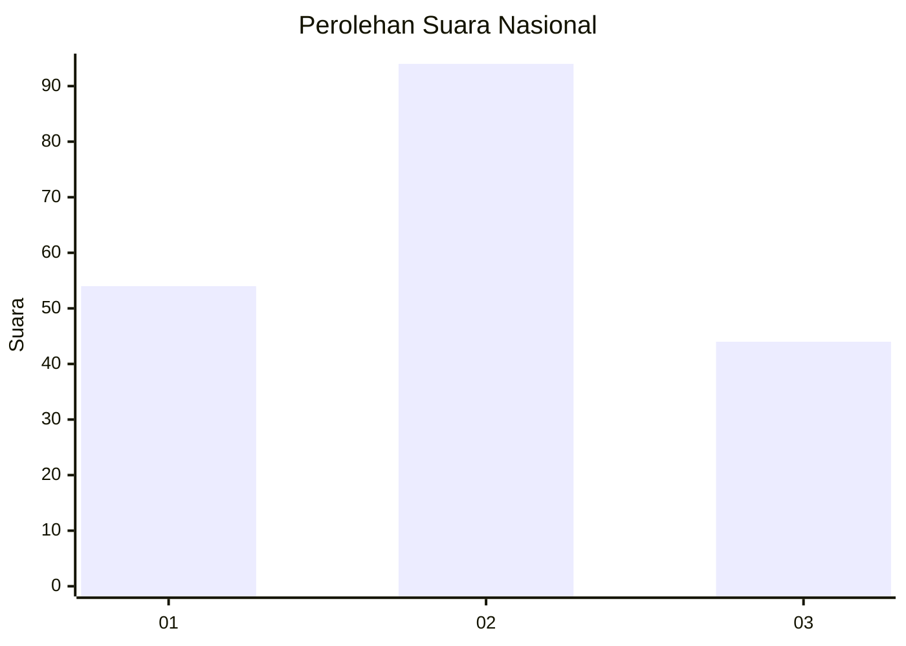
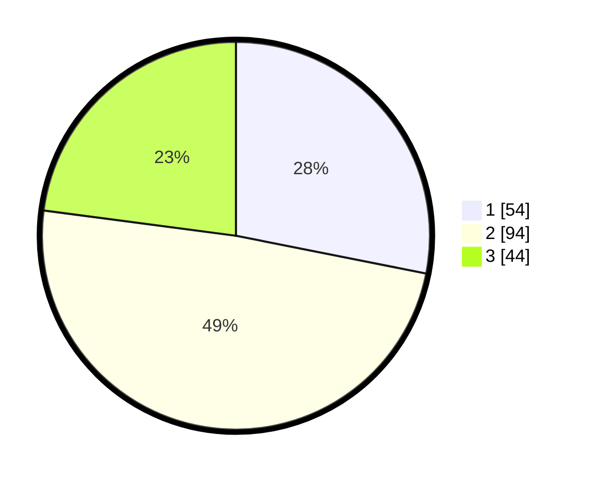

# Hasil

## Grafik

## Tabel

| No.    | Nama Paslon    | Suara | Suara (raw) | Persentase |
|:------ |:-------------- | -----:| -----------:| ----------:|
| 100025 | ANIES MUHAIMIN | 54    | [54][p-1]   | 28,13      |
| 100026 | PRABOWO GIBRAN | 94    | [94][p-2]   | 48,96      |
| 100027 | GANJAR MAHFUD  | 44    | [44][p-3]   | 22,92      |

[p-1]: https://github.com/gigit-pemilu/pemilu-2024/blob/main/pilpres/hitung-suara/sub/31-dki-jakarta/sub/72-jakarta-utara/sub/03-koja/sub/1005-tugu-selatan/sub/114-tps/sub/paslon-1.txt
[p-2]: https://github.com/gigit-pemilu/pemilu-2024/blob/main/pilpres/hitung-suara/sub/31-dki-jakarta/sub/72-jakarta-utara/sub/03-koja/sub/1005-tugu-selatan/sub/114-tps/sub/paslon-2.txt
[p-3]: https://github.com/gigit-pemilu/pemilu-2024/blob/main/pilpres/hitung-suara/sub/31-dki-jakarta/sub/72-jakarta-utara/sub/03-koja/sub/1005-tugu-selatan/sub/114-tps/sub/paslon-3.txt

## Foto C Plano

https://sirekap-obj-formc.kpu.go.id/6f09/pemilu/ppwp/31/72/03/10/05/3172031005114-20240215-005248--9884331d-8a66-4363-ab07-9aefd6ed6ce2.jpg

https://sirekap-obj-formc.kpu.go.id/6f09/pemilu/ppwp/31/72/03/10/05/3172031005114-20240215-004019--8b8152b5-3928-4b6a-b8aa-ade7462b1f08.jpg

https://sirekap-obj-formc.kpu.go.id/6f09/pemilu/ppwp/31/72/03/10/05/3172031005114-20240215-004004--b33b2e0a-2589-4214-a834-4f2ee4a33f55.jpg

## Metadata

| Key        | Value               |
| ---------- | ------------------- |
| Time Stamp | 2024-02-20 16:00:00 |

