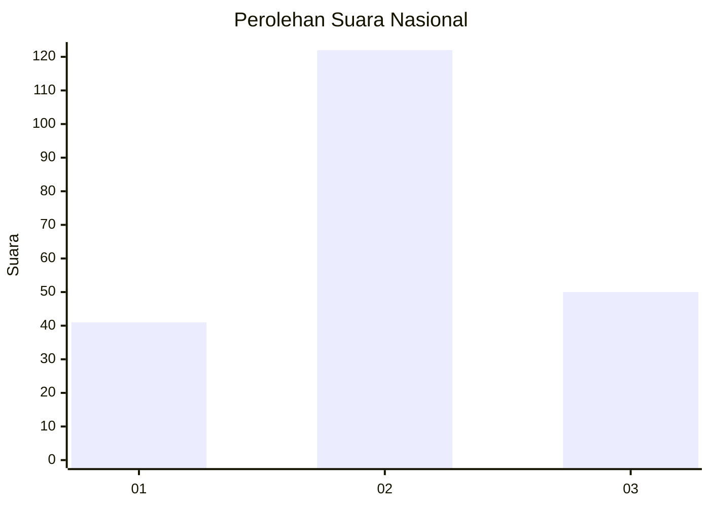
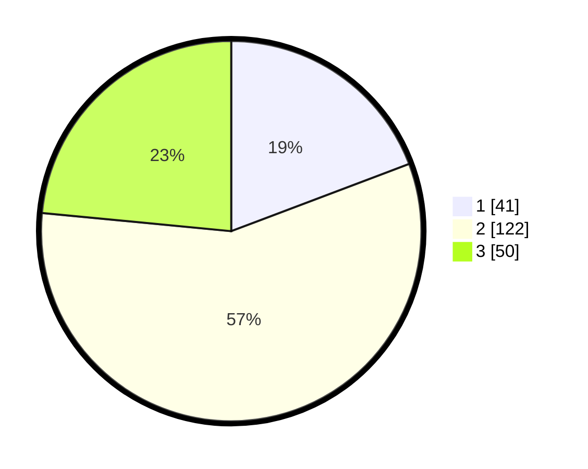

# Hasil

## Grafik

## Tabel

| No.    | Nama Paslon    | Suara | Suara (raw) | Persentase |
|:------ |:-------------- | -----:| -----------:| ----------:|
| 100025 | ANIES MUHAIMIN | 41    | [41][p-1]   | 19,25      |
| 100026 | PRABOWO GIBRAN | 122   | [122][p-2]  | 57,28      |
| 100027 | GANJAR MAHFUD  | 50    | [50][p-3]   | 23,47      |

[p-1]: https://github.com/gigit-pemilu/pemilu-2024/blob/main/pilpres/hitung-suara/sub/31-dki-jakarta/sub/72-jakarta-utara/sub/03-koja/sub/1005-tugu-selatan/sub/115-tps/sub/paslon-1.txt
[p-2]: https://github.com/gigit-pemilu/pemilu-2024/blob/main/pilpres/hitung-suara/sub/31-dki-jakarta/sub/72-jakarta-utara/sub/03-koja/sub/1005-tugu-selatan/sub/115-tps/sub/paslon-2.txt
[p-3]: https://github.com/gigit-pemilu/pemilu-2024/blob/main/pilpres/hitung-suara/sub/31-dki-jakarta/sub/72-jakarta-utara/sub/03-koja/sub/1005-tugu-selatan/sub/115-tps/sub/paslon-3.txt

## Foto C Plano

https://sirekap-obj-formc.kpu.go.id/e61b/pemilu/ppwp/31/72/03/10/05/3172031005115-20240214-222133--c85f6c58-c912-49a2-b63c-83945913007a.jpg

https://sirekap-obj-formc.kpu.go.id/e61b/pemilu/ppwp/31/72/03/10/05/3172031005115-20240214-222346--3bd09a56-687b-45ca-be1e-68263629a634.jpg

https://sirekap-obj-formc.kpu.go.id/e61b/pemilu/ppwp/31/72/03/10/05/3172031005115-20240214-221844--6a377aa5-fcda-4fc1-a2e0-36e863844d8e.jpg

## Metadata

| Key        | Value               |
| ---------- | ------------------- |
| Time Stamp | 2024-02-20 17:00:00 |

