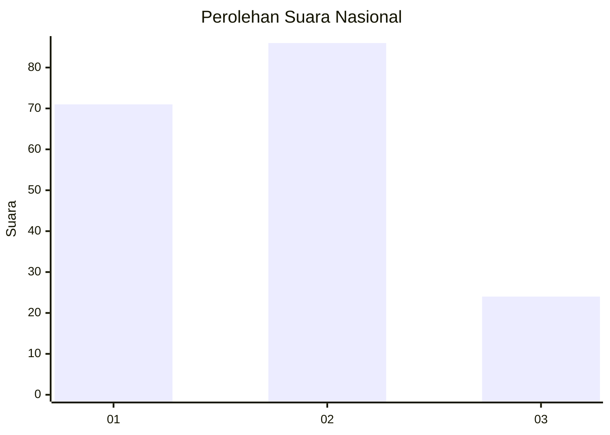
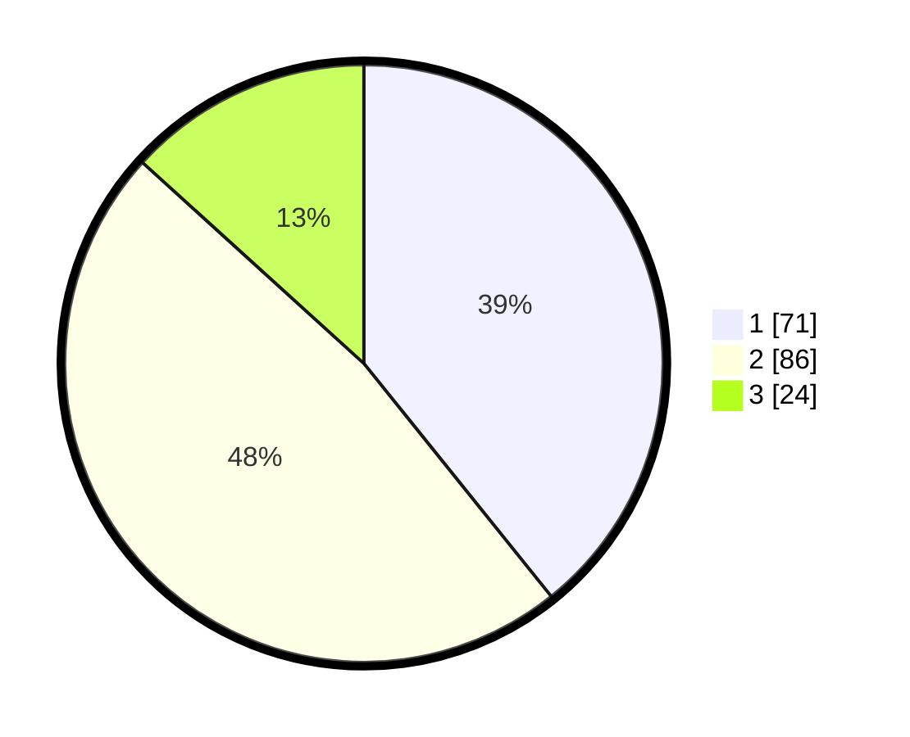

# Hasil

## Grafik

## Tabel

| No.    | Nama Paslon    | Suara | Suara (raw) | Persentase |
|:------ |:-------------- | -----:| -----------:| ----------:|
| 100025 | ANIES MUHAIMIN | 71    | [71][p-1]   | 39,23      |
| 100026 | PRABOWO GIBRAN | 86    | [86][p-2]   | 47,51      |
| 100027 | GANJAR MAHFUD  | 24    | [24][p-3]   | 13,26      |

[p-1]: https://github.com/gigit-pemilu/pemilu-2024/blob/main/pilpres/hitung-suara/sub/31-dki-jakarta/sub/72-jakarta-utara/sub/03-koja/sub/1005-tugu-selatan/sub/116-tps/sub/paslon-1.txt
[p-2]: https://github.com/gigit-pemilu/pemilu-2024/blob/main/pilpres/hitung-suara/sub/31-dki-jakarta/sub/72-jakarta-utara/sub/03-koja/sub/1005-tugu-selatan/sub/116-tps/sub/paslon-2.txt
[p-3]: https://github.com/gigit-pemilu/pemilu-2024/blob/main/pilpres/hitung-suara/sub/31-dki-jakarta/sub/72-jakarta-utara/sub/03-koja/sub/1005-tugu-selatan/sub/116-tps/sub/paslon-3.txt

## Foto C Plano

https://sirekap-obj-formc.kpu.go.id/4005/pemilu/ppwp/31/72/03/10/05/3172031005116-20240214-235222--359a1da5-f9aa-44a8-9afc-b640a9652d5a.jpg

https://sirekap-obj-formc.kpu.go.id/4005/pemilu/ppwp/31/72/03/10/05/3172031005116-20240214-235543--b37e31b8-56e1-4220-b589-7351def3ead0.jpg

https://sirekap-obj-formc.kpu.go.id/4005/pemilu/ppwp/31/72/03/10/05/3172031005116-20240214-235740--b0bcc490-0153-4675-b51a-0eb1101b641c.jpg

## Metadata

| Key        | Value               |
| ---------- | ------------------- |
| Time Stamp | 2024-02-20 16:00:00 |

